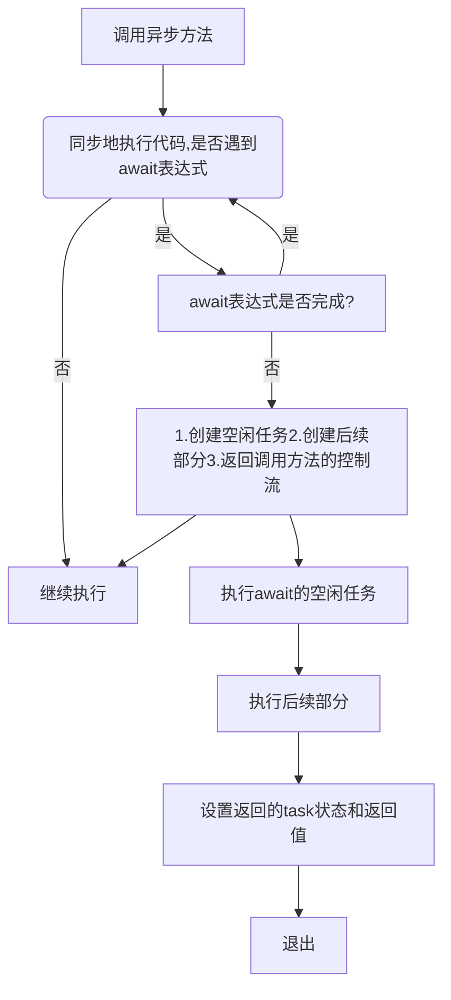

异步编程相关内容

<!-- more -->

# 1.1概述

异步编程时.Net框架的一部分，并不是c#特有的。

启动程序时，系统会在内存中创建一个新的进程。进程是构成运行程序资源的集合，资源包括：虚地址空间，文件句柄，和其他程序运行需要的东西。

进程内部，系统创建了一个称为线程（执行线程的简称）的内核对象，它代表真正执行的程序。 一旦进程建立，系统会在Main方法的第一句语句处就开始线程的执行。

关于线程的几点：

- 默认情况，一个进程只包括一个线程。从程序的开始一直到执行结束。
- 线程可以派生其他线程，一个进程可以包含不同状态的多个线程，来执行程序的不同部分。
- 一个进程拥有多个线程，线程间会共享进程的资源。
- 系统为处理器执行所规划的单元是线程，不是进程。

例子：

```csharp
 class SyncPractice
    {
     	//用于测试代码中不同任务的执行时间
        Stopwatch sw = new Stopwatch();

        public void DoRun()
        {
            const int LargeNumber = 600000;
            sw.Start();

            int t1 = CountCharacters(1,"http://www.microsoft.com");
            int t2 = CountCharacters(2, "http://www.baidu.com");

            CountToALargeNumber(1, LargeNumber);
            CountToALargeNumber(2, LargeNumber);
            CountToALargeNumber(3, LargeNumber);
            CountToALargeNumber(4, LargeNumber);

            Console.WriteLine("chars in www.microsoft.com:{0}", t1);
            Console.WriteLine("chars in www.baidu.com:{1}", t2);
        }

		//下载网站的内容，返回网站包含的字符串数。     
        private int CountCharacters(int id , string uriString)
        {
            WebClient wc1 = new WebClient();
            Console.WriteLine("Starting call{0}:{1,4:NO} ms", id, sw.Elapsed.TotalMilliseconds);

            string result = wc1.DownloadString(new Uri(uriString));
            Console.WriteLine("call{0} compelted:{1,4:NO} ms", id, sw.Elapsed.TotalMilliseconds);

            return result.Length;
        }

     	//只是一个消耗时间的方法，测试用
        private void CountToALargeNumber(int id, int value)
        {
            for (long i  = 0;  i < value; i++)
            {
                Console.WriteLine("End Counting {0} : {1,4:NO} ms", id, sw.Elapsed.TotalMilliseconds);
            }
            return;
        }
 }

class Program
{
  static void Main(string[] args)
   {
    SyncPractice sp = new SyncPractice();
    sp.DoRun();
    }
}
```

输出结果：

```
Starting call 1:0.7881 ms
call1 compelted:132.0713 ms
Starting call 2:132.1764 ms
call2 compelted:983.1649 ms
End Counting 1 : 983.5177 ms
End Counting 2 : 983.8779 ms
End Counting 3 : 984.1251 ms
End Counting 4 : 984.416 ms
chars in www.bing.com:14462
chars in www.baidu.com:111980
```

实例的执行顺序是：1.执行两次下载网页内容的CountCharacters。2.执行四次CountToALargeNumber，可以看到，时间大部分都浪费在等待网站相应上了，如果先执行四次CountToALargeNumber方法，同时等待网络，时间会减少很多。所以引入了Async/await特性。

# 1.2 Async/Await特性

Async/Await特性可以实现不需像上例中等待网络响应后再做其他操作。

## 1.2.1 例子

一个应用了Async/await特性的例子：

```csharp
class SyncPracticeUseSync
{
        Stopwatch sw = new Stopwatch();    
public void DoRun()
    {
        const int LargeNumber = 6;
        sw.Start();
        
        //保存结果的对象
        Task<int> t1 = CountCharacters(1, "https://www.baidu.com/");
        Task<int> t2 = CountCharacters(2, "https://cn.bing.com");

        CountToALargeNumber(1, LargeNumber);
        CountToALargeNumber(2, LargeNumber);
        CountToALargeNumber(3, LargeNumber);
        CountToALargeNumber(4, LargeNumber);
	
        //获取结果
        Console.WriteLine("chars in www.bing.com:{0}", t1.Result);
        Console.WriteLine("chars in www.baidu.com:{0}", t2.Result);
    }

	//上下文关键字 
    private async Task<int> CountCharacters(int id, string uriString)
    {
        WebClient wc1 = new WebClient();
        Console.WriteLine(string.Format("Starting call {0}:{1} ms", id, sw.Elapsed.TotalMilliseconds));
			//上下文关键字
        string result = await wc1.DownloadStringTaskAsync(new Uri(uriString));
        Console.WriteLine(string.Format("call{0} compelted:{1} ms", id, sw.Elapsed.TotalMilliseconds));

        return result.Length;
    }

    private void CountToALargeNumber(int id, int value)
    {
        for (long i = 0; i < value; i++)
        {
            Console.WriteLine(string.Format("End Counting {0} : {1} ms", id, sw.Elapsed.TotalMilliseconds));
        }
        return;
    }

}
```
运行后的结果为：

```
Starting call 1:1.6199 ms
Starting call 2:85.9381 ms
End Counting 1 : 87.4253 ms
End Counting 2 : 87.8023 ms
End Counting 3 : 87.8327 ms
End Counting 4 : 88.333 ms
call1 compelted:381.3264 ms
chars in www.bing.com:14462
call2 compelted:924.1949 ms
chars in www.baidu.com:111980
```

比之前的结果快很多，现在CountToALargeNumber方法的4次调用是在等待网站响应时进行的，**所有的工作都是在主线程中进行的，并没有创建额外的线程。**

## 1.2.2 Async/Await的结构

两种调用方法的时机：

- 同步方法：一个程序调用某个方法，等待方法执行所有处理后才能继续执行。
- 异步方法：在方法处理完成之前就返回到调用位置。

async/await可以创建并使用异步方法，它由三个部分组成：

1. 调用方法：该方法调用异步方法，然后异步方法（可能在相同的线程，亦可能在不同的线程）执行其任务时继续执行。如例子中的DoRun()。

2. 异步方法：该方法异步执行其工作，然后立即返回到调用方法。如同例子中的CountCharacters();

3. await表达式：用于异步方法内部，指明需要异步执行的任务，异步方法可以包含任意多个await表达式，如果一个不包含的话编译器会发出警告。如同例子的：

   ```c#
   string result = await wc1.DownloadStringTaskAsync(new Uri(uriString));
   ```

# 1.3 异步方法

异步方法的语法特点：

1. 方法头中包含async方法修饰符。
2. 包含一个或多个await表达式，表示可以异步完成的任务。
3. 必须具备以下三种返回类型：Void，Task，Task<T> 。后两种的返回对象表示将在未来完成的工作，调用方法和异步方法可以继续执行。
4. 异步方法的参数可以为任意类型任意数量，但不能是out或ref参数。
5. 按约定，异步方法名称应该以Async为后缀。
6. 除方法以外，lambda表达式和匿名方法也可以作为异步对象。
7. await语句可以放入Try Catch结构内。

async关键字只是包含一个或多个await表达式，它本身不能创建任何异步操作。同时，async关键字还是一个上下文关键字，除了作为方法的修饰符，async还可作为标识符。

## 1.3.1 三种返回类型介绍

Task<T> ：

如果调用方法要从调用中获取一个T类型的值，异步方法的返回类型就必须是Task<T> ，调用方法将通过读取Task的Result属性获取这个T类型的值。

```csharp
 Task<int> t1 = CountCharacters(1, "https://www.baidu.com/");
```

Task :

如果调用方法不需要从异步方法中返回值，但需要检查异步方法的状态，就可以只返回一个Task类型的对象，如果异步方法种有return语句，也不会返回任何东西：

```csharp
 Task t1 = CountCharacters(1, "https://www.baidu.com/");
```

Void :

如果调用方法仅仅想执行异步方法，而不需要做任何交互，这种叫做调用并忘记，异步方法可以返回void类型，同时return语句也不会返回任何东西。

## 1.3.2 异步方法的控制流

异步方法的结构包括三个不同的区域：

```csharp
private async Task<int> CountCharacters(int id, string uriString)
{
    /*1.await表达式之前的部分*/
  	WebClient wc1 = new WebClient();

    /*2.await表达式*/
    string result = await wc1.DownloadStringTaskAsync(new Uri(uriString));
    
    /*3.后续部分*/
    return result.Length;
}
```

控制流：




*注：这需要解释一下，异步方法的返回值返回的是一个任务，里面有需要的数值length。 当执行到await时，异步方法会继续执行调用方法，同时返回了一个task，此时任务可能未完成，但异步方法还是返回了一个task，同时可以通过task来判断await表达式是否执行完成。当await表达式结束后，return legnth才会真正执行，同时可以通过调用task对象的成员来使用：

```csharp
private async Task<int> CountCharacters(int id, string uriString)
{
  	WebClient wc1 = new WebClient();
    string result = await wc1.DownloadStringTaskAsync(new Uri(uriString));
    return result.Length;
}
```

## 1.3.3 Await表达式

**Await**：由关键字和一个空闲对象（任务）组成，表达式指定了一个异步执行的任务。

**空闲对象**：就是一个awaitable类型的实例，awaitable类型指包含GetAwaiter方法的类型，该方法没有参数，返回一个awaiter类型的对象。

**Awaiter**：包含以下成员(实际上，不需要构建自己的awaitable。)

- bool IsCompleted{get;}
- void OnCompleted(Action);
- Void GetResult();或T GetResult();

## 1.3.4 自定义异步任务

作为await表达式的任务，最简单的方法是在自己的方法中使用Task.run方法。

Task. run会在不同的线程上运行你的方法，签名：以Func<treturn>委托作为参数，返回值类型为T return。有三种创建方法：

```csharp
 class UserAwaitFunc
    {
        public int GetNum()
        {
            return 10;
        }
        public async Task DoWorkAsync()
        {
            //第一种
            Func<int> ten = new Func<int>(GetNum);
            int a = await Task.Run(ten);
            //第二种
            int b = await Task.Run(new Func<int>(GetNum));
            //第三种
            int c = await Task.Run(() => { return 10; });
        }
    }
```

Task.Run()有很多重载，包括以Func和Action为参数等等。如果方法的参数不匹配，则可以使用lambda表达式包装此不兼容的方法。

## 1.3.5 取消一个异步操作

一些.net异步方法允许请求终止执行，自定义的异步方法中也可以加入这个特性。

System.threading.task命名空间有两个为此设计：cancellationtoken和cancellationtokensource。

- cancellationtoken对象包含任务是否应被取消的信息，拥有cancellationtoken对象的任务需要定期检查其令牌（token）的状态，如果cancellationtoken对象的iscancellationrequested的属性为true，任务需停止操作并返回。cancellationtoken不可逆，一旦取消被设置为true，就不能被更改。
- cancellationtokensource对象创建可分配给不同任务的cancellationtoken对象，任何持有cancellationtokensource的对象都可以调用其cancel方法，这样会将iscancellationrequested属性设置为true。

简略的说：调用cancellationtokensource的cancel时，本身并不会执行取消操作。只是将cancellationtoken的iscancellationrequested属性设置为true，包含cancellationtoken的代码负责检查该属性来判断任务是否停止执行。

```csharp
class CancelSync
    {
        public async Task RunAsync( CancellationToken ct)
        {
            if (ct.IsCancellationRequested)
            {
                return;
            }
            await Task.Run(() => CycleMethod(ct), ct);
        }


        public void CycleMethod(CancellationToken ct)
        {
            Console.WriteLine("Starting CycleMethod");
            const int max = 5;
            for (int i = 0; i < max; i++)
            {
                if (ct.IsCancellationRequested)
                {
                    return;
                }
                Thread.Sleep(1000);
            }
        }
    }
```

```csharp
    class Program
    {
        static void Main(string[] args)
        {
            CancellationTokenSource cts = new CancellationTokenSource();
            CancellationToken token = cts.Token;

            CancelSync mc = new CancelSync();
            Task t = mc.RunAsync(token);

            Thread.Sleep(3000);
            cts.Cancel();
            t.Wait();

        }
    }
```

##  1.3.6 调用方法中同步的等待任务

有的时候需要等待某个Task对象完成，Task的Wait方法可以实现该功能。

```
    class Program
    {
        static void Main(string[] args)
        {
            CancelSync mc = new CancelSync();
            Task t = mc.RunAsync();
            t.Wait();
        }
    }
```

wait方法可用于单一task或一组task对象，对于一组task对象，可以等待所有任务都结束，也可以等待某一个任务结束。 实现这两个功能的是task类中的两个静态方法：

- Waitall(params Task[] tasks);
- Waitany(params Task[] tasks);

这两个方法都没有返回值，调用时会停止，直到条件满足后再继续执行。

## 1.3.7 在异步方法中异步地等待任务

在异步方法中，有时会希望用await表达式等待task，这时异步方法会返回到调用方法。Task.whenall task.whenany方法实现，这两个方法称为组合子(combinator）

```csharp
public void DoRun()
    {
        const int LargeNumber = 6;
        sw.Start();
        
        //保存结果的对象
        Task<int> t1 = CountCharacters(1, "https://www.baidu.com/");
        Task<int> t2 = CountCharacters(2, "https://cn.bing.com");
        
        List<Task> tasks = new List<Task<int>>();
    	tasks.Add(t1);
    	tasks.Add(t2);
    	await Task.WhenAll(tasks);
    	Console.WriteLine("Done");
    }
```

此时会等待两次CountCharacters执行完毕，然后输出Done。

将WhenAll换成如下，此时会等待其中一个CountCharacters执行完毕，然后输出Done。

```csharp
await Task.WhenAny(tasks);
```

## 1.3.8 Task.Delay方法

Task.Delay 方法创建一个task对象，该对象将暂停其在线程中的处理，和thread.sleep阻塞线程不同的是，task.delay不会阻塞线程，线程可以继续处理其他工作。


# 1.4 BackgroundWork类

Async/await 特性适合处理需要在后台完成的，不相关的小任务。但有时候，可能需要新建一个线程，在后台持续允许已完成某项工作，并不时与主线程进行通信。background类就是为此创建的。

```mermaid
classDiagram
Class01 <|-- object
Class01 : RunWorkerAsync()
Class01 : CancelAsync()
Class01 : ReportProgress()
Class01 : WorkerReportsProgress
Class01 : WorkerSupportsCancellation
Class01 : IsBusy
Class01 : CancellationPending
Class01 : Event:DoWorkEvent
Class01 : Event:ProgressChanged
Class01 : Event:RunWorkerCampleted
```

`WorkerReportsProgress`和`WorkerSupportsCancellation`用于设置后台任务是否可以把它的进度汇报给主线程，以及是否支持从主线程取消。可以用`isbusy`属性检查后台任务是否在运行。

后台线程开始时触发`DoWork`，后台任务汇报状态的时候触发`ProgressChanged`事件，线程退出的时候 触发`RunWorkerCompeted`事件。

`RunWorkerAsync()`用于获取后台线程并执行DoWork事件处理程序，`CancelAsync()`会把`CancellationPending`设置为True，`DoWork`事件处理需要检查这个属性决定是否应该停止处理，`ReportProgress()`用于Dowork向主线程汇报进度。

要使用Back类，需要写一些事件处理程序，`DoWork`事件的处理程序是必须的。剩下两个可选。

注：这块东西也比较多，但是对于我来说不常用，等用到再回来补充。

# 1.5 并行循环

任务并行库（task parellel library）是BCL中的一个类库，简化了并行编程。简单的介绍以下这个类库：`Parallel.for`，`Parallel.foreach`循环，用于不与其他动作依赖的迭代行为。一定要注意的是，此方式不能保证迭代的执行次序，只能保证结果的正确。

## 1.5.1 Parallel.for

```csharp
public static ParallelLoopResult.For(int fromInclusive,int toExclusive,Action body)
```

例子：

```csharp
Parallel.for(0,15,i=>Console.WriteLine("wwww" + i));
```

## 1.5.2 Parallel.foreach

```csharp
static ParallelLoopResult ForEach(IEnumerable<TSource> source,Action<TSource> body)
```

```csharp
Parallel.ForEach(array,i=>Console.WriteLine("wwww" + i));
```


# 1.6 其他异步编程模式

了解一下旧的异步方法的模式：

当委托对象在调用列表中只有一个方法，就可以异步执行这个方法（下面叫引用方法）。委托类有两个方法，叫做`BeginInvoke`和`Endinvoke`，当调用`Begininvoke`方法时，它开始在独立线程上执行引用方法，并且立即返回到原始线程。原始线程可以继续，引用方法会在线程池的线程中并行执行。

当程序希望获取已完成的异步方法的结果时，可以检查`Begininvoke`返回的`Iasyncresult`的`Iscompleted`属性，或调用委托的`Endinvoke`方法等待委托完成。

下面介绍一下原始线程如何知道发起的线程是否完成的几个办法。

## 1.6.1 等待一直到结束模式

```csharp
MyDel del = new MyDel(Sum);
IAsyncReult iar = del.BeginInvoke(3,5,null,null);
//等待开启的线程结束
long result = del.EndInvoke(iar);
```

## 1.6.2 轮询模式

```csharp
MyDel del = new MyDel(Sum);
IAsyncReult iar = del.BeginInvoke(3,5,null,null);

while(!iar.IsCompleted)
{
	//dosomething
}

//调用EndInvoke来获取接口并进行清理
long result = del.EndInvoke(iar);
```

## 1.6.3 回调模式

等待一直结束模式和轮询模式中，初始线程继续自己的流程，然后去观察开启的线程是否完成，然后拿到结果并继续。回调模式不同，一旦开启，就是自己管自己，不用考虑同步，异步方法结束后，系统调用一个用户自定义的方法处理结果，并且调用委托的endinvoke方法，这个用户自定义的方法叫做回调方法或回调。

`Begininvoke`方法需要传入两个参数：

- 第一个，回调方法的名字。签名必须与`void AsyncCallback(IAsyncReult iar)`一致。
- 第二个，state，可以传null，或者传入回调方法的一个对象的引用。

例子：

```csharp
IAsyncReult iar1 = del.BeginInvoke(3,5,new AsyncCallback(CallBack),null);
IAsyncReult iar2 = del.BeginInvoke(3,5,CallBack,null);
```

回调方法内调要调用`Endinvoke`处理异步方法执行后的输出值。要调用`Endinvoke`方法，需要有委托对象的引用，但他在初始线程中，不在开启的线程中。如果不使用`BeginInvoke`的state参数作为其他用途，可以使用它发送委托的引用给回调方法。

```csharp
IAsyncReult iar = del.BeginInvoke(3,5,CallBack,del);

void CallBack(IAsyncReult iar)
{
	AsyncReult ar = (AsyncReult)iar;
	Mydel del = (Mydel)ar.AsyncDelegate;
	long Sum = del.EndInvoke(iar);
}
```

## 1.6.3 计时器

计时器每次时间到期后调用回调方法。回调方法必须是`TimerCallback`形式的:`void TimerCallback(object state)` 

```csharp
Timeer mytimer = new Timer(MyCallback,someobject,2000,2000)
```

参数含义：

1. 回调的名字。
2. 传给回调的对象，可以是null或者每次回调方法执行时要传入的对象引用。
3. 多少秒后第一次调用。
4. 每多少秒执行一次。