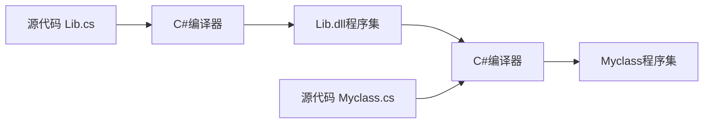

命名空间 程序集 相关内容

<!-- more -->

# 1.1概述

编译器接受源代码文件并生成名称为程序集的输出文件。有些项目中，可能会使用来自其他程序集的类或类型，这些程序集可能是BCL，也可能是来自第三方提供，他们被称为类库，通常它们的名称以`dll`拓展结尾，而不是exe。



Console类定义在mscorlib程序集中，mscorlib中含有c#类型以及大部分的.net语言的基本类型的定义，在编译c#程序时，它总会被引用，所以也不会出现在referneces目录中。

如果两个库中都有相同名称的类，就会出现问题。比如使用了Lib1.dll和Lib2.dll，它们都有一个叫做BClass的类，此时产生了命名冲突。

# 1.2 命名空间

命名空间的定义：

- 命名空间名可以被视为一个字符串，它加在类名或者类型名签名并通过点进行隔离。
- 包括命名空间，分割点，以及类名的完整字符串叫类的完全限定名。
- 命名空间是共享命名空间名的一组类和类型。
- 命名空间内的类型被称为命名空间的成员。

例子：

```csharp
//---命名空间名--/ //---类名--//	
ABCCorp.Ultralib.SquareWidget
```

引用类库中的类时，使用`.`就可以避免类库的类名称重复，using命令可以解决每次用类库都要打全称的麻烦。

我的理解是命名空间通过点使命名更规范。其实两个点的含义是不一样的，第一个是字符串中方法标记的点，第二个是在点出命名空间中的类。

## 1.2.1 命名空间跨文件伸展

命名空间不是封闭的，可以在不同的文件中再次声明它。

## 1.2.2 嵌套命名空间

再怎么套，命名空间也是互相独立的，不会有父子关系。

# 1.3 using指令

完全限定名可能会很长，使用using命名空间指令和using别名指令避免这个问题。指令必须放在源文件的顶端，在任何类型声明之前。using命名空间指令应用于当前源文件中的所有命名空间。

## 1.3.1using命名空间指令

using命名空间指令通知编译器你将要使用来自某个指定命名空间的类型。当编译器遇到不在当前命名空间的名称时，它会检查using命名空间指令中给出的命名空间列表，并把未知名称加到列表中的第一个命名空间后面。如果完全限定名称匹配了这个程序集或引用程序集的一个类，编译器将使用那个类，如果不匹配，就实验列表中下一个命名空间。

## 1.3.2 using别名指令

别名指令允许起一个别名给命名空间或命名空间内的一个类型。

```csharp
using su = System；
using swu = System.Console；
```

# 1.4 程序集

程序集不包含本地机器代码，是中间公共语言代码，同时也包含编译器JIT在运行时转换CIL到本机代码所需的一切，文件拓展名通常为exe或者dll。

程序集有4个主要部分：

- 清单：
  - 程序集名称标识符
  - 组成程序集的文件列表
  - 指示程序集中内容在哪里的地图
  - 关于引用其他程序集的信息
- 类型元数据：包含该程序集中所定义的所有类型的信息。
- CIL代码：程序集中所有的中间代码
- 资源：可选，包括图形或语言资源

程序集的代码文件称为模块，有些程序集有多个模块(文件)，一个文件是主模块，其他的是次要模块。

- 主模块含有程序集的清单和到次要模块的引用。
- 次要模块文件以.netmodule结尾。
- 多文件程序集被视为一个单一单元。

## 1.4.1 程序集标识符

.Net中，程序集的文件名不像N在其他操作系统和环境中那么重要。更重要的是程序集标识符。组成部分：1.简单名，2.版本号，3.文化信息，4.公钥，用于创建安全的数字签名。

## 1.4.2 强弱命名程序集

强命名程序集有一个唯一的数字签名，比没有强命名的程序更安全：

- 强名称唯一标识了程序集，没有一个和其有相同名称的程序集，可以保证该程序集来自于其声称的来源。
- 没有CLR安全组件捕获更改，程序集内容不能被改变。

弱命名程序集是没有被强命名的程序集。没有数字签名，天生不安全。

程序员不产生强名称，编译器产生。需要拿到如版本号，公钥私钥对等信息，然后进行散列化。 创建强命名程序集除了vs自带的，也可以使用strongname工具。

## 1.4.3 程序集的私有方式部署

私有程序集就是可以复制粘贴的程序集，不依赖其他程序集。这种复制粘贴的部署方式叫复制文件部署。私有程序集可以被放入任何目录中，只需要它的文件都在同一目录或子目录下。

- 私有程序集所在的目录被称为应用程序目录。
- 私有程序集可以使强命名的，也可以是弱命名的。
- 不需要在注册表注册文件。
- 卸载只需要删除。

## 1.4.3 共享程序集和GAC

.NET有一个贮藏库，称为全局程序缓存(GAC)，用于把一个程序集被系统中的其他程序集共享，当今GAC的程序集称为共享程序集。重要内容如下：

- 只有强命名程序能被添加到GAC。
- GAC早期只接受dll扩展名文件，现在也可以添加exe扩展名的程序集。
- GAC的目录一般在\Windows\Assembly中。

试图安装到GAC时，CLR安全组件会检查数字签名是否有效。安装后，被一个程序引用时，不再需要进一步的检查。

如果程序集的版本有更改，会产生不同的公钥，这样再GAC中会存在不同的程序集，并可以完美共存，这被称为并兼执行。

## 1.4.4 配置文件

配置文件含有关于应用程序的信息，供CLR运行时使用。如指示CLR使用不同版本的DLL。配置文件由XML组成。

配置文件的作用时，比如现在GAC中的程序集更新了，程序还再使用老版本的DLL，如果想用新的，就得重新编译，为了避免重新编译，同时使用新的DLL，这时就需要使用配置文件告诉CLR要使用的DLL版本。配置文件以.config结尾。

## 1.4.5 延迟签名

最终的程序集强命名一般都是在开发的末期，有特殊权限的小组执行。由于公钥是程序集标识符的4个部分之一，所以直到有了公钥才能被设置，如果要测试时需要部署到GAC，就需要一种方式：延迟签名，修改了赋值强命名的形式。或者叫分签名。

使用延迟签名可以把程序集部署到GAC中，但必须使用命令行取消该机器的GAC签名确认，只针对这个程序集，并允许它被装在GAC中。

## 1.4.6 总结

强命名程序集，和延迟签名程序集，弱程序集都拥有清单，元数据，CIL。区别是，前两者强命名还有拥有公钥私钥的数字签名，延迟签名拥有数字签名占位。弱程序集则没有。