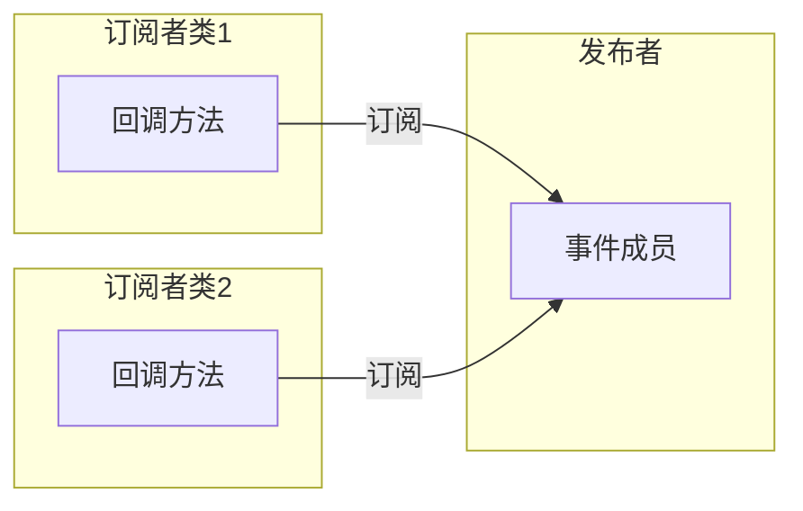
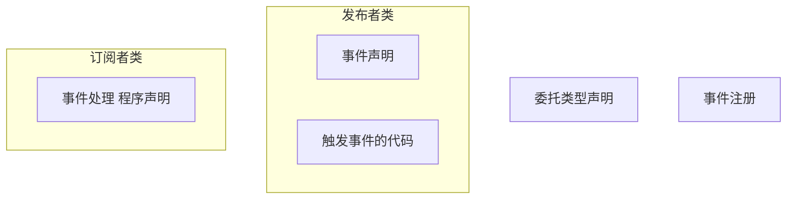

发布者/订阅者模式，源代码组件概览

<!-- more -->

## 1.1 概述

- 事件和委托类似，事件就像是某种特殊用途的简单委托。
- 事件内部包含了一个私有的委托，并提供了对私有委托的结构化访问，用户无法直接访问委托。
- 事件可用的操作比委托要少，事件只能添加删除调用事件处理程序。
- 事件被触发时，调用委托来一次调用方法列表中的方法。
- 事件也可以是静态的。
- 事件是成员，并不是类型。

## 1.2 发布者/订阅者模式

发布者/订阅者模式可以在特定的程序事件发生时，程序的其他部分收到通知。

发布者定义一个事件，其他类可以通过向发布者提供体一个方法来注册，当事件发生时，发布者执行订阅者所提交的方法，订阅者提供的方法称为回调方法。



- 发布者：发布某个事件的类或者结构，其他类可以在该事件发生时得到通知。
- 订阅者：注册并在事件发生时得到通知的结构。
- 事件处理程序：由订阅者注册到事件的方法。
- 触发事件：调用或触发事件。

## 1.3 源代码组件概览

事件由五个部分组成：

1. 委托类型声明：事件和事件处理程序必须有相同的签名和返回类型，通过委托进行描述。
2. 事件处理程序声明：不一定是显示的命名方法，也可以是匿名方法或者lambda表达式。
3. 事件声明：发布者必须声明一个订阅者类可以注册的事件成员，当声明的事件为public时，称发布了事件。
4. 事件注册：订阅者必须订阅事件才能得到通知。
5. 触发事件的代码：发布者类触发事件并导致调用所有事件处理程序的代码。



## 1.4 声明组件

事件声明需要委托类型的名字。可以用已存在的，或自己声明一个。如果自己声明，必须指定事件保存的方法的签名和返回类型。BCL中有EventHandler委托，专门用于系统事件。

事件声明在一个类中，声明需要注意的点：

1. 它需要委托类型的名称，任何附加到事件的事件处理程序都必须和委托类型的签名和返回类型匹配。
2. 声明为public，其他类和结构才能注册事件处理程序。
3. 不能使用对象创建表达式new来创建事件对象。

```csharp
class Eg
{
    //   关键字   委托类型      事件名
	public event EventHandler AEvent;
    
    //可以使用逗号声明一个以上的事件：
    public event EventHandler AEvent,AEvent1,AEvent2;
    
    //也可以使用static关键字让事件变为静态的
    public static event EventHandler AEvent;
}
```

由于事件是成员：

- 不能在一段可执行代码中声明事件。
- 必须声明在类和结构中。
- 被隐式自动初始化为null。

## 1.5 订阅,移除事件

事件处理程序的规范：

- 实例方法的名称。
- 静态方法的名称。
- 匿名方法。
- Lambda表达式。

使用+=运算符为事件增加事件处理程序，增加方法也就是订阅：

```csharp
//类      事件成员	
Someclass.Aevent += Method;     //实例方法
Someclass.Aevent += Class.Method; //静态方法
Someclass.Aevent += new EventHandler(Method) //委托形式
Someclass.Aevent += ()=> x++; //Lambda表达式
Someclass.Aevent += delegate{x++;} //匿名方法
```

使用-=号移除一个订阅，但如果 处理程序向事件注册了多次，那当执行命令移除处理程序时，将只移除列表中该处理程序的最后一个实例。和委托一样。

## 1.6 触发事件

事件保存了事件处理程序，但如果事件不被触发，任何处理程序都不会被调用。

触发事件之前应该和null进行比较，看看是否事件是或否包含处理程序：

```csharp
if(Aevent != null)
	Aevent(x,y);
```

一个简单的例子：

```csharp
delegate void Handler();
class A
{
    public event Handler Aevent;
    
    public void DoCount()
    {
        for (...)
            Aevent();
    }
}
class B
{
    public int x;
    public B(A classa)
    {
        x = 0;
        classa.Aevent += Method;
    }
    public void Method()
    {
        x ++;
    }
}
```

## 1.7 标准事件的用法

GUI编程是事件驱动的。

.net提供了一个标准模式，事件使用的标准模式的根本就是System命名空间下的Eventhandler委托类型。 Eventhandler的声明如下：

```csharp
public delegate void EventHandler(object sender,EventArgs e);
```

- sender参数用于保存触发事件的对象的引用。
- e保存状态信息，指明什么类型适用于该应用程序。
- 事件处理程序的签名必须和EventHandler委托匹配。

例子：

```csharp
class A
{
    //使用系统定义的EventHandler委托。
    public event EventHandler Aevent; 
    
    public void DoCount()
    {
        for (...)
            //触发事件时使用EventHandler的参数
            Aevent(this,null);
    }
}
class B
{
    public int x;
    public B(A classa)
    {
        x = 0;
        classa.Aevent += Method;
    }
    //事件处理程序的签名必须和委托匹配
    public void Method(object sender,EventArgs e)
    {
        x ++;
    }
}
```

### 1.7.1 Eventargs

Eventargs被设计为不能传递任何数据，它用于不需要传递数据的事件处理程序。通常会被忽略。（类型结构）

但Eventargs很重要，他和object总是基类，这样eventhandler提供了任何事件和事件处理程序都通用的签名。

拓展Eventargs来传递数据：

```csharp
public class AExtendClass:Eventargs
{
    public int SomeArg;
}

//使用,泛型委托使用自定义类
public delegate void EventHandler<AExtendClass> Aevent;
```

:grey_question:不明为什么要用泛型

完整的例子：

```csharp
public class AExtendClass:Eventargs
{
    public int SomeArg;
}

class A
{
    //使用自定义的泛型委托。
    public event EventHandler<AExtendClass> Aevent; 
    
    public void DoCount()
    {
        AExtendClass eventarg = new AExtendClass();
        for (...)
            //触发事件时传递参数
            eventarg.somearg = 1;
            Aevent(this,eventarg);
    }
}
class B
{
    public int x;
    public B(A classa)
    {
        x = 0;
        classa.Aevent += Method;
    }
    //事件处理程序的签名必须和委托匹配
    public void Method(object sender,AExtendClass e)
    {
        Console.WriteLine(e.somearg);
    }
}
```

## 1.8 事件访问器

+=和-=是事件唯一允许的运算符，但可以通过实现事件访问器自定义一些代码进去。修改运算符的行为。

事件访问器看上去和声明一个属性差不多，声明了事件访问器以后，事件不包含任何内嵌的委托对象。必须自己实现机制来存储和移除事件注册方法。

事件访问器表现为void方法 就是不能使用带返回值的return语句。

```csharp
public event EventHandler Aevent
{
    add{...}
    remove{.....}
}
```


