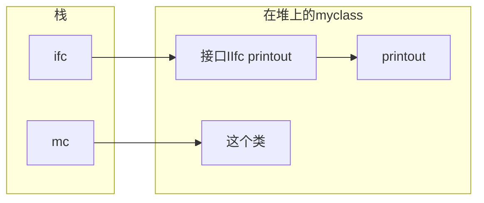

枚举相关内容

接口基础

<!-- more -->

## 1.1 概述

接口是指定一组方法成员而不实现它们的引用类型。只能类和结构来实现接口。

接口是引用类型。

类强制转换未实现的接口的引用会抛出一个异常，可以使用as运算符避免这个问题。如果类没有实现接口，as运算符的表达式会返回null而不是抛出异常。

例如：array类的sort方法依赖于Icomparable接口，接口声明在BCL中，包含一个comparato方法。我们可以为自己的类添加compareto方法，这样sort就可以使用了。如果没有自定义compareto方法，sort调用不存在的compareto方法会抛出异常。

```csharp
//实现IComparable的例子
class  Myclass:IComparable
{
    public int TheValue;

    public int CompareTo(object obj)
    {
        Myclass mc = (Myclass)obj;
        if (this.TheValue < mc.TheValue)
        {
            return -1;
        }else
        {
            return 1;
        }
    }
}
```

一个使用的例子：

```csharp
interface Iinfo
{
    string GetName();
    string GetAge();
}
//实现接口
class CA:Iinfo
{
    public string Name;
    public int Age;
    public string GetName(){return Name;}
    public string GetAge(){return Age.ToString();}
}
//实现接口
class CB:Iinfo
{
    public string First;
    public string Last;
    public double PersonsAge;
    public string GetName(){return First;}
    public string GetAge(){return Last;}
}
class Program
{
    static void PrintInfo(Iinfo item)
    {
        Console.WriteLine(item.GetName());
    }
    static void Main()
    {
        CA a = new CA(){Name = "xxxxx",Age = 12};
        CB b = new CB(){First = "zzzzz",PersonsAge = 22.2};
        //对象的引用自动转换为接口的引用。
        PrintInfo(a);
        PrintInfo(b);
    }
}
```




## 1.2 声明接口

声明的惯例是接口命名以大写i开头。

接口的声明可以有任何访问修饰符(public protected internal private)，但是接口的成员不允许有任何访问修饰符，成员为隐式public的。

接口不能包含以下成员：

- 数据成员
- 静态成员

只能包含以下类型的非静态成员函数声明：

- 方法
- 属性
- 事件
- 索引器

如果类从基类实现了接口，基类列表中的基类名称必须放在所有接口之前。

## 1.3 实现多个接口

接口可以实现多个。

- 类或结构可以实现任意数量的接口，这一点和类的继承是不同的。
- 所有实现的接口必须列在基类列表中并用逗号分隔。
- 如果一个类实现了多个接口，那他可以通过转换as运算符来获得多个接口的引用。

## 1.4 派生成员作为实现

MyBassClass包含了PrintOut方法，和IIfc1的方向相匹配，Derived有一个空的声明主题，但他派生自MyBaseClass，并且在基类列表包含了IIfc1，所以即使Derived的声明主体是空的，基类的代码还是能满足接口的需求。

:grey_question:子类没有实现方法怎么办？

```csharp

interface IIfc1{void PrintOut(string s)};
class MyBassClass
{
    public void PrintOut(string s)
    {
        Console.WriteLine(s);
    }
}
class Derived : MyBassClass, IIfc1
{

}
class Program
{
    static void Main()
    {
        Derived d = new Derived();
        d.PrintOut("object");
    }
}
```

## 1.5 显示接口成员实现

如果需要分离不同的接口，可以创建显示接口成员实现。

和所有接口的实现一样，位于实现了接口的类或结构中。但它使用限定接口名称声明：

```csharp
class Derived : MyBassClass, IIfc1,IIfc2
{   public void IIfc1.PrintOut(string s)
    {
        Console.WriteLine(s);
    }
     public void IIfc2.PrintOut(string s)
    {
        Console.WriteLine(s);
    }
}
```

因为他们不是类级别的实现了，所以显示接口成员实现之后，可以通过接口的引用调用方法。

即使是类中的其他成员，也不能访问显示实现。需要强制转换此类或实例为接口的引用调用显示接口实现：

```csharp
public void Method()
{
	PrintOut();  //编译错误
	this.PrintOut();  //编译错误
	((IIfc1)this).PrintOut();
}
```

显示接口实现对继承产生了重要的影响，由于其它类成员不能直接访问显示接口成员实现，衍生类的成员也不能直接访问他们，必须总是通过接口的引用来访问。

## 1.6 接口可以继承接口

接口本身可以被一个或多个接口继承。

与类不同，类的基类列表只能只能有一个类。但接口可以在基接口列表有任意多的接口。列表中的接口可以继承其他接口。结果接口包括它声明的所有接口和所有基接口成员。