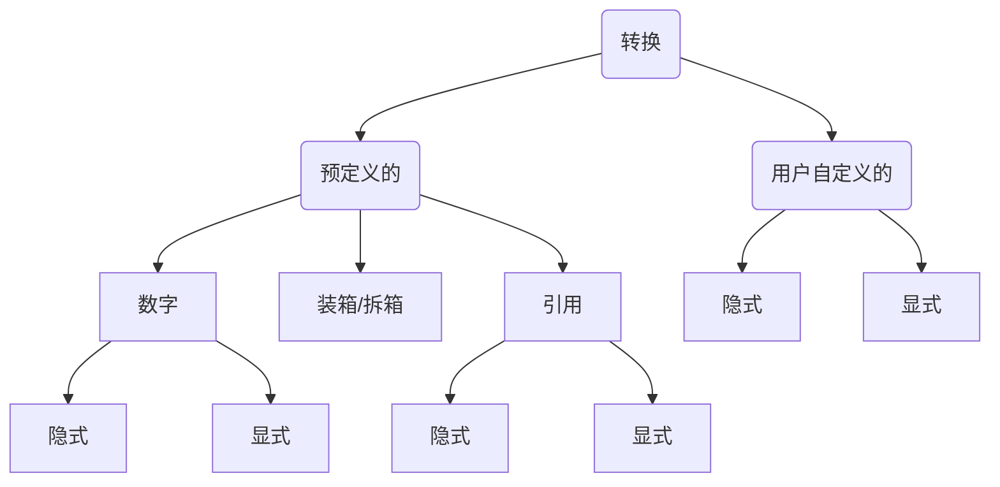

显示转换和强制转换

<!-- more -->

## 1.1 概览

转换的定义： 接受一个类型的值并使用它作为另一个类型的等价值过程。

转换后的值应该和源值一样的。但其类型为目标类型。

## 1.2 隐式转换

  语言会自动做的转换叫自动转换，比如8位转16位 从位数少的转为高数，多出来的位用0或1补充， 补0的过程叫零扩展。

对于有符号的类型转换，额外的高位用源表达式的符号位进行填充。这种叫符号拓展：

```csharp
//正数
				0|0|0|0|1|0|1|0|   //sbyte:10
//复制到高位的符号位
0|0|0|0|0|0|0|0|0|0|0|0|1|0|1|0|   //short:10
                    
//负数
				1|1|1|1|0|1|1|0|   //sbyte:-10        
1|1|1|1|1|1|1|1|1|1|1|1|0|1|1|0|   //short:-10        
```

## 1.3 显示转换和强制转换

当无符号16位ushort的值是相对小一点的数字(0.4%) 时，才能在不损失数据的情况下转换为无符号8位byte类型。

数据中其他结果会溢出，会产生其他值：

```csharp
0|0|0|0|0|1|0|1|0|1|0|1|0|1|0|1  //1365
				0|1|0|1|0|1|0|1	 //85
```

如果原类型的任意值会被转换成目标类型值时会出现丢失值的情况，语言不会自动提供转换。必须使用显示转换，这叫做强制转换表达式。

## 1.4 转换的类型



可以为自定义类型定义隐式转换和显示转换。

还有一个预定义的转换类型，叫装箱。可以将任何值类型转换为：

- object类型
- System,valuetype类型。

拆箱可以将一个装箱的值转换为原始类型。

## 1.5 数字的转换

图太麻烦了，总之位数大的转小的是显式转换，小的转大的是隐式转换，就像两个大小不一样的水杯倒水一样。

另外，同类型的无符号要比有符号位数少。


## 1.6 溢出检测上下文

 checked和unchecked运算符，用于检查转换是否溢出。

如果指定一个表达式或一段代码为checked，CLR会在转换产生溢出时派出一个overflowexception异常。

如果代码不是checked，转换会继续而不管是否产生溢出。

```csharp
public void method()
{
    byte sb;
    ushort sh = 2000;

    unchecked
    {
        sb = (byte)sh;
        Console.WriteLine(sb);

        checked
        {
            sb = (byte)sh;
            Console.WriteLine(sh);
        }
    }
    byte sb;
    sb = unchecked((byte)sh);
    Console.WriteLine(sb);

    sb = checked((byte)sh);
    Console.WriteLine(sb);
}
```

*checked和unchecked运算符checked和unchecked语句是两回事。

## 1.7 引用转换

- 引用保存的信息是它指向的数据类型。
- 引用转换接受源引用，并返回一个指向堆中同一位置的引用，但是把引用标记为其他类型。

### 1.7.1 隐式引用转换

1. 所有引用类型都可以被隐式转换为object类型。
2. 任何类型可以隐式转换到它继承的接口。
3. 类可以隐式转换到：他继承链中的任何类，它实现的任何接口。

委托可以隐式转换成.Net BCL类和接口：

- System.Delegate
- System.MulticastDelegate
- System.ICloneable
- System.Runtime.Serilization.Iserialiable

ArrayS数组，其中元素是Ts类型，可以转换成：

- System.ICloneable，System.IList，System.ICollection，System.IEnumerable
- System.Array
- 另一个数组ArrayT，其中元素是Tt类型，如果Tt类型满足以下所有条件：1.两个数组有一样的维度。2.元素类型Ts和Tt都是引用类型，不是值类型。3.Ts和Tt存在隐式转换。

### 1.7.2 显示引用转换

显示引用转换是从一个普通类型到一个更精确类型的引用转换：

- 从object到任何引用类型的转换
- 从基类到从它继承的类的转换。

编译器允许无限制的类型转换，如果没能成功转换，会抛出异常，但并不会导致编译错误。

有效显示引用转换有三种情况：

1. 没必要的显示转换。也就是说语言进行了隐式转换

   ```csharp
   class A{}
   class B:A{}
   B var1 = new B();
   A var2 = (A)var1 //不必转换，因为A是B的基类。
   ```

2. 源引用是null：

   ```csharp
   class A{}
   class B:A{}
   A var1 = null;
   B var2 = (B)var1 //允许转换，因为var1是空
   ```

3. 由源引用指向的实际数据可以被安全的进行隐式转换。

   ```csharp
   class A{}
   class B:A{}
   B var1 = new B();
   A var2 = var1;
   B var3 = (B)var2;  //允许转换，因为数据是B类型的。
   ```


## 1.8 装箱转换

包括值类型在内的所有c#类型都派生自object类型。

### 1.8.1 装箱

 如果值类型想使用对象组件，就可以使用装箱。

-  装箱是一种隐式转换，接受值类型的值，根据这个值在堆上创建一个完整的引用类型对象并返回对象引用。
- 装箱是创建副本。装箱返回的是值的引用类型副本，装箱后该值有两份副本，原始值类型和引用类型副本。每一份独立操作。

*引用类型转换成object不叫装箱，因为它只是引用指向的堆数据改变了，并非把值类型数据装到堆上。

装箱的过程：

```
int i = 12;
object o = null;
o = i;
```

在第三步时，系统做了如下操作：

1. 由于i时值类型对象，当i赋值给o时，必须在堆上分配一个对象的引用。所以在堆上创建了int类型的对象。
2. 将i的值复制到int对象。
3. 返回int对象的引用，让oi作为引用保存，此时oi指向的是，堆上的int对象的object部分。

任何值类型ValueTypeS都可以被隐式转换为object类型，System.ValueType或InferfaceT(如果ValueTypeS实现了InferfaceT)。

### 1.8.2 拆箱

拆箱是把装箱后的对象，显示转换为值类型的过程。

系统把值类型拆箱为ValueTypeT时，检测到要拆箱的对象实际是ValueTypeT的装箱值，然后把对象的值复制到变量。

## 1.9 用户自定义转换

可以为类或结构定义隐式和显示转换。

除了implicit和explicit关键字以外，隐式和显示转换的声明语法是一样的。

需要有public和static修饰符：

```csharp
public static implicit operator TargetType(SourceType type)
{
    return SomeObject;
}
//例子
public static implicit operator int(Person P)
{
    return p.Age;
}
```

用户自定义转换的约束：

- 只可以为类和结构自定义。
- 不能重定义标准隐式转换或显示转换。
- 对于源类型S和目标类型T，以下命题是真：
  - S和T必须是不同类型。
  - S和T不能通过继承关联。
  - S和T都不能是接口或object类型。
  - 转换运算符必须是S或T的成员。
- 对于相同的源和目标类型，不能声明隐式转换和显示转换。

例子：

```csharp
class  Person
{
   
    public Person(string name,int age)
    {
        Name = name;
        Age = age;
    }

    public static implicit operator int(Person P)
    {
        return p.Age;
    }

    public static implicit operator Person(int i)
    {
        return new Person("None",i);
    } 
}
class  Program
{
    static void Main()
    {
        Person bill = new Person("bill",25);
        int age = bill;
        Person p = 35;
    }
}
```

显示转换只是关键字换成了explicit，并且使用时需要使用强制转换表达式。

之前讲的是单步用户自定义转换。但用户自定义转换在完整转换中最多可以有3个步骤：

1. 预备标准转换
2. 用户自定义转换
3. 后续标准转换

在这个链中不可能有一个以上的用户自定义转换。

继上面的例子，展示多步的转换：

```csharp
class Em:Person{}
Em em = new Em(); em.Name = "a"; em.Age = 2;
float fVar = em;  
//步骤：1.em通过标准转换为Person，2.Person通过自定义转换为int，3.int通过标准转换为float。
```

## 1.10 is as运算符

### 1.10.1 is运算符

is运算符可以避免盲目的转换。只能用于引用转换以及装箱拆箱转换，不能用于用户自定义转换。

```csharp
Expr is TatgetType //返回bool
```

如果Expr通过以下方式成功转换为TatgetType，返回true：

- 引用转换
- 装箱转换
- 拆箱转换

### 1.10.2 as运算符

as运算符和强制转换运算符类似 但它不抛出异常。如果转换失败返回null。

```csharp
Expr as TatgetType //返回引用
```

由于as运算符返回引用表达式，所以可以作为赋值操作中的源。

as和is类似，只能用于引用转换和装箱转换，不能用于用户自定义类型或到值类型的转换。

