iOS的SDK接入流程

基础笔记

<!-- more -->

## 一 .net框架

### 1.2 .net框架构成

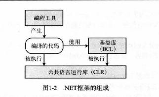

CLR：Common Language Runtime 公共语言运行库

BCL：Base Class Library  基础类库

（或者称为框架类库 Framework Class Library ， FCL）

自己写程序时可以调用BCL

### 1.3编译成CIL

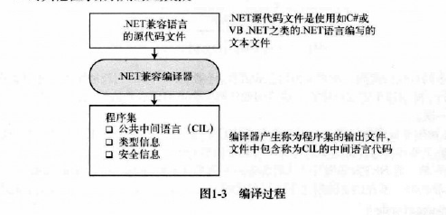

使用编程语言写好的文件需要使用编译器生成**程序集**文件，程序集文件只能是可执行的，或者是**DLL**。并且程序集中的不是本机代码，而是CIL（Common Intermediate Language）公共中间语言的中间语言。

和CIL有关的还有IL和MSIL 不过已经很少用到了

### 1.4编译成本机代码并执行

CIL被调用运行时才会被编译成本机代码。

（先检查程序集的安全特性）

JIT: Just-in-Time 实施编译器

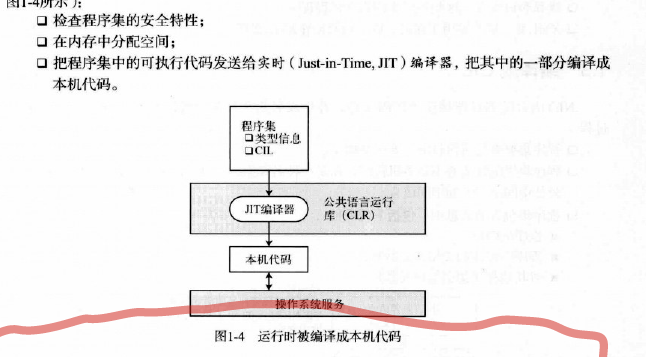

程序集中的可执行代码只有在需要时才会有JIT编译，编译后被缓存起来以备后面的程序执行。不被调用的代码将不会被编译。并且被调用的代码只编译一次。

CIL被JIT编译为本机代码后，在运行时会被CLR管理，执行GC检查数组边界参数类型异常管理的任务。

托管代码managed code：.net编写的代码成为托管代码。

非托管代码 unmanaged code：不在CLR控制之下的代码，如Win32，C/C++ DLL。

Ngen工具可以将程序集转换成当前处理器的本机代码。Ngen处理过的代码可以面去运行时的JIT编译过程。

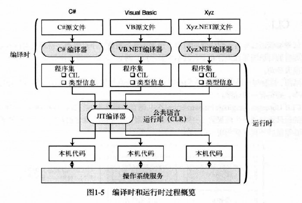

### CLR

CLR是核心组件，

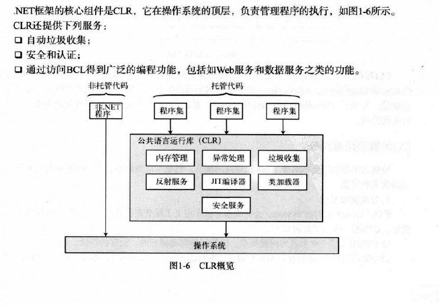

可以看到，非托管代码CLR不提供服务。

### CLI

CLI （Common Language Infrastructure,公共语言基础结构）一组数据结构 系统标准

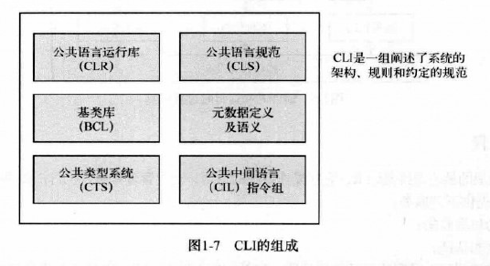

CLI的重要组成部分是：

1.CTS（COmmon Type System 公共类型系统）定义了托管代码中一定会使用的类型特征。.net兼容的编程语言的类型通常会映射到CTS中已定义的类型。

CTS最重要的特征是，所有类型都继承公共的基类 object

使用CTS可以确保系统类型和用户定义类型能被任何.net兼容的语言所使用

2.CLS（COmmon Language Soecification公共语言规范）详细说明了.net兼任语言的规则和行为，包括参数传递，类结构，数据类型。

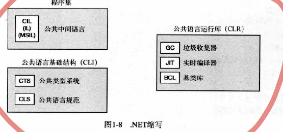


c#的演化可以单独说一下

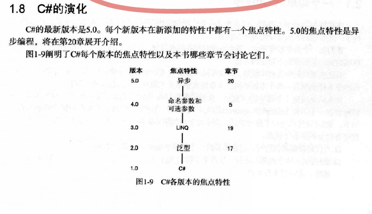

## 二

`csc HelloWord.cs `  命令行启动csc C#编译器对文件进行编译。

### 1.有的没的

标识符：

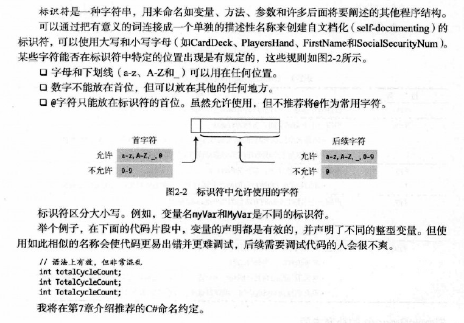

关键字：

上下关键字是仅在特定语言结构中充当关键字的标识符。上下文关键字可以在代码的其他部分被用做标识符。

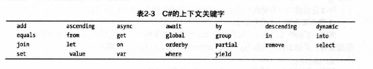

块：

大括号包围的多条语句和序列，**在语法上相当于一条语句**

用途：

语法上只需要一条语句，但执行的动作无法用一条简单语句表达。

有一些特定的程序结构只能使用块，哪些结构？？

块后面不跟分号

WriteLine

{0} {1} 这叫替换值

```csharp
Console.WriteLine("aaaa {0} and {1}",3,6);
```

也可以：

```csharp
Console.WriteLine("aaaa {0} and {1}",3,6);
```

不要试图引用替换值长度列以外位置的值，比如{2}

格式化数字字符串

这{1：C}叫格式说明符或者对齐说明符

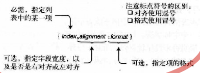

格式说明符如：

```
Console.WriteLine("aaaa {0:C}",3);
```

对齐说明符如：

```
Console.WriteLine("aaaa {0,10}",3);
```

负数表示左对齐

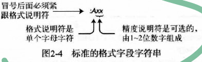

```
Console.WriteLine("aaaa {0:F4}",3.123);
```

像这种就表示显示四位小数点。

格式说明符可以去查表

文档注释

```csharp
///<summary>
///这是说明
///</summary>
```

文档注释包含XML文本，可以生成程序文档，25章会讲。

## 三

**c是一组函数和数据类型，c++是一组函数和类，但是c#的程序是一组类型声明**。

C#程序或DLL源代码是一组类型声明

Main方法当然也是必须的。

**命名空间**是一种把相关的类型声明分组并命名的办法。

```csharp
namespace Game
{
    DeclarationOfTypeA
    
    DeclarationOfTypeB
    
    class C
    {
        static void Main()
        {
            
        }
    }
}
```

三个类型被声明在Game命名空间中。命名空间会在21章讲。

类就是一个模板，它本身并不是数据结构，但他说明了由模板构造的对象的特征。

BCL或者其他库也会提供一些类。

类里面的叫数据成员和函数成员。

### 预定义类型

和C/C++不一样，c#数字不具有布尔意义。

16中预定义类型：

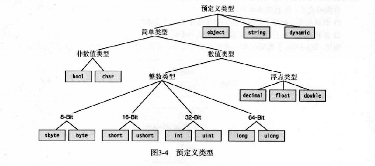

c#的类型名称就是.net类型的别名。.net类型可以在c#中使用（不推荐）。

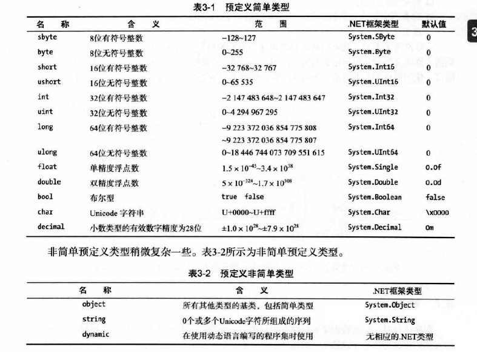


用户定义的类型：

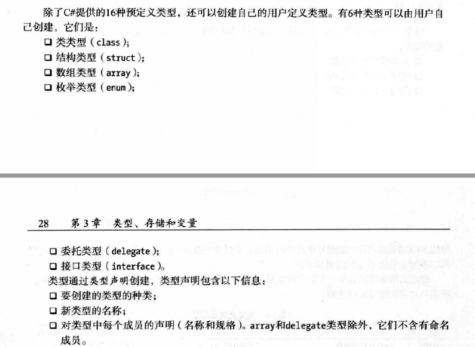

预定义类型可以直接用，如int。用户定义类型必须先声明后实例化。

### 堆和栈

栈是内存数组，


堆是一块内存区域，GC会自动清除堆对象。


**类型决定了对象的存储位置。**

类型有两种：值类型和引用类型。值类型存放在栈里。

引用类型需要两端内存，一个存实际的数据，在堆中。另一个存引用，指向堆的存放位置，可能在堆中也可能在栈中。

**对于一个引用类型，其实例数据部分始终存放在堆里** 无论值还是引用


int var ， float var1这种是不可以的

stirng是引用类型 


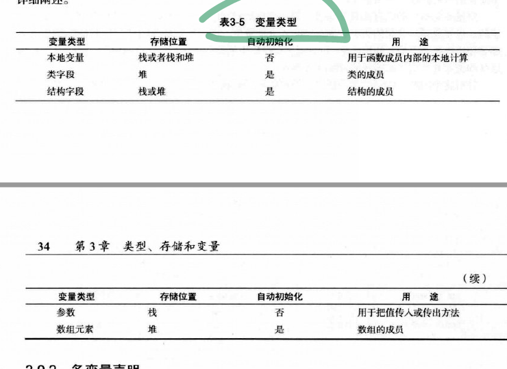

dynamic关键字的类型在运行时才会被解析。

## 四

字段是数据成员 方法是函数成员


c#和c++不同，不能再类型的外部声明全局变量。所有的字段都属于类型。也没有全局方法（在类型的外部)。

不带修饰符默认私有成员

## 五

方法体也是个块


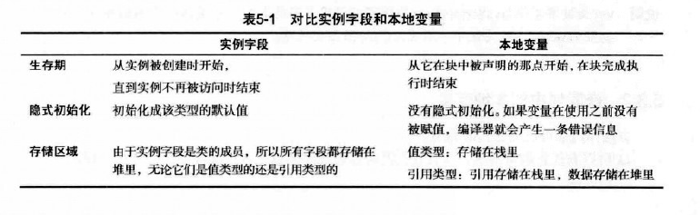


