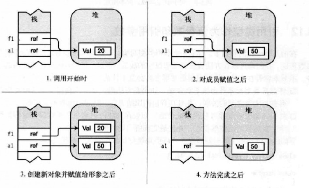
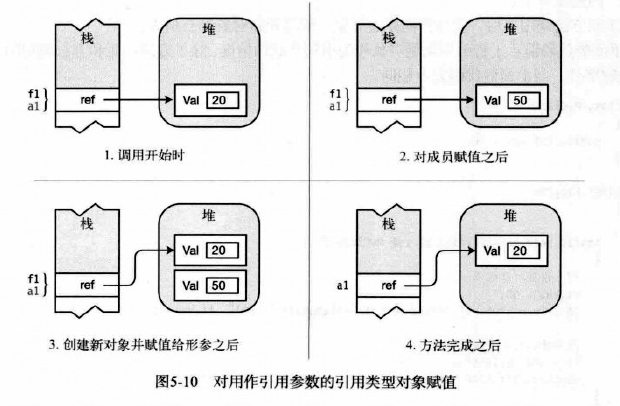
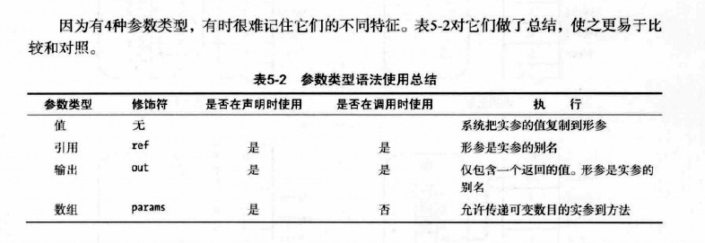
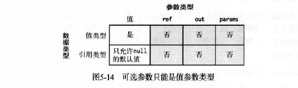

iOS的SDK接入流程

基础笔记

<!-- more -->

## 一 .net框架

### 1.2 .net框架构成


CLR：Common Language Runtime 公共语言运行库

BCL：Base Class Library  基础类库

（或者称为框架类库 Framework Class Library ， FCL）

自己写程序时可以调用BCL

### 1.3编译成CIL


使用编程语言写好的文件需要使用编译器生成**程序集**文件，程序集文件只能是可执行的，或者是**DLL**。并且程序集中的不是本机代码，而是CIL（Common Intermediate Language）公共中间语言的中间语言。

和CIL有关的还有IL和MSIL 不过已经很少用到了

### 1.4编译成本机代码并执行

CIL被调用运行时才会被编译成本机代码。

（先检查程序集的安全特性）

JIT: Just-in-Time 实施编译器


程序集中的可执行代码只有在需要时才会有JIT编译，编译后被缓存起来以备后面的程序执行。不被调用的代码将不会被编译。并且被调用的代码只编译一次。

CIL被JIT编译为本机代码后，在运行时会被CLR管理，执行GC检查数组边界参数类型异常管理的任务。

托管代码managed code：.net编写的代码成为托管代码。

非托管代码 unmanaged code：不在CLR控制之下的代码，如Win32，C/C++ DLL。

Ngen工具可以将程序集转换成当前处理器的本机代码。Ngen处理过的代码可以面去运行时的JIT编译过程。


### CLR

CLR是核心组件，


可以看到，非托管代码CLR不提供服务。

### CLI

CLI （Common Language Infrastructure,公共语言基础结构）一组数据结构 系统标准


CLI的重要组成部分是：

1.CTS（COmmon Type System 公共类型系统）定义了托管代码中一定会使用的类型特征。.net兼容的编程语言的类型通常会映射到CTS中已定义的类型。

CTS最重要的特征是，所有类型都继承公共的基类 object

使用CTS可以确保系统类型和用户定义类型能被任何.net兼容的语言所使用

2.CLS（COmmon Language Soecification公共语言规范）详细说明了.net兼任语言的规则和行为，包括参数传递，类结构，数据类型。


c#的演化可以单独说一下


## 二

`csc HelloWord.cs `  命令行启动csc C#编译器对文件进行编译。

### 1.有的没的

标识符：


关键字：

上下关键字是仅在特定语言结构中充当关键字的标识符。上下文关键字可以在代码的其他部分被用做标识符。


块：

大括号包围的多条语句和序列，**在语法上相当于一条语句**

用途：

语法上只需要一条语句，但执行的动作无法用一条简单语句表达。

有一些特定的程序结构只能使用块，哪些结构？？

块后面不跟分号

WriteLine

{0} {1} 这叫替换值

```csharp
Console.WriteLine("aaaa {0} and {1}",3,6);
```

也可以：

```csharp
Console.WriteLine("aaaa {0} and {1}",3,6);
```

不要试图引用替换值长度列以外位置的值，比如{2}

格式化数字字符串

这{1：C}叫格式说明符或者对齐说明符


格式说明符如：

```
Console.WriteLine("aaaa {0:C}",3);
```

对齐说明符如：

```
Console.WriteLine("aaaa {0,10}",3);
```

负数表示左对齐


```
Console.WriteLine("aaaa {0:F4}",3.123);
```

像这种就表示显示四位小数点。

格式说明符可以去查表

文档注释

```csharp
///<summary>
///这是说明
///</summary>
```

文档注释包含XML文本，可以生成程序文档，25章会讲。

## 三

**c是一组函数和数据类型，c++是一组函数和类，但是c#的程序是一组类型声明**。

C#程序或DLL源代码是一组类型声明

Main方法当然也是必须的。

**命名空间**是一种把相关的类型声明分组并命名的办法。

```csharp
namespace Game
{
    DeclarationOfTypeA
    
    DeclarationOfTypeB
    
    class C
    {
        static void Main()
        {
            
        }
    }
}
```

三个类型被声明在Game命名空间中。命名空间会在21章讲。

类就是一个模板，它本身并不是数据结构，但他说明了由模板构造的对象的特征。

BCL或者其他库也会提供一些类。

类里面的叫数据成员和函数成员。

### 预定义类型

和C/C++不一样，c#数字不具有布尔意义。

16中预定义类型：


c#的类型名称就是.net类型的别名。.net类型可以在c#中使用（不推荐）。


用户定义的类型：


预定义类型可以直接用，如int。用户定义类型必须先声明后实例化。

### 堆和栈

栈是内存数组，


堆是一块内存区域，GC会自动清除堆对象。


**类型决定了对象的存储位置。**

类型有两种：值类型和引用类型。值类型存放在栈里。

引用类型需要两端内存，一个存实际的数据，在堆中。另一个存引用，指向堆的存放位置，可能在堆中也可能在栈中。

**对于一个引用类型，其实例数据部分始终存放在堆里** 无论值还是引用


int var ， float var1这种是不可以的

stirng是引用类型 


dynamic关键字的类型在运行时才会被解析。

## 四

字段是数据成员 方法是函数成员


c#和c++不同，不能再类型的外部声明全局变量。所有的字段都属于类型。也没有全局方法（在类型的外部)。

不带修饰符默认私有成员

## 五

方法体也是个块


var关键字不是特定类型变量的符号，只是语法速记。表示可以从右侧推断出类型。

var只能用于本地变量，不能用于字段，只能在变量声明中包括初始化时使用，一点推断出类型则是固定不可更改的。

和js的var不一样。


本地变量的生存周期只在块里，直到声明他的那个块的尾部结束。

c#和c++不一样 不允许在第一个有效范围内声明另一个同名本地变量。

const 关键字不是修饰符，是核心声明的一部分必须放在类型前面。

const必须在声明时初始化，且后面不能改变。

const 必须有初始化语句。

const也可以是null引用，但不能是某个对象的引用，因为对象的引用实在运行时决定的。


return； 这种只能用在void方法。

实参可以隐式转换为形参


几种参数类别

**值参数**是把实参的值复制给形参。所以会复制引用，对于值类型会复制值。实参同时必须是变量，在用作实参前必须被赋值。如果是引用需要复制引用或者null

值参数系统在栈上为形参分配内存。

```C
void MyMethod（ref int val）｛...｝

int y = 10；

MyMethod（ref y）；


```


**引用参数**，**声明和调用**都使用ref修饰符。**实参同时必须是变量**，在用作实参前必须被赋值。如果是引用需要复制引用或者null


必须是变量的意思是  xxx(ref 3+4)这种是不可以的。

引用参数不会在栈上分配内存，实际上，形参的参数名作为了实参变量的别名。指向相同的内存位置。

所以改了形参，实参也会变。


引用类型作为值参数和引用参数

无论是值参数还是引用参数，都可以在方法内部修改它的成员。但实质上还是有区别的：

1.作为值参数传递：如果在方法内创建一个新对象并赋值给形参，实参和形参的关联会切断。 方法调用结束后，新对象也就不在了。



2.作为引用参数传递，如果在方法内创建一个新对象并赋值给形参，在方法结束后该对象依然存在，并且是实参所引用的值。



**输出参数**

输出参数用于方法体内把数据传出到调用代码。

必须在声明和调用中都使用out修饰符。

实参同时也必须是变了，不能是其他类型的表达式，因为方法需要内存位置保存返回值。

```csharp
void Method(out int val){}

int y = 10;

Method(out y)

```

和引用参数相似，形参担当实参的别名，实参和形参是同一块内存。所以对形参的更改会改变实参。

输出参数有几个要求：

在方法中，输出参数在能够被读取前**必须被赋值**。这意味着参数的初始值是无关的，并且没必要在方法调用之前为实参赋值。

在方法返回前，内部贯穿的任何可能路径都必须为所有输出参数进行一次赋值。


此外，因为在方法内读取输出变量之前必须对其写入，所以不可能使用输出参数把数据传入方法。如果在赋值之前试图读取他，编译器会有错误信息。


**参数数组**

允许零个或多个实参对应一个特殊的形参，有几个要求：

1.参数列表中只能有一个参数数组。并且是最后一个

2.参数数组表示的所有参数必须有相同的类型。

声明参数数组必须做的事：

1.数据类型前使用params修饰符。

2.放一个方括号

```csharp
void ListInts(params int[] invals)
```

参数数组是一个数组，数组是引用类型，所以所有数据都保存在堆中。

可以通过两种方式给参数数组传参：

```csharp
ListInts（10,20,30）；

int[] intarray = {1,2,3};
ListInts（intarray）;
```

params修饰符不需要再调用时使用。

如果对应的形参数组没有实参，编译器会创建一个有零个元素的数组使用。

当数组在堆中被创建时，实参的值是被**复制**到数组中，像值参数。

如果数组是值类型，则值被复制，实参不受方法内部影响。

如果数组是应用类，那引用被复制，实参可能会收到方法内部影响。


数组作为实参

数组作为实参传递，便一起会使用实参数组而不是创建新的




重载


重载必须有和其他方法不一样的签名

签名包括：方法名称，参数数目，参数数据类型和顺序，参数修饰符。

**返回类型不是签名的一部分，形参的名称也不是签名的一部分。**


命名参数

之前用的都叫位置参数。

named parameter只要指定参数的名字，就可以任意顺序在方法调用中列出实参。

```
Method（c:2,a:4,B:3）;
```

可以同时使用位置参数和命名参数，但位置参数必须先列出来。


可选参数

optional parameter

表明某个参数是可选的，需要在方法声明时为参数提供默认值。

不是所有的参数类型都可以作为可选参数：

只有值类型的默认值可以在编译时确定，才可以将值类型作为可选参数

只有默认值是null的时候引用类型才可以作为可选参数使用




所有必填参数必须在可选参数声明之前声明。如果有params参数必须在所有可选参数之后声明。

```csharp
｛intx,decimal y ...int op = 19,double op2 = 32; ... params int[] intVals｝
```


省略参数必须在最后开始，也就是说不能前面省略，后面不省略。

如果需要随意省略可选参数，必须使用命名参数的特性来实现，使用可选参数的名字来消除歧义。


栈帧


