iOS的SDK接入流程

基础笔记

<!-- more -->

## 一 .Net框架

### 1.1 .net框架构成


**BCL(Base Class Library )** :

基础类库(或者称为框架类库 Framework Class Library ， FCL)，自己写程序时也会调到BCL

**CLR(Common Language Runtime)**： 

公共语言运行库。.net框架的核心组件，在操作系统的顶层，负责**管理**程序的执行。可以从下图看到，可以看到，非托管代码CLR不提供服务。

CRL还提供这几种服务：1.自动垃圾收集，2.安全和认证。3.通过访问BCL得到广泛的编程功能，如Web服务和数据服务。

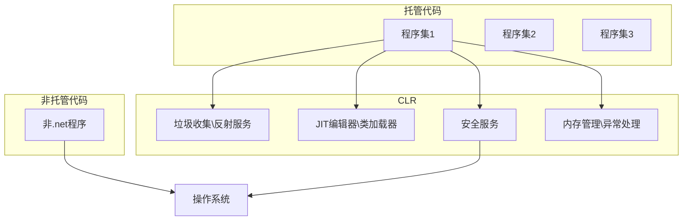

**托管代码(managed code)**：

.net编写的代码称为托管代码。

**非托管代码(unmanaged code)：**

不在CLR控制之下的代码，如Win32，C/C++ DLL。

### 1.2 编译过程

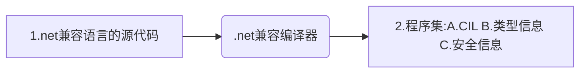

**解释：**

1. 使用c#或vb等.net语言编写的文本文件。
2. 使用编程语言写好的文件需要使用编译器生成**程序集**文件，程序集文件只能是可执行的，或者是**DLL**。并且程序集中的不是本机代码，而是CIL公共中间语言的中间语言，

**CIL（Common Intermediate Language）：**

公共语言基础结构，CIL是一组阐述了系统架构，规则，和约定的规范。也是一组数据结构，系统标准。和CIL有关的还有**IL**和**MSIL** 不过已经很少用到了。

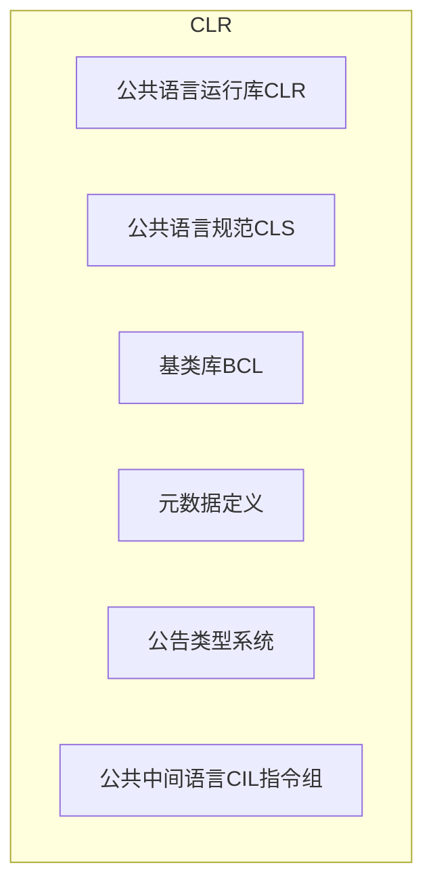

CLI的重要组成部分是：

1. **CTS（COmmon Type System ）**：公共类型系统，定义了托管代码中一定会使用的类型特征。.net兼容的编程语言的类型通常会映射到CTS中已定义的类型。CTS最重要的特征是，所有类型都继承公共的基类 object,使用CTS可以确保系统类型和用户定义类型能被任何.net兼容的语言所使用
2. **CLS（COmmon Language Soecification）**：公共语言规范，详细说明了.net兼任语言的规则和行为，包括参数传递，类结构，数据类型。

### 1.3 编译成本机代码并执行

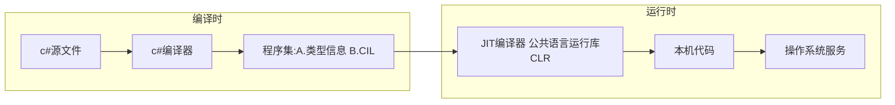

**编译步骤**：

1. 检查程序集的安全特性
2. 在内存中分配空间
3. 把程序集中的可执行代码发送给JIT，把其中一部分编译成本机代码。

**需要注意的点：**

- 程序集中的可执行代码只有在需要时才会有JIT编译，编译后被缓存起来以备后面的程序执行。不被调用的代码将不会被编译。并且被调用的代码只编译一次。
- CIL被JIT编译为本机代码后，在运行时会被CLR管理，执行GC检查数组边界参数类型异常管理的任务。
- CIL被调用运行时才会被编译成本机代码。

**JIT(Just-in-Time):**  实时编译器

Ngen工具可以将程序集转换成当前处理器的本机代码。Ngen处理过的代码可以免去运行时的JIT编译过程。

### 1.4 总结

.net的框架的结构和缩写:

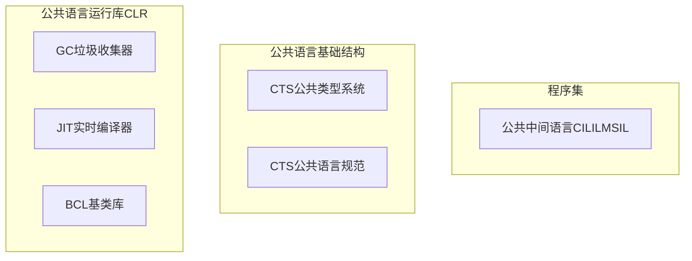

## 二.格式规则

### 2.1 标识符

用来命名如变量，方法，参数等程序结构的字符串。命名上有一些规则：

- 字幕和下划线可以用在任何位置。
- 数字不能放在首位，但是可以放在其他地方。
- @字符只能放在标识符首位，虽然允许使用，但不推荐使用@做字符。
- 标识符区分大小写。

### 2.2 关键字

**定义：**

> 关键字是预定义的保留标识符，对编译器有特殊意义。 除非前面有 `@` 前缀，否则不能在程序中用作标识符。 例如，`@if` 是有效标识符，而 `if` 则不是，因为 `if` 是关键字。

**上下文关键字：**

> 上下文关键字仅在一部分程序上下文中有特殊含义，可以在相应上下文范围之外用作标识符。 一般来说，C# 语言中新增的关键字会作为上下文关键字添加，以免破坏用旧版语言编写的程序。

上下关键字是仅在特定语言结构中充当关键字的标识符，可以在代码的其他部分被用做标识符。

上下文关键字：

|        |           |       |         |         |            |         |
| :----- | --------- | ----- | ------- | ------- | ---------: | :-----: |
| add    | ascending | async | await   | by      | descending | dynamic |
| equals | from      | get   | global  | group   |         in |  into   |
| join   | let       | on    | orderby | partial |     remove | select  |
| set    | value     | var   | where   | yield   |            |         |

### 2.3 其他

**块：**

大括号包围的多条语句和序列，**在语法上相当于一条语句**。用于语法上只需要一条语句，但执行的动作无法用一条简单语句表达。

**WriteLine**:

{0} {1} 这叫替换值

```csharp
Console.WriteLine("aaaa {0} and {1}",3,6);
```

也可以：

```csharp
Console.WriteLine("aaaa {1} and {0}",3,6);
```

不要试图引用替换值长度列以外位置的值，比如{2}

**格式化数字字符串**：

这{1：C}叫格式说明符或者对齐说明符

```
{index(必选指定列表中的某一项),alignment(可选,指定字段宽度对齐):format(可选，指定项的格式)}
```

```csharp
//格式说明符如：
Console.WriteLine("aaaa {0:C}",3);
```

```csharp
//对齐说明符如：
//负数表示左对齐
Console.WriteLine("aaaa {0,10}",3);
```

```csharp
//标准的格式字段字符串形如:Axx，其中A代表格式说明符，XX代表精度
Console.WriteLine("aaaa {0:F4}",3.123); //像这种就表示显示四位小数点。
```

**文档注释**：

```csharp
///<summary>
///这是说明
///文档注释包含XML文本，可以生成程序文档。
///</summary>
```


## 三.类型，存储和变量

### 3.1 CSharp的相关特点

c的程序是一组函数和数据类型，c++是一组函数和类，但是**c#的程序(可执行程序或DLL)是一组类型声明。**

Main方法当然也是必须的，c#同时引入了命名空间:

**命名空间**是一种把相关的类型声明分组并命名的办法。

```csharp
namespace Game
{
    DeclarationOfTypeA
    DeclarationOfTypeB
    class C
    {
        static void Main()
        {
        }
    }
}
```

*****类就是一个模板，它本身并不是数据结构，但他说明了由模板构造的对象的特征。

### 3.2 预定义类型

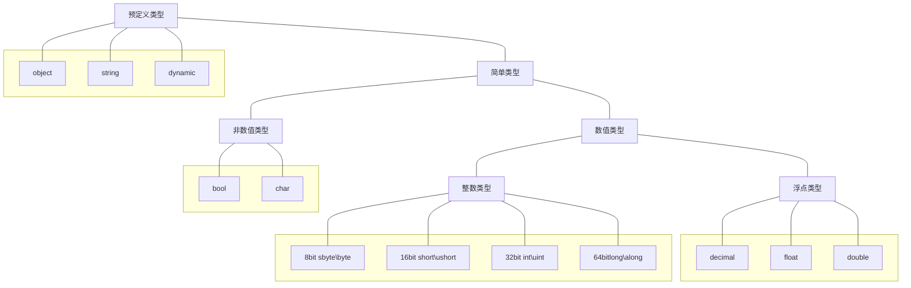

常用的预定义简单类型:

| 名称   | 范围                                                  | .net框架类型  | 默认值  |
| ------ | ----------------------------------------------------- | ------------- | ------- |
| byte   | 0~255 (2^8)                                           | System.Byte   | 0       |
| short  | -32768~32767 (2^16)                                   | System.Int16  | 0       |
| int    | -2147483638~2147483647 (2^32)                         | System.Int32  | 0       |
| long   | -9223372036854775808~<br />9223372036854775807 (2^64) | System.Int64  | 0       |
| float  | 1.5*10^(-45) ~ 3.4 *10^(38)                           | Sytem.Single  | 0.0F    |
| double | 5*10^(-324) ~ 1.7 *10^(308)                           | System.Double | 0.0D    |
| char   | U+0000~U+ffffSystem.Char                              | System.Char   | \ x0000 |

c#的类型名称就是.net框架类型的别名。.net框架类型可以在c#中直接使用但不推荐。

和C/C++不一样，c#数字不具有布尔意义。

预定义类型可以直接用，如int，和用户类型不一样。

### 3.3 用户类型

除了16种预定义类型，还可以创建用户定义类型，有6种类型可以由用户自己创建:

- 类类型(class)
- 结构类型(struct)
- 数组类型(array)
- 枚举类型(enum)
- 委托类型(delegate)
- 接口类型(interface)

*****用户定义类型必须先声明后实例化。

### 3.4 堆和栈

- 栈是内存数组。
- 堆是一块内存区域，GC会自动清除堆对象。

类型决定了对象的存储位置。类型有两种：值类型和引用类型。

- 值类型存放在栈里。
- 引用类型需要两块内存，一个存实际的数据，在堆中。另一个存引用，指向堆的存放位置，可能在堆中也可能在栈中。

*****对于一个引用类型，其实例数据部分始终存放在堆里，无论值还是引用

| 变量类型 | 存储位置     | 自动初始化 | 用途                       |
| -------- | ------------ | ---------- | -------------------------- |
| 本地变量 | 栈或者栈和堆 | 否         | 用于函数成员内部的本地计算 |
| 类字段   | 堆           | 是         | 类的成员                   |
| 结构字段 | 栈或堆       | 是         | 结构的成员                 |
| 参数     | 栈           | 否         | 用于把值传入或传出方法     |
| 数组元素 | 堆           | 是         | 数组的成员                 |

*注意：*

- dynamic关键字的类型在运行时才会被解析。
- c#和c++不同，不能再类型的外部声明全局变量。所有的字段都属于类型。也没有全局方法（在类型的外部)。

## 四.方法

*****方法体也是个块

### 4.1 变量的生存周期

|                | 实例字段                                                     | 本地变量                                           |
| -------------- | ------------------------------------------------------------ | -------------------------------------------------- |
| **生存期**     | 从实例被创建开始                                             | 从它在块中被声明的那点开始，在块完成执行时结束。   |
| **隐式初始化** | 初始化该类型的默认值                                         | 没有隐式初始化。未初始化尝试使用编译器会报错。     |
| **存储区域**   | 实例字段是类的成员，所以所有字段都存在堆里。无论是值类型还是引用类型。 | 值类型：栈。引用类型：引用存在栈里，数据存在堆里。 |

*****c#和c++不一样 不允许在第一个有效范围内声明另一个同名本地变量。

### 4.2 隐式类型

- 在方法范围内声明的变量可以具有隐式类型var。var关键字不是特定类型变量的符号，只是语法速记。表示可以从右侧推断出类型。
- 隐式类型本地变量为强类型。
- var只能用于本地变量，不能用于字段，只能在变量声明中包括初始化时使用，一旦推断出类型则是固定不可更改的。
- 和js的var不一样。

### 4.3 Const关键字

- const 是核心声明的一部分必须放在类型前面。
- 必须有初始化语句，变量必须在声明时初始化，且以后不能改变。
- **const也可以是null，但不能是某个对象的引用，因为对象的引用是在运行时决定的。**

### 4.4 参数

**形参和实参**

形参（形式参数）：

- 方法的定义中的参数，一个占位符。没有数据，等到方法调用时接受传过来的参数。
- 只有在方法被调用时才会分配内存，方法调用结束后立即释放内存。

实参（实际参数）：

- 调用时传给形参。
- 实参必须有确切的值。
- 如果存在和形参类型的兼容，那么实参的类型可以和形参不一致。

**值传递参数和引用传递参数**

值传递参数：

- 把实参的值复制给形参。引用类型的实参会复制引用，对于值类型会复制值。
- 通过值传递参数，系统在栈上为形参分配内存。

引用传递参数：

- 引用传递参数不会在栈上分配内存，实际上，形参的参数名作为了实参变量的别名。指向相同的内存位置。所以修改了形参就是在修改实参。可以理解为C中的指针。
- 声明和调用使用ref修饰符。
- 实参同时必须是变量，在用作实参前必须被赋值。必须是变量的意思是 ，Function(ref 3+4)这种是不可以的。

*****数组作为实参传递，便一起会使用实参数组而不是创建新的

**引用类型作为值传递参数和引用传递参数**

无论是值参数还是引用参数，都可以在方法内部修改它的成员。但实质上还是有区别的。

作为值参数传递：

如果在方法内创建一个新对象并赋值给形参，实参和形参的关联会切断。 方法调用结束后，新对象也就不在了。

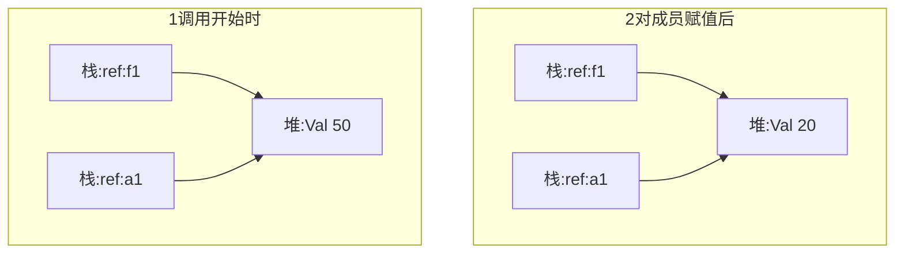

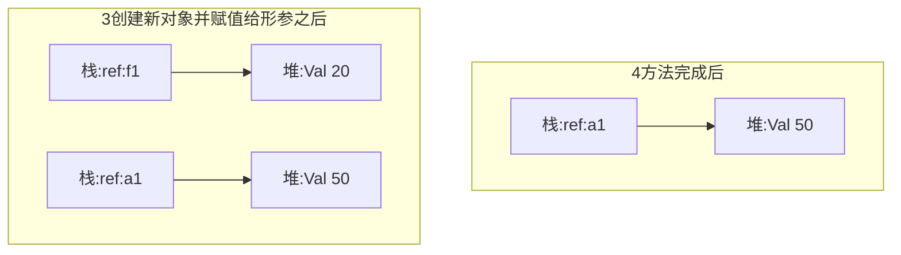

作为引用参数传递:

如果在方法内创建一个新对象并赋值给形参，在方法结束后该对象依然存在，并且是实参所引用的值。

**输出参数**

输出参数用于方法体内把数据传出到调用代码,必须在声明和调用中都使用out修饰符。输出参数out，我个人理解和ref是不同功能的，out参数主要是为了将方法中的变量传出，而ref是为了将变量传入方法。

- 实参同时也必须是变量（out 3+5 不可以），不能是其他类型的表达式，因为方法需要内存位置保存返回值。
- 和引用参数相似，形参担当实参的别名，实参和形参是同一块内存。所以对形参的更改会改变实参。

输出参数有几个要求：

- 在方法中，输出参数在能够被读取前**必须被赋值**。这意味着参数的初始值是无关的，并且没必要在方法调用之前为实参赋值。
- 在方法返回前，内部贯穿的任何可能路径都必须为所有输出参数进行一次赋值。
- 此外，因为在方法内读取输出变量之前必须对其写入，所以不可能使用输出参数把数据传入方法。如果在赋值之前试图读取他，编译器会有错误信息。

**参数数组**

关键字params，允许零个或多个实参对应一个特殊的形参，注意的点：

- 参数列表中只能有一个参数数组。并且是最后一个
- 参数数组表示的所有参数必须有相同的类型。
- params修饰符不需要在调用时使用。

格式：

```csharp
void ListInts(params int[] invals)
```

可以通过两种方式给参数数组传参：

```csharp
ListInts（10,20,30）；
int[] intarray = {1,2,3};
ListInts（intarray）;
```

一些补充：

- 参数数组是一个数组，数组是引用类型，所以所有数据都保存在堆中。
- 如果对应的形参数组没有实参，编译器会创建一个有零个元素的数组使用。
- 当数组在堆中被创建时，实参的值是被**复制**到数组中，像值传递参数。
- 如果数组是值类型，则值被复制，实参不受方法内部影响。
- 如果数组是引用类型，那引用被复制，实参可能会收到方法内部影响。

**命名参数和位置参数**

一般的方法，实参和形参的顺序一致。称为位置参数。

还有一种，只需要要指定参数的名字，就可以任意顺序在方法调用中列出实参。叫做命名参数。

```csharp
Method(c:2,a:4,B:3)
```

可以同时使用位置参数和命名参数，但位置参数必须先列出来。

**可选参数**

表明某个参数是可选的，需要在方法声明时为参数提供默认值。不是所有的参数类型都可以作为可选参数：

- 只有值类型的默认值可以在编译时确定，才可以将值类型作为可选参数
- 只有默认值是null的时候引用类型才可以作为可选参数使用（意思是只能在方法签名上将此形参标记为null，而不是在签名中去尝试new这个引用类型。）
- 可选参数只能是值类型。

对于方法签名：所有必填参数必须在可选参数声明之前声明，如果有params参数必须在所有可选参数之后声明。

对于调用方法：省略参数必须在最后开始，也就是说不能前面省略，后面不省略。如果需要随意省略可选参数，必须使用命名参数的特性来实现，使用可选参数的名字来消除歧义。

- 

**参数类型语法使用总结**

| 参数类型 | 修饰符 | 是否在声明时使用 | 是否在调用时使用 |                  执行                  |
| :------: | :----: | :--------------: | :--------------: | :------------------------------------: |
|    值    |   无   |                  |                  |        系统把实参的值复制到形参        |
|   引用   |  ref   |        是        |        是        | 仅包含一个返回的值。形参是实参的别名。 |
|   输出   |  out   |        是        |        是        |  仅包含一个返回的值。形参是实参的别名  |
|   数组   | params |        是        |        否        |     允许传递可变数目的实参到方法。     |

### 4.6 重载

注意重载的讲解放入在方法章节中，可以作为提醒:重载是方法的一个性质，和类无关。

（突然想到，c支持重载吗？）

- 重载必须有和其他方法不一样的签名，签名包括：方法名称，参数数目，参数数据类型和顺序，参数修饰符。
- **返回类型不是签名的一部分，形参的名称也不是签名的一部分。**

### 4.7 栈帧

调用方法时内存从栈的顶部开始分配，保存和方法关联的数据项。这块内存叫**栈帧**(stack frame)。栈帧包括如下内容：

- 返回地址，方法退出时继续执行的位置。
- 方法的值参数，或者参数数组。
- 和方法调用相关的其他数据管理项。

栈帧的展开过程：

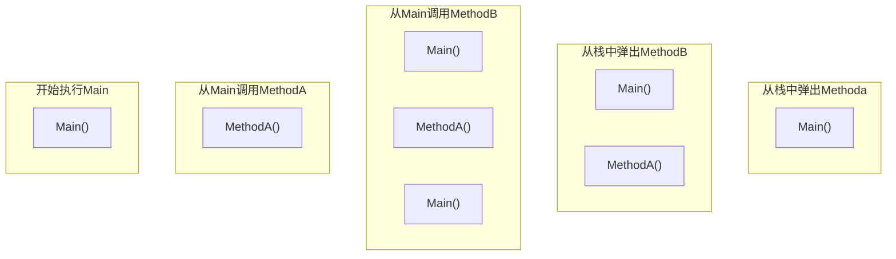

*****递归的调用会产生很多不同的独立栈帧。

## 五.类

类成员类型有9种

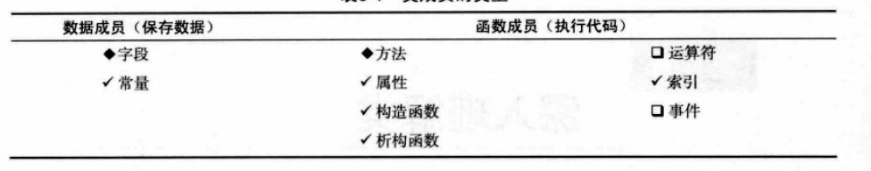

声明类成员的方式： [][]   [特性]   [修饰符]  核心声明

顺序必须是这个。多个特性和多个修饰符内部可以顺序随意，但整体上必须是这个顺序。


静态字段被类的所有实例共享，所有实例都访问内存同一位置。

static和const是不一样的

如果静态字段有初始化语句，那会在使用任何静态成员之前初始化该字段。但是不会在程序执行开始就初始化。


静态方法不能访问实例成员，但是能访问其他静态成员。

静态的成员当然也是在堆上。

成员常量不能被声明为静态的。

成员常量和本地常量差不多。同时成员常量的值必须是编译时可计算的。

和静态量不同，常量没有自己的存储位置，而是在编译时被编译器替换，类似于c和c++的define。


属性

它是命名的类成员

它不为数据存储分配内存

和字段不同，它执行代码


set 和 get访问器有预定义的语法和语义。set有一个隐式的值参数value，返回类型是void。get没有参数，且get所有路径必须包含一条return语句，返回和属性相同的类型。

属性上不允许有除了get和set以外的其他方法。

访问器不能显示调用。

属性可以是只读或者只写的。


**属性和公共字段**

属性是函数性成员，不是数据成员允许处理输入输出。公共字段不行。

属性可以只读或者只写，字段不行。

**编译后的变量和编译后的属性语义不同。**


自动实现属性（有什么意义？）

允许只声明属性而不声明后备字段。编译器会创建隐藏的后备字段，并自动挂接到get和set访问器上。

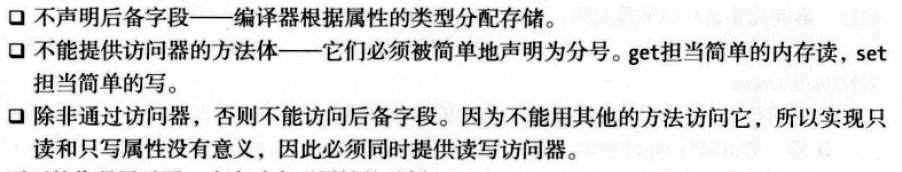

eg：

```csharp
public int MyValue
{
set; get;
}
```

自动属性使开发者在倾向于声明一个公有字段的地方很容易的插入一个属性

（插入一个问题  1-6章什么时候讲了修饰符 private protect public这些东西了）

静态属性：不能访问实例成员，只能被实例成员访问。不管有没有实例都是存在的。外部访问使用类名。


实例构造函数

构造函数声明为public可以从类的外部创建实例

构造函数没有返回值

构造函数可以被重载

如果用户声明了任何构造方法，则编译器不会提供默认的构造方法。

构造方法可以声明为static，

用于初始化类级别的项，静态字段这种。

**类中只能有一个静态构造函数，而且不能带参数**

静态构造函数不能有任何访问修饰符。

静态构造函数和静态方法一样，不能访问实例成员，因此不能使用**this访问器**

不能从程序中显示调用静态构造方法，系统会自动调用它：

引用任何静态成员之前，创建类的任何实例之前。


对象初始化有两种

1. new xxx()
2. new xxx(){在此初始化设置公有字段的值}  大括号里就是初始化

第二种也叫**对象初始化语句** 扩展了对象创建的语法

需要注意，初始化发生在构造方法执行之后，因此构造方法中设置的值可能会在之后对象初始化中重置为相同或不相同的值。


析构函数  destructor

析构函数具体在后面讲  执行类的实例被销毁之前需要的清理或释放非托管资源的行为。

非托管资源是指通过win32api获得的文件句柄 如果坚持使用。net类就不用编写析构方法


readonly修饰符

字段可以用readonly修饰符声明 作为类似const  一旦值被设定就不能改变。

但有一些却别：

const字段只能在声明语句中初始化，readonly可以在 声明语句和任何构造函数中初始化。如果readonly的字段是static的则需要在静态构造函数中初始化。

const字段的值必须在编译的时候决定，但readonly可以在运行时决定。也就是说可以在不同的构造方法中设置不同的值。

const的行为是静态的，readonly是实例字段，也可以说静态字段，在内存中有存储位置


this关键字

在类中使用，对当前实例的引用。只能被用在 **实例**构造函数、实例方法、属性和索引器的实例访问器

不能再静态方法中使用this

this的目的是区分累的成员和本地变量或者参数，或者作为调用方法的实参。


索引器

和属性差不多：

和属性意义，不用分配内存来存储

索引器和属性都是主要被用来访问其他数据成员

属性通常表示单独的数据成员 索引通常表示多个数据成员

索引器不能被声明为static


需要注意：

索引器没有名称，在名称的位置关键字是this

参数列表再方括号中间

参数列表至少声明一个参数

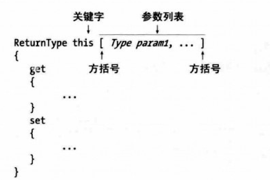

索引器的set访问器接受两项数据：1.隐式参数value持有要保存的数据，2.一个或更多索引参数表示数据应该保存到哪。

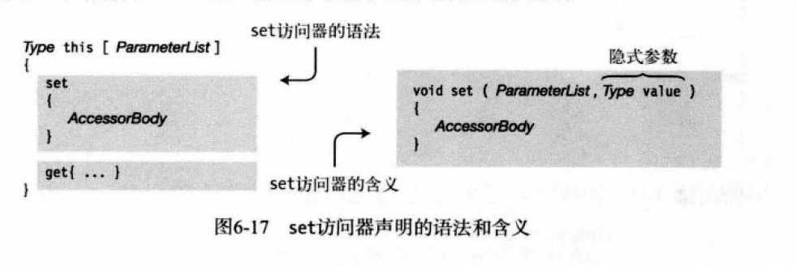

get、访问器必须检查索引参数确定他表示那个字段，并返回字段值。

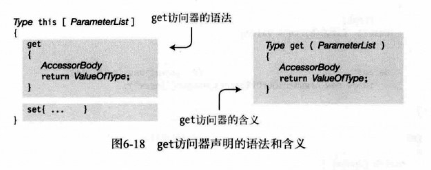

补充

set和get是不能显示调用的，当索引器在表达式中取值时将自动调用get 赋值时自动调用set

emp[0] = "q";

string name = emp[0];

例子

```csharp
class Empolyee
{
    public string LastName;
    public string FirstName;
    public string City;
    
    public string this[int index]
    {
        set{
            switch(idnex){
                case 0:lastName = value; break;
                    ...
                        default: throw new ArgumentOutOfRangeexception("index");
            }
		}
        get{
            case 0:return LastName; break;
                    ...
                        default: throw new ArgumentOutOfRangeexception("index");
        }
	}
}
```


```csharp
class Class1
{
    int tmp1;
    int tmp2;
    public int this[int index]
    {
        get{
            return (0 == index)
                	? tmp1
                	:tmp1;
        }
        set{
            if(0 == idnex)
                tmp1 = value;
            else
                tmp2 = value;
        }
    }
}
```


索引器可以重载，一定要保持有不同的参数列表。

```csharp
class Class1
{
    int tmp1;
    int tmp2;
    public int this[int index]
    {
        get{
           ...
        }
        set{
  			...
        }
    }
    
        public int this[int index，int index]
    {
        get{
           ...
        }
        set{
  			...
        }
    }
}


```


**访问器的修饰符** 看好了 是访问器 不是索引器

属性和索引器是函数成员，并自带了get和set索引器

可以对get和set设置不同的访问级别 可以用于在对象的外部，只能读取该属性 是一个非常重要的封装工具

但要注意

必须同时有gat和set访问器时，访问器才能有修饰符，并且只能有一个访问修饰符

访问器的修饰符必须比成员的级别更严格。 也就是访问器的访问级别必须要比成员的访问级别的位置低，也不能等于属性的访问级别

访问级别：


public --> protected ------>protected--------> private

​				  internal---------->internal----------->private

分部类和分部类型：

分部类可以生命在不同或相同的文件中  ，局部声明要被标注为partial class。

partial不是关键字，在程序中可以用于标识符。但在class struct（局部结构） interface（局部借口）前它表示分布类型。


分部方法：

分布方法是声明在分部类中不同部分的方法，也可以声明在同一个类中

分为两个部分：

定义分布方法声明：给出签名和返回类型，声明的实现部分知识一个分号。

实现分部方法声明：给出签名和返回类型，是以正常形式的语句块实现。

需要注意的内容：

定义和实现的签名和返回类型必须匹配。返回类型必须是void，签名不能包括访问修饰符，也就是说分部方法是私有的，列表不能包含out参数。定义和实现必须包含上下文关键字partial，直接放在关键字void之前。

可以有定义而没有实现 编译器会把方法的声明以及方法内部任何对方法的调用移除。

例子：

```csharp
public class Myclass
{
    partial void PrintSum(int x , int y); 
    
    public void Add(int x, int y)
    {
        PrintSum(x,y);
    }
}


partial class Myclass
{
    partial void PrintSum(int x, int y)
    {
        console.writeLine("xxx:" , x +y);
    }
}


```


以下是第七章的内容

已存在类的成为基类 (base class) 新类叫派生类derived class

要声明一个派生类，类名后要加入基类规格说明 就是冒号+基类

派生类被描述为直接继承自列出的基类


所有类都派生自object类 即时没有任何基类规格说明(继承)的类 

object是唯一的非派生类  它是继承层次结构的基础

没有基类规格说明的类隐式派生自object

c#是单继承 但继承的层次没有限制


屏蔽基类成员

无法删除父类的任何成员 但是可以通过声明和父类一样名字的成员来屏蔽（mask）基类成员：

1.声明一个相同名称相同类型的成员

2.屏蔽方法需要在派生类中声明新的带有相同签名的函数成员。

**签名是有名称和参数列表组成，不包括返回类型。**

3.使用new修饰符告诉编译器正在故意屏蔽继承的成员，否则程序会成功编译但会警告你隐藏了一个继承的成员。

比如：

```csharp
class Someclass
 ｛
    public string a;
   ｝
class someclass2
{
    new public string a;
}

```


可以使用基类访问（base access）表达式访问隐藏的继承成员。

```csharp
Console.WriteLine("{0}" , base.a);
```


(屏蔽基类成员再使用基类访问并不是好的设计方式)

### 7.6使用基类的引用

派生类的实例由基类的实例加上派生类新增的成员组成。派生类的引用指向整个类对象，包括基类部分。

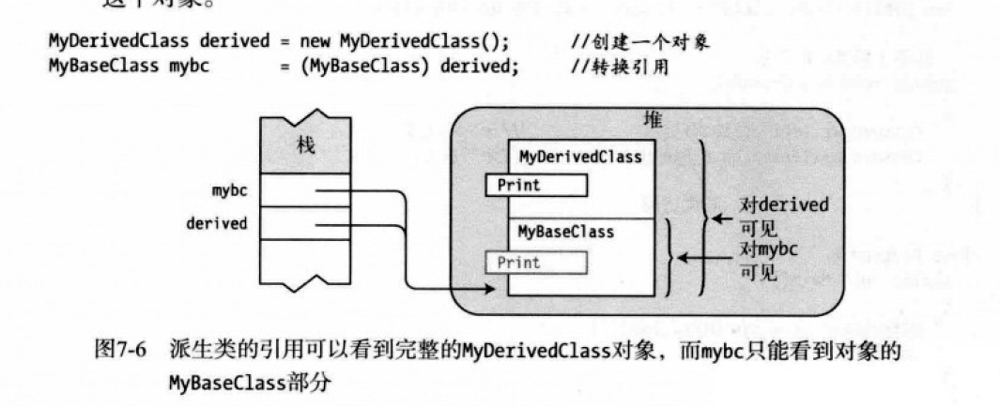


#### 虚方法和覆写方法

基类引用调用派生类（derived class）方法：

1.派生类的方法和基类的方法有享用的签名和返回类型

2.基类的方法使用virtual标注

3.派生类的方法使用override标注

（注意此方式和new隐藏基类成员在行为上的区别。）

这样就实现了基类方法调用了子类中的方法

需要注意：

1，覆写和被覆写的方法必须具有相同的可访问性。

2.不能覆写static方法或**非虚方法**

（override的其他用途？）

3.方法，属性，索引器，以及事件，都可以被声明为virtual和override


#### 覆写标记为override的方法


