该文档主要是介绍Unity的导航系统和寻路插件使用，不同场景下寻路的工作流程，以及工作原理，没有涉及太多API讲解以及如何与其他组件的集成开发。

目录下包含一个简单的演示Demo，里面包括我作为练习写的几个Scene以及官方提供的实例，需要使用寻路导航系统的场景非常多，这些场景中彼此又具有较大的差异，如寻路时动态躲避障碍物，追逐某移动中的角色寻路，Demo中没有包含实际游戏中的全部情况，想了解更多可以去下载官网Demo，或看一些更专业的教程，下载地址和教程以及我学习时查询的资料的链接会在附录中给出。

文档若出现错误，请及时指正。

<!-- more -->

## 前言


**备注**

------

2018.12.10 Unity的NavMesh应用于简单的静态动态场景的使用方法介绍，以及A*插件的部分使用方法介绍。
2018.12.14 Unity的NavMesh的工作原理概述，navgation系统中各个组件面板介绍。
2018.12.18 介绍Unity的NavMesh中的实时局部Bake场景，自动离网链接场景的简单使用。
2018.12.19 增加寻路代价实现demo

## Unity的导航系统

Unity的导航系统主要有四个部分：**NavMesh**，**NavMesh Agent**，**Off-Mesh Link**，**NavMesh Obstacle**。

**NavMesh**（ Navigation Mesh的缩写）导航网格，是一种**数据结构**，并将游戏中物体结构关系转化为带有信息的网格，通过网格进行计算自动寻路的路径。NavMesh数据可以通过烘焙(Bake)产生。

**NavMesh Agent**导航网格代理，简称代理。是Unity导航系统的核心**组件**，用来存放代理周游NavMesh的路径信息的平台。角色导航避障的移动是通过**代理**(NavMesh Agent)实现的，也就是说除非使用其他的寻路算法，否则想让某一个物体具有寻路导航的功能，就必须要为他配置一个代理。该组件一般添加在需要寻路的角色上。

**Off-Mesh Link**离网链接，该**组件**主要用于连接两个不连通的跳跃点，如跳过沟渠或者开门等场景。该组件一般添加在跳跃点上。

**NavMesh Obstacle**导航网格障碍，该**组件**主要用于移动障碍。代理可以自动躲避添加了该组件的障碍物（动态和静态）。该组件一般添加在静止或移动的障碍物上。

导航系统的基本流程大概流程，比如一个RPG游戏的某个副本场景：
1. 为障碍物添加NavMesh Obstacle，根据实际情况对NavMesh Obstacle组件进行设置；
2. 为传送点，跳跃点添加Off-Mesh Link；
3. 烘焙副本场景，生成Navmesh；
4. 为角色添加NavMesh Agent并指定参数；
5. 角色寻路，代理根据生成好的NavMesh以及地图中的障碍物信息进行计算最佳路径。

### 工作原理

------

#### NavMesh的生成

我的理解（翻译）：

导航系统需要一种数据结构来存储游戏场景中的**可行走区域**。，可行走区域的定义是场景中**代理**可以站立和移动的区域。 同时，在Unity中，代理被视为圆柱体，并以圆柱的体积参数来参与计算。 **可行走区域**通过场景中测试代理可以站立的位置自动生成可供代理移动的，由多个多边形组成的平面（下图蓝色部分），平面置于游戏的地板（或几何体平面）之上，同时平面存储了有哪些多边形彼此相邻的信息，该表面称为导航网格（简称NavMesh）。NavMesh是可行走区域的**近似值**。

官方手册的原文：

> The navigation system needs its own data to represent the walkable areas in a game scene. The walkable areas define the places in the scene where the agent can stand and move. In Unity the agents are described as cylinders. The walkable area is built automatically from the geometry in the scene by testing the locations where the agent can stand. Then the locations are connected to a surface laying on top of the scene geometry. This surface is called the navigation mesh (NavMesh for short).
> we store information about which polygons are neighbours to each other. This allows us to reason about the whole walkable area.
>
> Another thing to keep in mind is that the NavMesh is an approximation of the walkable surface.This can be seen for example in the stairs which are represented as a flat surface, while the source surface has steps

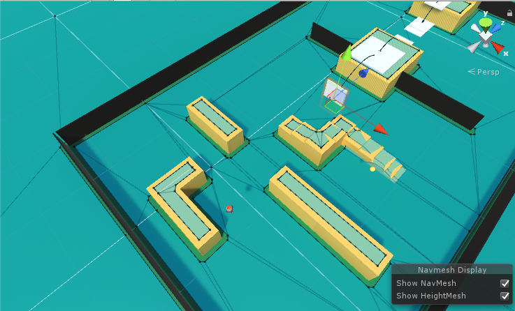

 


生成的蓝色NavMesh平面

 

在烘焙（Bake）后，会在场景同级目录生成一个文件夹：
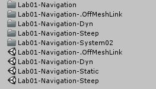


文件夹


原文链接：

 

------

#### NavMesh生成的多边形

NavMesh生成的是凸多边形，凸多边形中任意两点可以以直线相连。

原文：

> The NavMesh stores this surface as convex polygons. Convex polygons are a useful representation, since we know that there are no obstructions between any two points inside a polygon. In addition to the polygon boundaries,

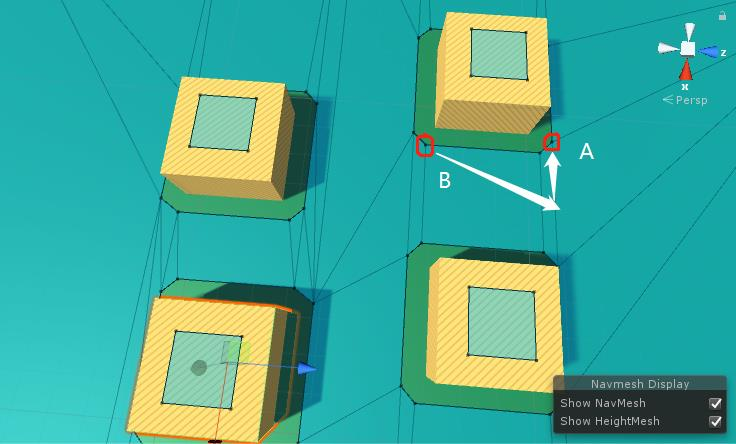


AB两点无法通过直线相连

 

原文链接:

------

#### NavMesh Agent如何找到路径

要查找场景中两个位置之间的路径，首先需要将起始位置和目标位置**映射**到附近的多边形上。 然后从起始位置开始搜索，访问所有临近多边形，直到到达目标位置。 根据被访问过的多边形，可以得到一个从起始位置到目标位置的多边形序列。，该序列被称为corridor。Unity寻找路径使用的算法是A *。

原文

> To find path between two locations in the scene, we first need to map the start and destination locations to their nearest polygons. Then we start searching from the start location, visiting all the neighbours until we reach the destination polygon. Tracing the visited polygons allows us to find the sequence of polygons which will lead from the start to the destination. A common algorithm to find the path is A* (pronounced “A star”), which is what Unity uses.
>
> The sequence of polygons which describe the path from the start to the destination polygon is called a corridor. The agent will reach the destination by always steering towards the next visible corner of the corridor.

关于为什么序列中储存的是多边形序列而不是路线线段：

> If you have a simple game where only one agent moves in the scene, it is fine to find all the corners of the corridor in one swoop and animate the character to move along the line segments connecting the corners.

如果使用线段作为corridor，当场景内有多个角色在寻路时，角色之间要在互相避让彼此的同时并寻路，这样就会造成寻路路径和计算出的造成偏差。尝试使用由线段组成的路径来纠正这种偏差很快变得非常困难且容易出错。

------

#### 障碍躲避

躲避障碍是基于下一个区域的位置，并计算出到达目的地所需的期望方向和速度来完成转向。个人理解即角色遇到障碍时只考虑并计算，如何到达避开障碍物拐点需要的速度和方向。

原文：

> The steering logic takes the position of the next corner and based on that figures out a desired direction and speed (or velocity) needed to reach the destination. Using the desired velocity to move the agent can lead to collision with other agents.

避障时选择了新的速度，这个速度由期望的方向和防止之后与其他寻路实体以及导航网格边缘碰撞来权衡的。 Unity目前使用RVO算法来预测和防止角色与障碍物碰撞。

------

#### Moving the Agent

在转向和避障之后，会得出最终的速度。在Unity里，寻路实体使用一个动力学的模型来模拟，通过计算加速度来使移动更自然和平滑。

------

#### Global and Local负责的工作

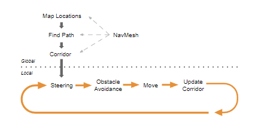

Global 的工作是在场景世界中寻找corridor。 在场景世界各地寻找计算corridor很耗费性能。

Local 的工作是通过线性存储的多边形导航关系路线corridor，来计算如何到达下一个拐点同时避开其他正在移动的物体。

打个比方，从家到公司，Globel负责计算这段路的行进路线，比如坐先公交-地铁-最后步行，但途中我如何刷卡进地铁，怎么过马路就是Local的工作了。Global负责宏观的路线规划，Local负责微观的细节处理。

原文：

> Global navigation is used to find the corridor across the world. Finding a path across the world is a costly operation requiring quite a lot of processing power and memory.
>
> The linear list of polygons describing the path is a flexible data structure for steering, and it can be locally adjusted as the agent’s position moves. Local navigation tries to figure out how to efficiently move towards the next corner without colliding with other agents or moving objects.

------

### 组件介绍*

------

#### 1.Nav Mesh Agent

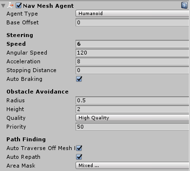

| 属性                       | 功能                                                         |
| -------------------------- | ------------------------------------------------------------ |
| Agent Type                 | 代理类型，可以选择不同的代理类型                             |
| Base Offset                | 基本偏移，物体实际的锚点和代理锚点的偏移量。[1]              |
| **Steering**               |                                                              |
| speed                      | 速度，前往目的地的最大移动速度。                             |
| Angular Speed              | 角速度，最大的转角速度，角度/秒                              |
| Acceleration               | 加速度，最大加速度                                           |
| Stopping Distance          | 停止距离，代理距离目的地小于该值时停止。[2]                  |
| Auto Braking               | 制动距离，当物体和目的地小于制动距离时，开始减速。[2]        |
| **Obstacle Avoidance**     |                                                              |
| Radius                     | 代理半径，该半径参数只用于寻路时使用，使用时最好比实际值大一些。[3] |
| Height                     | 代理高度                                                     |
| Quality                    | 避障精度，如果场景内存在大量的代理，可以通过降低精度来节省CPU消耗[4] |
| Priority                   | 躲避优先级，当代理表现为逃避时，优先级低的代理将会被忽略。该值的范围从0到99:最重要=0，最不重要=99，默认=50。[5] |
| **Path Finding**           |                                                              |
| Auto Traverse Off MeshLink | 自动生成离网链接，如果使用动画或某种特定方式穿过离网链接点，则应关闭此功能。[6] |
| Auto Repath                | 当前路径变成无效时该代理是否尝试获取新路径                   |
| Area Mask                  | 代理在查找路径时会考虑的区域类型                             |

[1]

[4]又名躲避精度。通过降低该值的方式可降低CPU开销，但如果寻路物体的躲避精度为none时，虽然寻路实体依然会绕开障碍物，但寻路实体之间不会发生碰撞（寻路实体会粘合在一起）

------

#### 2.Nav Mesh Obstacle

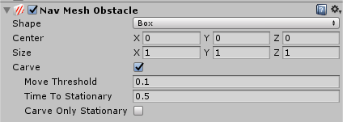

| 属性                  | 功能                                                         |
| --------------------- | ------------------------------------------------------------ |
| Shape                 | 物体形状,盒子/胶囊体                                         |
| Center                | 障碍的中心点，在对象的自身空间测量。                         |
| Size                  | 障碍的大小，在对象的自身空间测量。                           |
| Carve                 | 挖洞，是否打开在导航网格挖洞的模式。[1]                      |
| Move Threshold        | 移动距离阈值，物体移动距离超过阈值后将更新导航网格，导航网格将障碍物运动状态视为移动。 |
| Time To Stationary    | 时间阈值，超过该值，刷新导航网格                             |
| Carve Only Stationary | 勾选后，障碍物只在静止时挖洞                                 |

**[1]** 关于Carve:

障碍物有两种，一种是开启了Carve，一种是未开启，代理会根据障碍物的类型做出不同的反应：

Obstructing模式（关闭Carve）:障碍物没有开启Carve时，它只是一个带碰撞器的普通障碍物。导航过程中，代理会尽量避免与障碍物碰撞。但如果两者距离较近，还是会发生碰撞。因为障碍物躲避非常基础，并且是基于一个短半径来计算（模糊运算），所以当障碍物过多时会出现找不到路的情况。这个模式多用于动态障碍物，如汽车或游戏角色。

> When Carve is not enabled, the default behavior of the Nav Mesh Obstacle is similar to that of a Collider. Nav Mesh Agents try to avoid collisions with the Nav Mesh Obstacle, and when close, they collide with the Nav Mesh Obstacle. Obstacle avoidance behaviour is very basic, and has a short radius. As such, the Nav Mesh Agent might not be able to find its way around in an environment cluttered with Nav Mesh Obstacles. This mode is best used in cases where the obstacle is constantly moving (for example, a vehicle or player character).

Carving模式（开启Carve）：Carve被勾选时，静止的障碍物所在的网格会出现一个空洞，表示不可通行，只有当这个障碍物正在移动时才会变成Obstructing模式。NavMesh会记录空洞的相关信息，并引导寻路实体绕开障碍物或者当路径被封锁时启动重新寻路。用烂车和木箱设置关卡障碍时切记要勾选镂空属性，当且仅当这些障碍物受到其他外力和固定游戏事件时，如爆炸，才能被移开。

> When Carve is enabled, the obstacle carves a hole in the NavMesh when stationary. When moving, the obstacle is an obstruction. When a hole is carved into the NavMesh, the pathfinder is able to navigate the Nav Mesh Agent around locations cluttered with obstacles, or find another route if the current path gets blocked by an obstacle. It’s good practice to turn on carving for Nav Mesh Obstacles that generally block navigation but can be moved by the player or other game events like explosions (for example, crates or barrels).

两种障碍物的类型决定了计算的方式，Obstructing模式由Local负责处理，Carving模式由Global负责处理（代表着CPU开销更大）。

移动的障碍物应该尽量避免使用Carving模式，因为Carve产生的洞会影响NavMesh，同时Global的计算量也会增加，使CPU和内存开销变大。

------

#### 3.Off Mesh Link

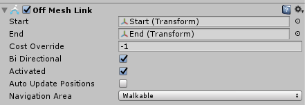

| 属性                   | 功能                                                         |
| ---------------------- | ------------------------------------------------------------ |
| Start                  | 离网链接的（跳跃点）起始位置                                 |
| End                    | 离网链接的（跳跃点）终点位置                                 |
| Cost Override          | 成本覆盖，如果值为正，则在计算处理路径请求时的路径成本时使用该值。值为负，则使用该区域的默认成本(Navigation面板中的Area中的Cost) |
| Bi Directional         | 勾选后可以双向移动，否则只能从Start到End。                   |
| Activated              | 勾选后角色寻路时将跳跃点也添加至计算范围，否则忽略。         |
| Auto Upadate Positions | 自动更新位置,若两端点位置有变化则自动此更新离网链接。        |
| Navigation Area        | 跳跃点所属的区域。[2]                                        |

*注：offmeshlink可以使用任何带有Transform的游戏对象作为开始和结束标记。*

------

#### 4.Navigation面板（window栏-Navigation）

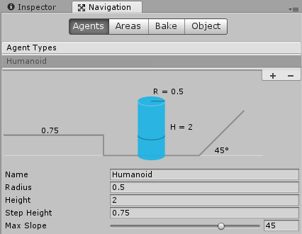

Agents面板用于代理和代理之间的躲避，该页的参数不参与Bake，只用于处理代理与代理，代理与障碍之间的躲避。
在使用章节有关于该面板如何使用的介绍。

关于此Tab，unity社区的问答：https://answers.unity.com/questions/1376465/what-is-the-difference-between-configuration-of-ag.html

------

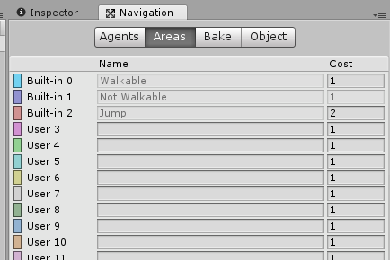

Areas代表烘焙网格所在的图层， 有29种自定义类型和3种内置类型：Walkable，Not Walkable和Jump。
\1. Walkable是通用区域类型，可以在该区域上行走。
\2. Not Walkable是阻止导航的区域类型。
\3. Jump是分配给自动生成的离网链接的区域类型。
另外，每个NavMesh代理都有一个Area Mask，用于指定代理可以移动的区域。
Cost是寻路的代价（成本），比如角色可以选择两条路，一条是过河，一条是草地。这两种寻路方式可能消耗的成本不一样。或是一扇门，人类可以通过但是其他怪物不能通过。都需要通过控制cost和area来实现。具体使用看下面的寻路导航章节。

------

Bake页面根据面板参数对当前场景进行烘焙地图，生成NavMesh，注意为了减少CPU和内存消耗，在烘焙设置中只能指定一种尺寸，如果需要生成多种NavMesh，**参考下面章节。**
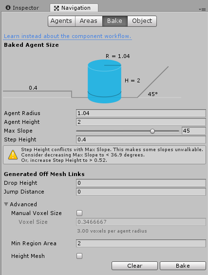

| 属性                         | 功能                                       |
| ---------------------------- | ------------------------------------------ |
| Agent Radius                 | 代理的中心与墙壁等障碍物可接近的距离半径。 |
| Agent Height                 | 代理的中心与墙壁等障碍物可接近的距离高度。 |
| Max Slope                    | 最大坡度，代理可以爬坡的最大高度。         |
| Step Height                  | 台阶高度，代理可以攀爬的最大台阶高度。     |
| **Generated Off Mesh Links** |                                            |
| Drop Height                  | 离网链接中最大的下落高度。[1]              |
| Jump Distance                | 离网链接中最大的下落距离。[2]              |

进阶设置具体在**高级烘培设置**章节看。

------

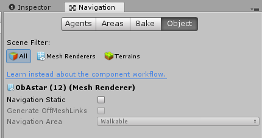

| 属性                   | 功能                                                         |
| ---------------------- | ------------------------------------------------------------ |
| Navigation Static      | 导航静态,表示该游戏对象是否参与导航网格的烘焙。              |
| OffMeshLink Generation | 生成离网链接，选中该复选框，可以自动根据Drop Height（下落高度）和Jump Distance（跳跃距离）的参数设置生成离网链接 |
| NavigationArea         | 导航区域设置。在默认情况下分为Walkable（行走区域），Not Walkable（**不可行走层，该层即使在Area Mask中选择可走，实际运行也无法行走**）和Jump（跳跃层）。（具体可以在Areas面板中进行设置） |

------

 

\###其他

\####代理的半径

通过上面的内容可以注意到，代理的半径和高度可以在两个位置更改，一是Nav Mesh Agent，另一个是在Navigation面板中。

Navigation面板中设置表示代理如何闪避和碰撞静态的游戏物体，为了减少内存和CPU的开销，只能指定一种半径大小。

Nav Mesh Agent的属性值代表代理如何与动态障碍物以及其他之间的碰撞。

一般情况下两个半径设置大小相同。

------

\####高级烘培设置
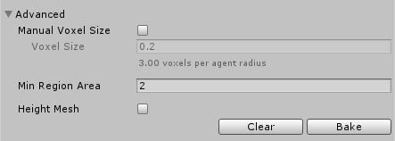

| 属性              | 功能                                                         |
| ----------------- | ------------------------------------------------------------ |
| **Advanced**      |                                                              |
| Manual Voxel Size | 手动更改体素大小，通常不需要调整体素大小，有两种情况可能需要这样做：构建较小的代理半径或更准确的 NavMesh。 |
| Voxel Size        | 体素大小                                                     |
| Min Region Area   | 最小区域设置，小于该值的NavMesh区域将被删除。                |
| Height Mesh       | 高度网格                                                     |

[1]**Min Region Area**不能完全的删除所以小于该值的多边形，因为会有下面这种情况：

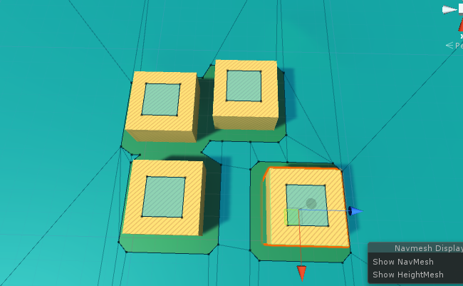删除前

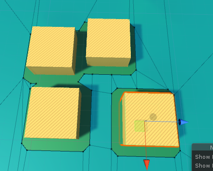删除后

可以看到，图中四个正方体上的多边形区域被删掉了，但是小于正方体上多边形面积的，位于正方体中间的区域却没有被删除，这是因为如果移除该区域则可能无法访问或连通周围的区域。

[2]**Manual Voxel Size**允许手动更改烘培的精准度，NavMesh是通过体素化场景内的物体生成的。 在生成NavMesh算法的开始，场景被栅格化为体素，然后提取可行走的表面，并将可行走的表面变成NavMesh。 **voxel size**表示生成的NavMesh的准确程度。

**voxel size**的默认精度始终是代理半径的1/3，也就是和代理半径保持着3倍的关系。这是Unity官方在精确度和烘焙速度之间的折衷方案。**将体素大小减半会使内存使用量增加4倍**，**构建场景需要4倍的时间。**

原文：

> The default accuracy is set so that there are 3 voxels per agent radius, that is, the whole agent width is 6 voxels. This is a good trade off between accuracy and bake speed. Halving the voxel size will increase the memory usage by 4x and it will take 4x longer to build the scene.

由于在默认情况下voxel size和代理半径表示为3倍关系，但可能会出现一种情况：需要较小的代理半径，但是不需要voxel size的值也跟随半径变小，可以使用以下办法：

1. 将“代理半径”设置为实际代理半径。
2. 打开手动体素大小，这将采用当前体素大小并“冻结”。
3. 设置较小的Agent Radius，因为已经开启了手动修改体素大小，所以大小不会改变。


官方文档：
https://docs.unity3d.com/2017.4/Documentation/Manual/nav-AdvancedSettings.html

------

#### 寻路代价*

通过cost可以定义通过该区域的困难程度(代价)，，成本更低的地方在寻路过程中优先级更高，cost可以控制角色寻路时偏好的区域。例如走草地要比走水路要快一些，就可以通过设置cost来实现。具体例子可以看**演示章节**。

在进一步了解之前，首先先了解一下A* 寻路的工作原理：Unity使用A*算法来寻找导航的最短路径，其核心数据结构为图。算法从离寻路实体最近的网格进行遍历，接着不停地访问相邻网格节点，直到搜寻到终点所在的网格区域(起点到终点的网格连线就是导航路径（此时未带入估价函数，即非最短路径）)。

因为导航网格是由一系列多边形组成的，所以寻路实体需要计算通过每块网格或者说节点的寻路代价。最短路径就是各节点连线的最低寻路代价。

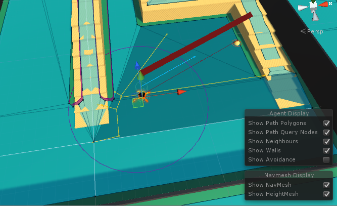

在两个节点之间移动的花费取决于行进距离以及当前所属区域的成本，即距离* 成本。 这意味着，如果一个区域的成本是2，那么寻路实体通过该区域的距离相对于普通区域的距离要大两倍。 A * 算法要求所有成本必须不小于1。

有时候可能会感觉在某些地方，寻路实体好像不会直接走最短路径。究其原因在于网格结点的放置位置。在空旷的地方有一个非常小的障碍物，这就会导致产生一大一小的网格。在这种情况下，网格结点可以放置在网格的任何地方，所以在我们看来，寻路实体好像并没有走最短路径。

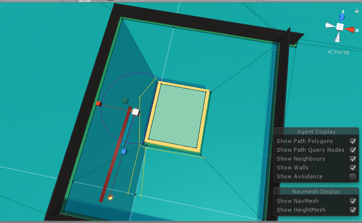

当某区域网格有多种寻路代价时，寻路网格一般优先使用寻路代价最低的那种。当然也有例外，不可行区域的寻路代价虽然为1，但优先使用该种区域，用于阻挡寻路实体移动**。

官网文档：https://docs.unity3d.com/2017.4/Documentation/Manual/nav-AreasAndCosts.html

*注：图中的寻路路径绘图（黄线）的显示方法是在hierarchy面板点击寻路角色，在Scene场景勾选如上图几项即可。*

------

#### 自动生成离网链接

有些时候我们需要自动生成离网格链接。链接的类型有两种：爬梯跳台式和跳跃跨栏式。

**跳台式**一般运用于高低平台之间的转换（跳下某平台）**跳跃跨栏式**主要在跳跃过某个缺口。

具体流程：

1. 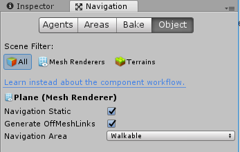 

2. 在Bake面板设置两个参数：

   

   解释：
   **Drop Height：**跳台式链接需要设置下落的高度。高度为0时，无法跳落。
   **Jump-Across：**可以跳跃的距离。跳跃的距离为0时，无法眺落。（最小值=寻路实体半径+始终点距离，且最小值要大于代理半径的二倍。）

3. 设置完成后点击Bake：
   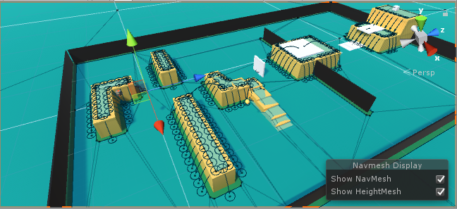

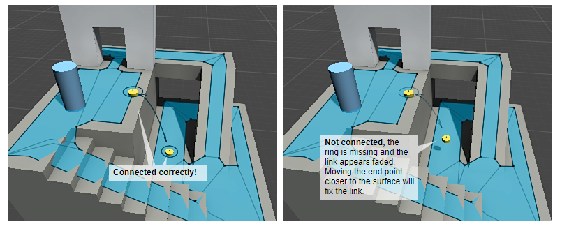

*注：生成的分离网格链接只能从上往下移动，如果需要从下往上则需要使用手动分离网格链接。*

官网链接：https://docs.unity3d.com/2017.4/Documentation/Manual/nav-BuildingOffMeshLinksAutomatically.html

------

#### 离网链接与动画系统

可以注意到，当演示中的胶囊体/Cube通过离网链接时都是一瞬间完成的，但在实际游戏中，人物的攀爬和跳跃都是有动作的，如果需要在通过离网链接点的时候有人物动作，需要把人物的Auto Traverse Off Mesh Link选项关掉，然后写对应的控制人物状态的脚本，具体可以看：
https://blog.csdn.net/elyxiao/article/details/51281602 ，在文章最后作者介绍了如何在通过离网链接点时执行动画。

------

#### Hight mesh

由于NavMesh是可行走空间的近似值，因此会忽略一些细节。例如，人物在通过楼梯时并不会出现上下颠簸的感觉，如果需要增加NavMesh的真实度，需要将**Navigation-Bake-Advanced settings**下的**Hight mesh**选项打开，当然开启Hight mesh会增加CPU和内存的开销，并且烘焙时间会变长。

原文：

> While navigating, the NavMesh Agent is constrained on the surface of the NavMesh. Since the NavMesh is an approximation of the walkable space, some features are evened out when the NavMesh is being built. For example, stairs may appear as a slope in the NavMesh. If your game requires accurate placement of the agent, you should enable Height Mesh building when you bake the NavMesh. The setting can be found under the Advanced settings in Navigation window. Note that building Height Mesh will take up memory and processing at runtime, and it will take a little longer to bake the NavMesh.

官方文档：https://docs.unity3d.com/2017.4/Documentation/Manual/nav-HeightMesh.html

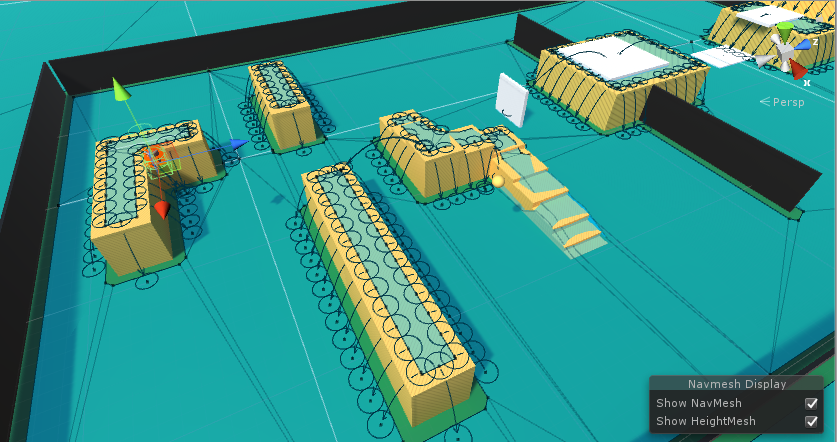

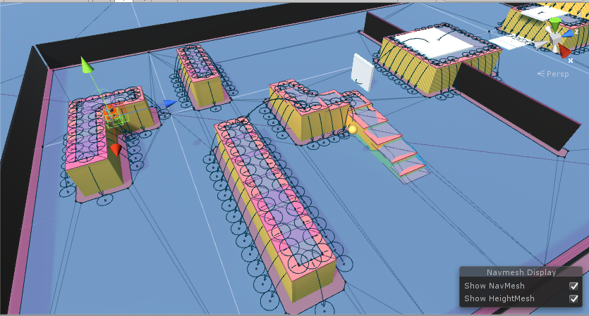

------

#### 对障碍物的补充

1.一个物体不能同时开启NavMeshAget和NavMeshObstacle,但是可以在运行时实时修改其开关。同时开启会产生角色躲避自己的冲突。如果再同时的开启的基础上启用Carve，会出现更多的异常行为。

------

#### 效率

//

------

#### high-level NavMesh building components

//

官方文档：https://docs.unity3d.com/2017.4/Documentation/Manual/NavMesh-BuildingComponents.html

------

### 使用

下面的几个例子是我作为熟悉导航系统练习写的，想看标准的演示可以点击Windows-Navigation-Bake面板中的蓝色文本下载官方Demo。
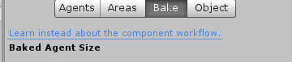

链接：https://github.com/Unity-Technologies/NavMeshComponents

#### 静态场景：

**（1）**首先将场景内的障碍物包括地板设置为Static（如图中的四面墙，黄色的cube以及绿色的地板）：

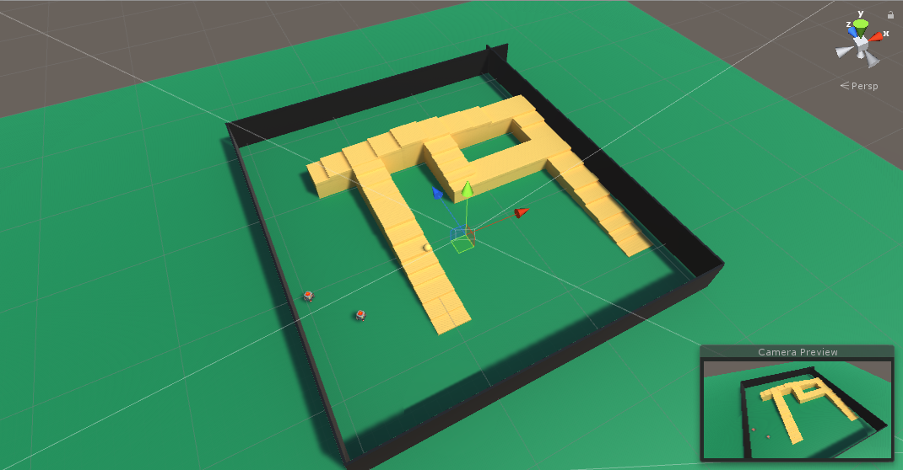

注意NAvigation Static要确定被勾选：

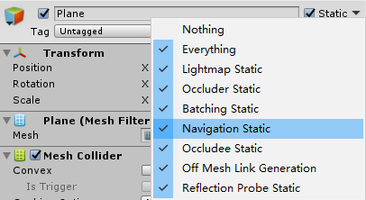

**（2）** 打开Navigation面板（window-Navigation），点击Bake：


点击Bake后场景会显示可通过的区域：

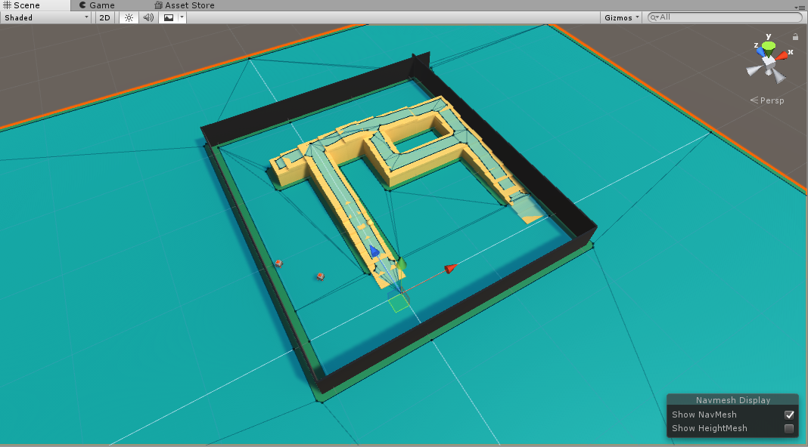

**（3）** 在需要寻路的物体(角色)上添加Nav Mesh Agent组件，并添加自定义的物体行走组件，通过调用NavMeshAgent中的SetDestination方法使物体寻路，例如:

```
 _agent.SetDestination(tar);
```

**（4）**效果如下（途中的路径红线显示要自己添加，具体角色的行走和绘图实现方式可以在Demo中找到对应脚本）：
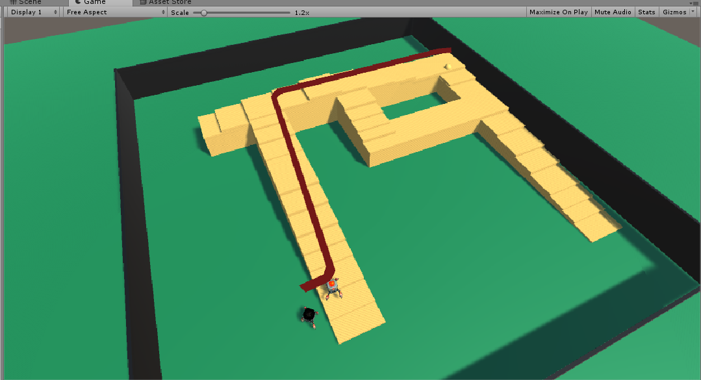

#### 动态场景：

NavMesh同时也支持动态规划路线，如果寻路过程中动态出现障碍可以重新规划路线，NavMesh对动态规划支持不好，相比插件的动态寻路，NavMesh差的很多。
**（1）** 先按照静态场景的流程走一遍，注意活动的障碍物不要标记为Static：
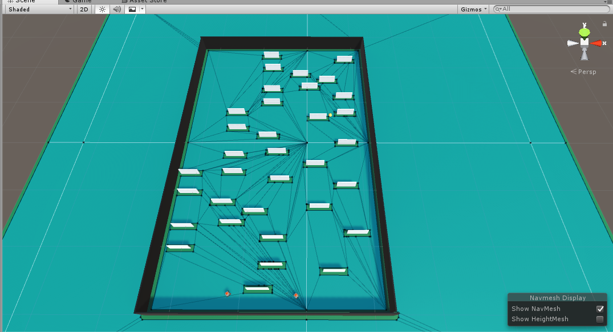

**（2）** 在动态运动物体上添加 Nav Mesh Obstacle组件。

**（3）**效果如下：
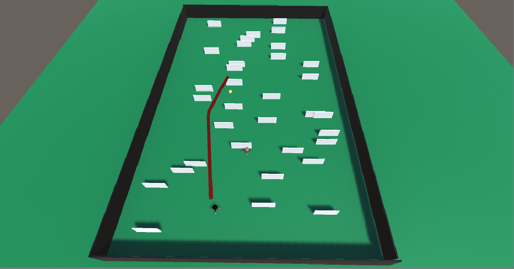

如果发现角色寻路困难，会在动态障碍物前停滞，可以更改Agent Radius的值来修改障碍物的半径，通过调大障碍物的占地面积让角色行走更流畅，或修改代理的自身半径：
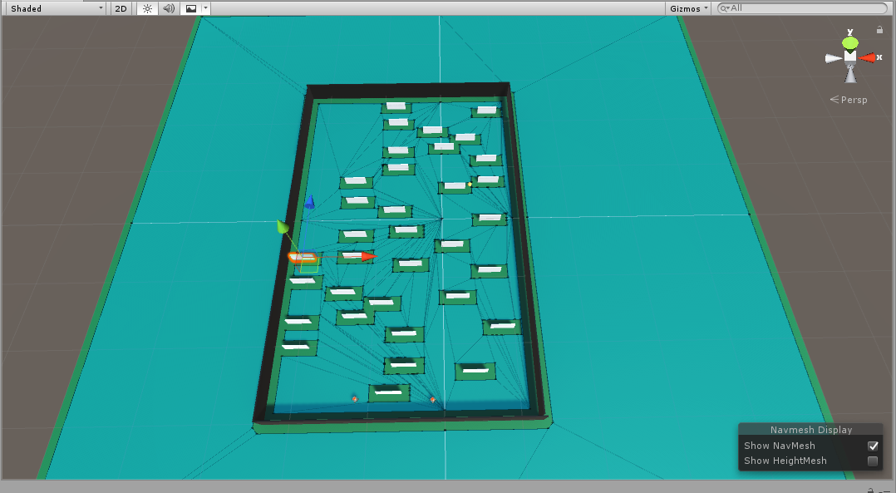

#### 离网链接场景：

有的时候场景中会出现一些传送点，跳跃点，如果需要在寻路时将传送点也包括在寻路计算内，则需要添加Off-Mesh-Line组件。
1.准备两个cube，分别命名为Start和End。作为传送点：
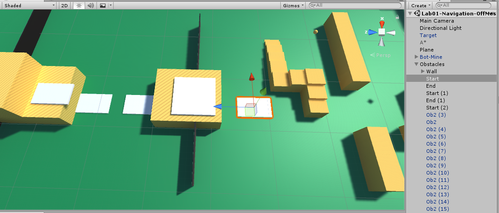
2.在Start的cube上添加Off-Mesh-Line组件，在Start和End属性添加对应的两个Cube（Start和End）：
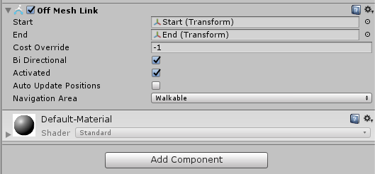
3.若添加成功则传送点上会出现黑色的线：
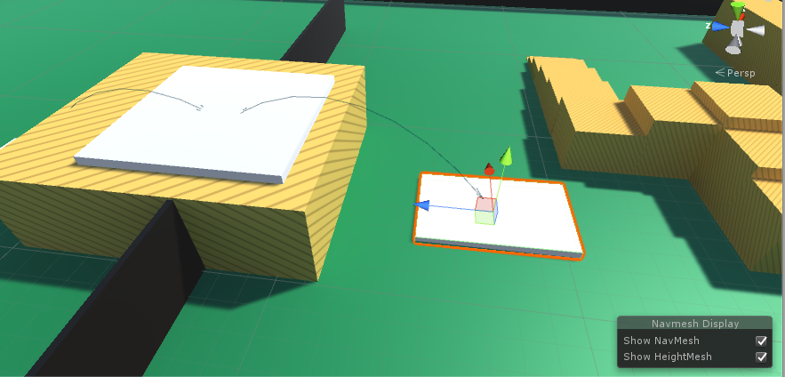
4.可以看到现在代理在寻路时会将跳跃点计算在内：
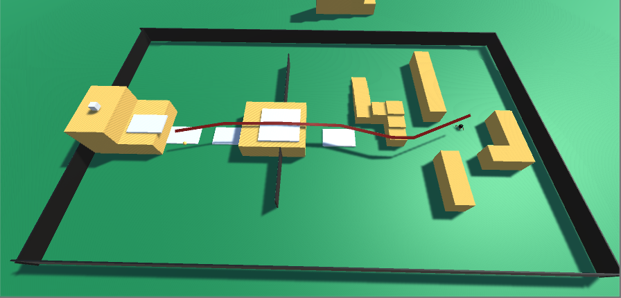

#### 区域寻路场景

有时可能会用不到Bake整个场景的地图，只生成局部的NavMesh就够了，比如RPG游戏中玩家在可见区域选路，其他地方被战争迷雾覆盖，无法自动前往。这时需要生成局部的NavMesh并实时刷新。
\1. 新建一个空物体，添加Local Nav Mesh Builder，Size为需要实时计算的NavMesh大小，并在Tracked位置填写需要使用局部网格的角色。
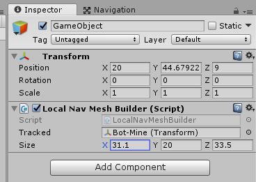

1. 为场景内的障碍物，地形添加Nav Mesh Source Tag组件。
   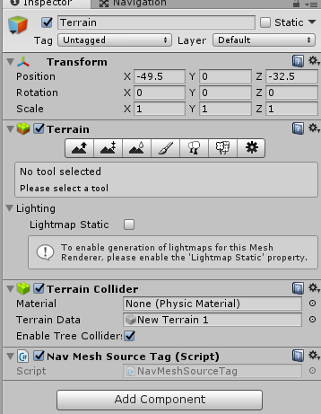

3.像其他场景一样为角色添加代理组件。

4.效果（不需要在Editor时Bake）：
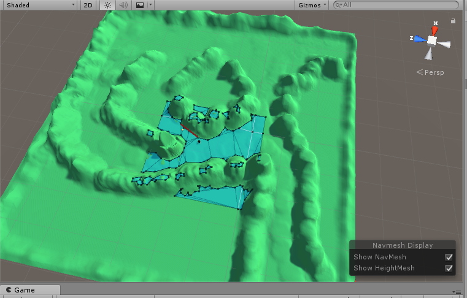

#### 有寻路代价的场景

如果想让干预代理决定两条路该走哪条，比如走沼泽会扣血而草地不会，可以为行走区域添加**代价**
1.添加路径需要的代价，默认是1，小于1的区域表示代价比标准低，大于1代表比标准代价高。
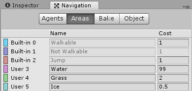
2.将行走区域修改为对应图层
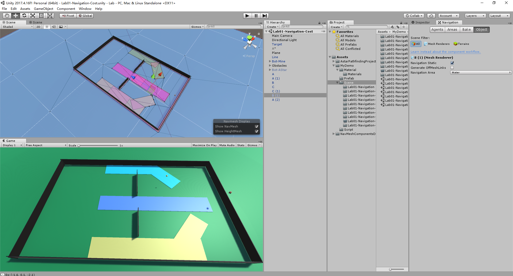
3.对应区域设置好后，点击Bake，如图。
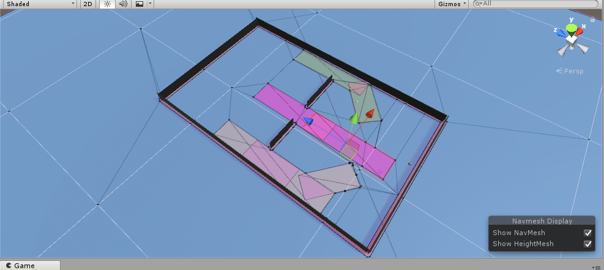
4.现在代理寻路时会考虑代价花费，倾向于花费低的路线。
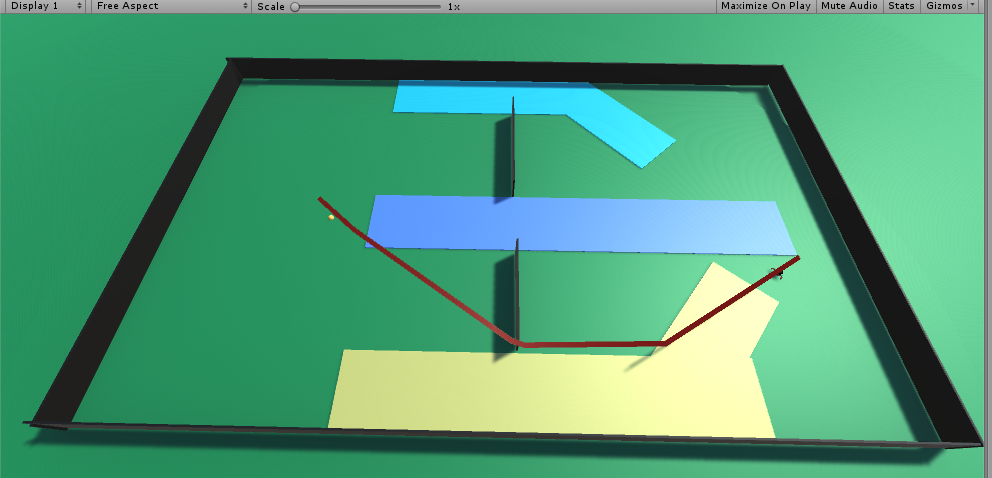

------

 

------