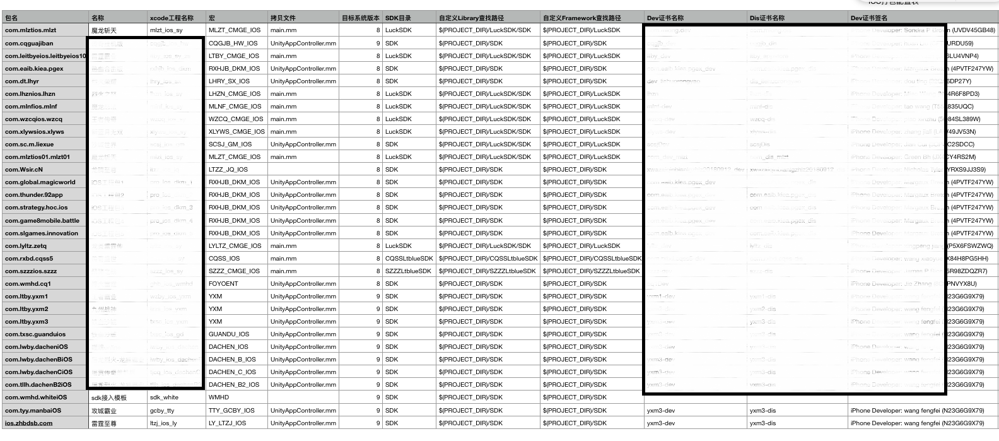
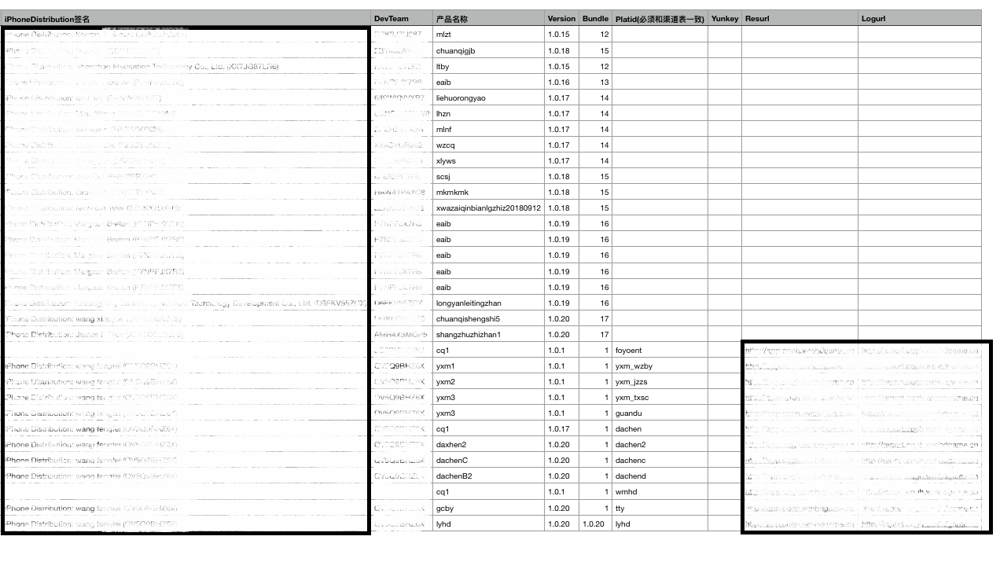
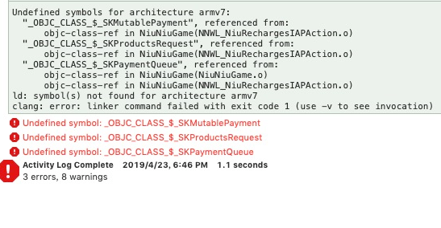

SDK接入流程

<!-- more -->

# 一 导出Xcode工程

## 1.1修改cs文件配置plist

修改 `IOSPostprocessBuild.cs` ，目的是在此提前配置好需要接SDK的Xcode工程的plist设置，如果不在此填配置参数则需要在Xcode中设置。

文件目录：

```
D:\workspace\cq1_g\branch_release\client\cq1_g\Assets\Editor\Game
```

（1）在`ModifyProj`方法中添加此SDK需要接入的额外.framework库，有一些通用的库已经在方法中配置好了，但如果需要对特定SDK添加额外的framework库。其中“YXM”为自定义的宏mingc，添加格式下：

```csharp
 public static void ModifyProj(string pathToBuildProject, XcodeBuilderItem xcodeBuilderItem)
    {
    	//通用的framework库
    	....
		switch (scriptDefine) {
		case "YXM":	// 游戏猫平台
			UnityEngine.Debug.Log ("游戏猫平台 modify：" + scriptDefine);

			// 添加登录SDK framework
			_pbxProj.AddFrameworkToProject(_targetGuid, "SystemConfiguration.framework", true);
			_pbxProj.AddFrameworkToProject (_targetGuid, "JavaScriptCore.framework", true);
			break;
		...
    }

```

（2）在`SetPlist`方法中设置SDK需要特定的plist设置：

```csharp
 static void SetPlist(string pathToBuildProject, XcodeBuilderItem xcodeBuilderItem)
    {
       //通用的plist设置
       ...
		switch (scriptDefine) {
		case "DACHEN_B2_IOS": //平台名
			UnityEngine.Debug.Log ("755sy (大臣B2)plist：" + scriptDefine);
			_rootDic.SetString("NSCameraUsageDescription", "需要使用您的相机照相");
			_rootDic.SetString("CFBundleDevelopmentRegion", "zh_CN");

			PlistElementArray LSApplicationQueriesSchemesB2 = _rootDic.CreateArray ("LSApplicationQueriesSchemes");
			LSApplicationQueriesSchemesB2.AddString ("weixin");
			LSApplicationQueriesSchemesB2.AddString ("alipay");
			LSApplicationQueriesSchemesB2.AddString ("openedvv");
			LSApplicationQueriesSchemesB2.AddString ("alipayqr");
			LSApplicationQueriesSchemesB2.AddString ("wechat");

			PlistElementArray dachenB2URLTypes = _rootDic.CreateArray ("CFBundleURLTypes");
			PlistElementDict dcb2item0_1 = dachenB2URLTypes.AddDict ();
			PlistElementArray dcb2urlSchemes = dcb2item0_1.CreateArray ("CFBundleURLSchemes");
			dcb2urlSchemes.AddString ("miaolevv5228");

			break;
	....
    }
```

## 1.2修改iOS配置表

打开`D:\workspace\cq1_g\branch_release\tool\客户端打包\iOS打包配置表`，对准备接入SDK的新包进行打包时的一些设置：





**一些需要配置的字段介绍：**

|           名称           |                             作用                             |
| :----------------------: | :----------------------------------------------------------: |
|           包名           | 包名由SDK方提供，如com.hyy.manba，如未提供按命名规则自行填写。 |
|           名称           |                         由SDK方提供                          |
|      xcode工程名称       |    自行按照命名规则填写，游戏名_平台 _渠道名(ltzj_ios_ly)    |
|          **宏**          |         在1.1章配置的特定frame库和plist时设置的宏。          |
|         拷贝文件         |                                                              |
|       目标系统版本       |                                                              |
|         产品名称         |                                                              |
|         Version          |                                                              |
|          Bundle          |                                                              |
| Platid(必须和渠道表一致) |                                                              |

## 1.3修改打包列表


## 1.4修改资源

（替换图标  添加UnityAppController.mm ... 添加SDK(.a .framework bundle ...) ）

## 1.5导出Xcode工程


# 二 接入SDK

## 2.1修改项目配置

（证书 内购 ）

## 2.2根据文档接入SDK


# 三 Lua中配置SDk

## 3.1配置渠道信息表


## 3.2添加对应SDK的Lua脚本


## 3.3添加新引入的SDK平台 （PlatformSDK.lua）


# 四 出包

## 4.1版本号

修改版本号文件夹（测试稳定后更为正式版本号）

## 4.2 热更测试

通知运维 

## 4.3出包

# 五 常见错误

