iOS的SDK接入流程

<!-- more -->

# 一 导出Xcode工程

## 1.1修改cs文件配置plist

修改 `IOSPostprocessBuild.cs` ，目的是在此提前配置好接下来导出的Xcode工程Custom iOS Target Properties的一些设置，如果不在此填配置参数则需要在Xcode中设置。

文件目录：

```
D:\workspace\cq1_g\branch_release\client\cq1_g\Assets\Editor\Game
```

（1）在`ModifyProj`方法中添加此SDK需要接入的额外.framework库，有一些通用的库已经在方法中配置好了，但如果需要对特定SDK添加额外的framework库。其中“YXM”为自定义的**宏**名称，添加格式下：

```csharp
 public static void ModifyProj(string pathToBuildProject, XcodeBuilderItem xcodeBuilderItem)
    {
    	//通用的framework库
    	....
		switch (scriptDefine) {
		case "YXM":	// 游戏猫平台
			UnityEngine.Debug.Log ("游戏猫平台 modify：" + scriptDefine);

			// 添加登录SDK framework
			_pbxProj.AddFrameworkToProject(_targetGuid, "SystemConfiguration.framework", true);
			_pbxProj.AddFrameworkToProject (_targetGuid, "JavaScriptCore.framework", true);
			break;
		...
    }

```

（2）在`SetPlist`方法中填写SDK需要的Xcode设置：

```csharp
 static void SetPlist(string pathToBuildProject, XcodeBuilderItem xcodeBuilderItem)
    {
       //通用的plist设置
       ...
		switch (scriptDefine) {
		case "DACHEN_B2_IOS": //平台名
			UnityEngine.Debug.Log ("755sy (大臣B2)plist：" + scriptDefine);
			_rootDic.SetString("NSCameraUsageDescription", "需要使用您的相机照相");
			_rootDic.SetString("CFBundleDevelopmentRegion", "zh_CN");

			PlistElementArray LSApplicationQueriesSchemesB2 = _rootDic.CreateArray ("LSApplicationQueriesSchemes");
			LSApplicationQueriesSchemesB2.AddString ("weixin");
			LSApplicationQueriesSchemesB2.AddString ("alipay");
			LSApplicationQueriesSchemesB2.AddString ("openedvv");
			LSApplicationQueriesSchemesB2.AddString ("alipayqr");
			LSApplicationQueriesSchemesB2.AddString ("wechat");

			PlistElementArray dachenB2URLTypes = _rootDic.CreateArray ("CFBundleURLTypes");
			PlistElementDict dcb2item0_1 = dachenB2URLTypes.AddDict ();
			PlistElementArray dcb2urlSchemes = dcb2item0_1.CreateArray ("CFBundleURLSchemes");
			dcb2urlSchemes.AddString ("miaolevv5228");

			break;
	....
    }
```

## 1.2修改iOS配置表

打开`D:\workspace\cq1_g\branch_release\tool\客户端打包\iOS打包配置表`，对准备接入SDK的包进行一些设置：


**一些需要配置的字段介绍：**

|           名称           |                             作用                             |
| :----------------------: | :----------------------------------------------------------: |
|           包名           | 包名由SDK方提供，如ios.zhbdsb.com，如未提供按命名规则自行填写。 |
|           名称           |                         由SDK方提供                          |
|      xcode工程名称       |    自行按照命名规则填写，游戏名_平台 _渠道名(ltzj_ios_ly)    |
|          **宏**          |         在1.1章配置的特定frame库和plist时设置的宏。          |
|         拷贝文件         |   需要拷贝到Xcode工程的文件，一般需要UnityAppController.mm   |
|       目标系统版本       |                      iOS设备的系统版本                       |
|         产品名称         |                      渠道方名称拼音缩写                      |
|         Version          |                                                              |
|          Bundle          |                                                              |
| Platid(必须和渠道表一致) |                                                              |

## 1.3修改打包列表

打开`D:\workspace\cq1_g\branch_release\tool\客户端打包\打包列表`，修改为1.2表中的包名：

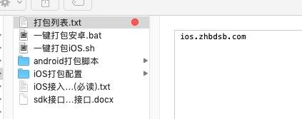

## 1.4修改资源

打开`D:\workspace\cq1_g\branch_release\client\cq1_g\BuildSetting\Package`文件夹，复制一份接过iOSSDK的包文件夹。修改文件夹中的内容为SDK中提供的文件、图标。

（1）将XcodeFiles\SDK中的内容替换为渠道方提供的.framework.bundle。

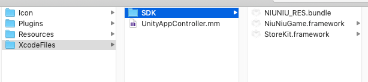

（2）在Resource文件夹下放入加载图片、闪屏

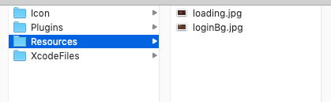

（3）在Icon文件夹下放入游戏图标，命名是固定的，注意修改。

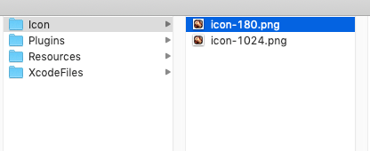

（4）在Plugins/IOS文件夹下放入如下四个文件，这两组文件接SDK时会用到：

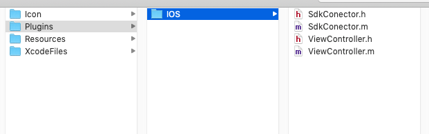


## 1.5导出Xcode工程

点击BuildProject导出Xcode工程文件。

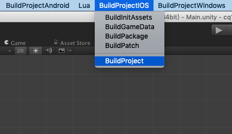

# 二 接入SDK

## 2.1修改项目配置

（1）勾选Automatically manage signing，自动管理证书。准备打包ipa时再调整为提供的证书。

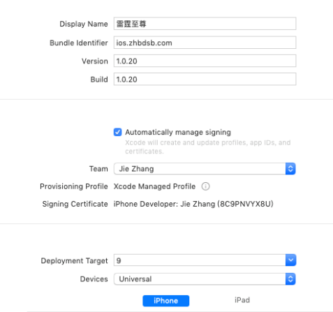

（2）检查Custom iOS Target Properties中的配置是否和SDK文档中对应，1.1章节配置的plist会显示在此：

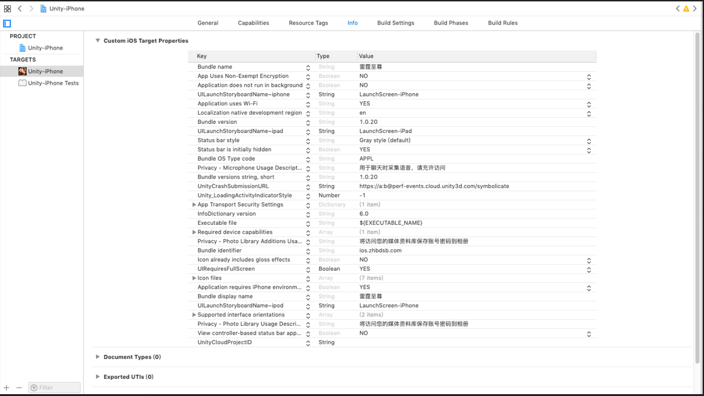

（3）如果提示内购报错，将内购关闭（下图的in-APP Purchase）：

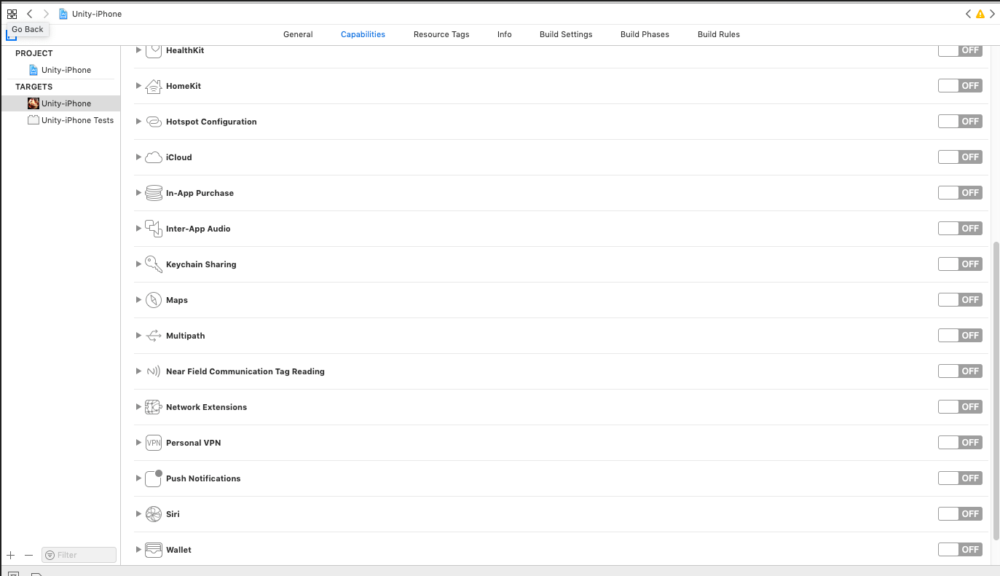

（4）检查framework是否添加至工程。

## 2.2根据文档接入SDK

（1）UnityAppDelegate中接入初始化，apple id，横竖屏等参数。

（2）在ViewController中接入支付、登陆、上传角色信息等接口。充值和上传角色需要传入的数组（param）会在Lua脚本中配置。

```objc
....
#import <NiuNiuGame/NiuNiuGameHeader.h>

...
// ************************** 添加事件 ************************** //
- (void) addEvent
{
    //捕获登录消息
    [[NSNotificationCenter defaultCenter] addObserver:self
                                        selector:@selector(loginNotificationResult:)
                                                 name:NSdkGameLoginNotification
                                               object:nil];
    //捕获注销消息
    [[NSNotificationCenter defaultCenter] addObserver:self
                                             			          selector:@selector(LogoutNotificationResult:)
                                                 name:NSdkGAMELogoutNotification
                                               object:nil];
    //充值回调
    [[NSNotificationCenter defaultCenter] addObserver:self
                                             selector:@selector(PayNotificationResult:)
                                                 name:NSdkGAMEMaiNotification
                                               object:nil];
}

...

// ************************** 登录 ************************** //
- (void) loginAction:(NSString*)param
{
    if ([[NiuNiuGame sharedInstance] isLogined]) {
        return;
    }
    if(![[NiuNiuGame sharedInstance] isShowLoginView]){
        [[NiuNiuGame sharedInstance] login];
    }
}

# pragma mark - 捕获登录消息
//捕获登录消息
- (void)loginNotificationResult:(NSNotification *) notif
{
    if ([[NiuNiuGame sharedInstance] isLogined]) {
        
         [[NiuNiuGame sharedInstance]showLogo];
        // 登录成功后的操作
        NSDictionary *userinfo = [notif userInfo];
        // 获取用户usertoken
        NSString *usertoken = [userinfo objectForKey:@"usertoken"];
        // 获取用户id
        NSString *userid = [userinfo objectForKey:@"userid"];
        // appid
        NSString *appid = @"1116";
        
        NSLog(@"登录成功");
        NSString *info =[NSString stringWithFormat:@"app_id=%@&user_id=%@&token=%@",appid,userid,usertoken];
        NSLog(@"--LoginInfo--%@", info);
        UnitySendMessage("SDKBack", "LoginBack", info.UTF8String);
    }
}


// ************************ 切换账号 ************************ //
- (void) changeAccountAction:(NSString*)param
{
    [[NiuNiuGame sharedInstance] logout];
}

# pragma mark - 捕获登出消息
- (void)LogoutNotificationResult:(NSNotification *) notif {
    NSLog(@"注销成功");
    UnitySendMessage("SDKBack", "LoginBack", "Logout");
}


// ************************ 支付 ************************** //
//param数组在lua中配置
- (void) rechargeAction:(NSString *)param
{
    NSArray *array = [param componentsSeparatedByString:@"|"];
    NSLog(@"---recharge ：%@",[self descriptionWithLocale:array]);
    
    if ([[NiuNiuGame sharedInstance] isLogined]) {
    [[NiuNiuGame sharedInstance] doSDKMaiWithSpxxId: array[0]   //牛牛的后台商品ID
                                             Spxxjg:[array[1] intValue]   //单份价格
                                           Multiple:[array[2] intValue]  //购买份数
                                          ExtraData:array[5]   //额外参数
                                            SpxxDdh:array[4] //[self getOrderid]   //厂商的订单号
                                           APItemId:array[0] ];// 苹果的内购ID  （iOS包不走内购的话就先填成商品ID）
        
    }
}


# pragma mark - 捕获付款消息
//捕获付款消息
- (void)PayNotificationResult:(NSNotification *) notif
{
    NSDictionary *payinfo = [notif userInfo];
    NSString * result = [payinfo objectForKey:@"result"];
    // 获取支付结果描述
    NSString *desc = [payinfo objectForKey:@"desc"];
    
    
    if([result isEqualToString:@"success"]){
        NSLog(@"支付成功");
   
        // 获取厂商订单号
        NSString *cporderid = [payinfo objectForKey:@"cporderid"];
        // 获取SDK订单号
        NSString *sdkorderid = [payinfo objectForKey:@"sdkorderid"];
        
        NSString * logresult = [NSString stringWithFormat:@"%@%@%@%@%@%@",
                                @"-捕获付款信息成功回调-\n--------------------------\n",
                                desc,
                                @"\n厂商订单号：\n",
                                cporderid,
                                @"\nSDK 订单号\n",
                                sdkorderid];
        NSLog(@"%@", logresult);
        UnitySendMessage("SDKBack", "RechargeBack","Success");
    }else
    {
        NSString * logresult2 = [NSString stringWithFormat:@"%@%@%@%@",
                                 @"-捕获付款信息失败回调-\n--------------------------\n",
                                 @"购买失败 【",
                                 desc,
                                 @"】"];
        NSLog(@"%@", logresult2);
        UnitySendMessage("SDKBack", "RechargeBack","Failed");
    }
}

//******************** 提交用户角色信息 ********************* //
//param数组在lua中配置
- (void) userDataAction:(NSString *)param
{
    NSArray *array = [param componentsSeparatedByString:@"|"];
    NSLog(@"---userdata ：%@",[self descriptionWithLocale:array]);
    
    //进入游戏
    if([array[0] intValue] == 1){
        NSLog(@"登陆上传角色信息");
        [[NiuNiuGame sharedInstance]setServId:array[1]          //区服ID
                                     ServName:array[2]          //区服名称
                                       RoleId:array[3]          //角色ID
                                     RoleName:array[4]          //角色名称
                                    RoleGrade:[array[5] intValue]];       //等级 int 型
    }//升级
    else if([array[0] intValue] == 2)
    {
        NSLog(@"升级上传角色信息");
        [[NiuNiuGame sharedInstance] setRoleId:array[1]          //角色ID
                                     RoleGrade:[array[2] intValue]];        //最新等级
    }
}

...

@end

```

# 三 Lua中配置SDk

## 3.1配置渠道信息表

在项目下的`渠道信息表`中配置包的参数，和1.2章节中的`iOS配置表`保持一致。

## 3.2添加对应SDK的Lua脚本

在`D:\workspace\cq1_g\branch_release\client\cq1_g\Assets\_GameData\Lua\Game\Game\SDK`文件夹下按命名规则（渠道名+平台+SDK 一律大写）新建脚本。

在2.2中的方法中使用的param数组，要从lua中组织好数据传过去才能使用：

.mm充值方法传入入的数组：

```lua
function LYLYHDIOSSDK:OnRecharge()
    self.rechargeParam = "" .. self.rechargeCfg.ID
    self.rechargeParam = self.rechargeParam .. "|" .. self.rechargeCfg.NeedCNY * 100
    self.rechargeParam = self.rechargeParam .. "|" .. "1"
    self.rechargeParam = self.rechargeParam .. "|" .. "1460762673"
    self.rechargeParam = self.rechargeParam .. "|"  .. self.rechargeOrderID
    self.rechargeParam = self.rechargeParam .. "|" .. encodeBase64(self.rechargeCustomInfo)
end
```

角色信息上传，1为登陆上传角色信息，2为升级上传角色信息。`HanleEnterGame`和`HandleLevelUp`方法为升级和登陆时需要进行的一些操作：

```lua
function LYLYHDIOSSDK:HanleEnterGame()
    self.sendDataType = "EnterGame"
    self:SendUserData()
end

function LYLYHDIOSSDK:HandleLevelUp()
    self.sendDataType = "LevelUp"
    self:SendUserData()
end

function LYLYHDIOSSDK:OnUserData()
    if self.sendDataType == "EnterGame" then
        local serverName = GameModels.login.selectServerName
        if serverName == "" then
            serverName = "无"
        end
        self.userdataParam = "" .. "1"
        self.userdataParam = self.userdataParam .. "|" .. GameModels.login.serverTag
        self.userdataParam = self.userdataParam .. "|" .. serverName
        self.userdataParam = self.userdataParam .. "|" .. GameModels.role.myRole:Get_roleID()
        self.userdataParam = self.userdataParam .. "|" .. GameModels.role.myRole:Get_name()
        self.userdataParam = self.userdataParam .. "|" .. GameModels.role.myRole:Get_level()
    else
        self.userdataParam = "" .. "2"
        self.userdataParam = self.userdataParam .. "|" .. GameModels.role.myRole:Get_roleID()
        self.userdataParam = self.userdataParam .. "|" .. GameModels.role.myRole:Get_level()
    end
end
```

如果需要调用其它方法，可以在BaseSDK.lua中查找并在SDK脚本中重写。


## 3.3添加新引入的SDK平台 （PlatformSDK.lua）

找到SDK目录下的PlatformSDK.lua，添加如下代码，导入3.2写的SDK脚本：

```lua
...
require "Game/SDK/Platform/LYLYHDIOSSDK"
...
PlatformSDK[116] = LYLYHDIOSSDK.new()
...
```

# 四 出包

## 4.1准备热更包

（1）使用cmd mstsc远程连接打包用的电脑，修改版本号文件夹（测试稳定后更为正式版本号）。

（2）打开生成热更包工具，生成热更文件。全部生成（lua，数据表，UI）约需要一个小时。

## 4.2 热更测试

通知运维上传热更包，对接入SDK的功能模块进行测试。在测试支付时可向渠道方询问是否有账号可以用来进行支付的测试。或者配置一个临时的商品数据进行调试。

## 4.3出包

（1）测试无误后将SDK提供证书安装好。再次运行游戏测试。安装SDK提供的证书（双击打开添加至钥匙串，密码由渠道方提供），然后在Xcode中打出ipa包：

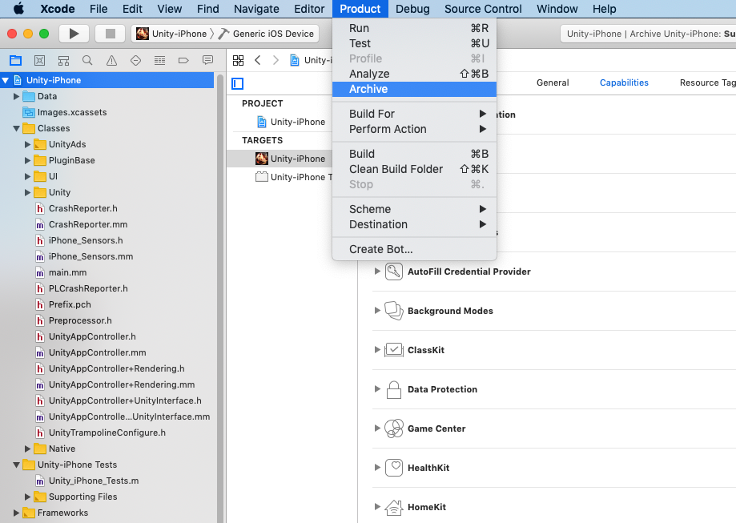

点击Distribute App：

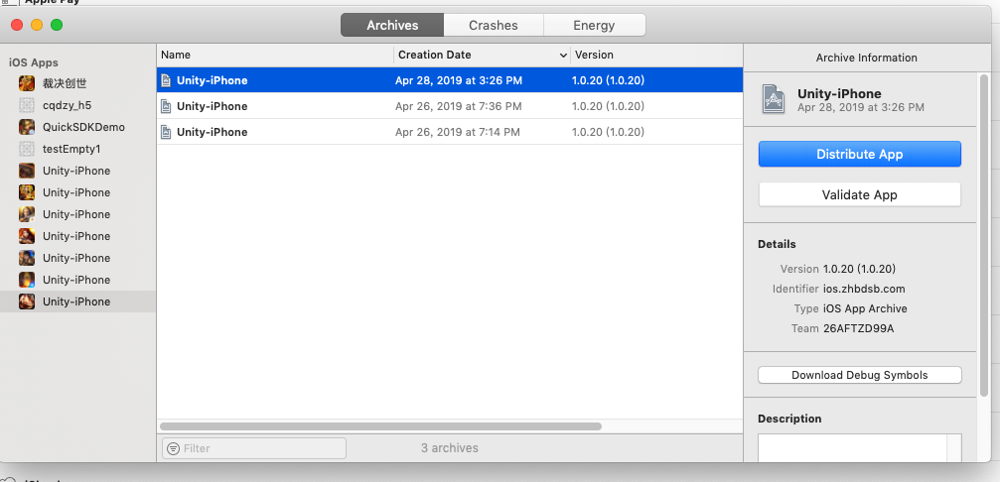

根据需求选择对应的包：

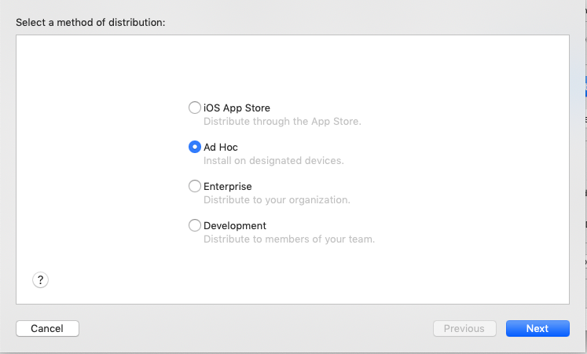

选择ipa包运行的设备：

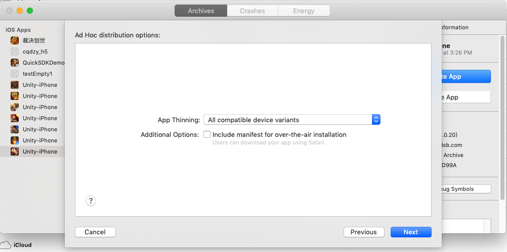

配置证书：

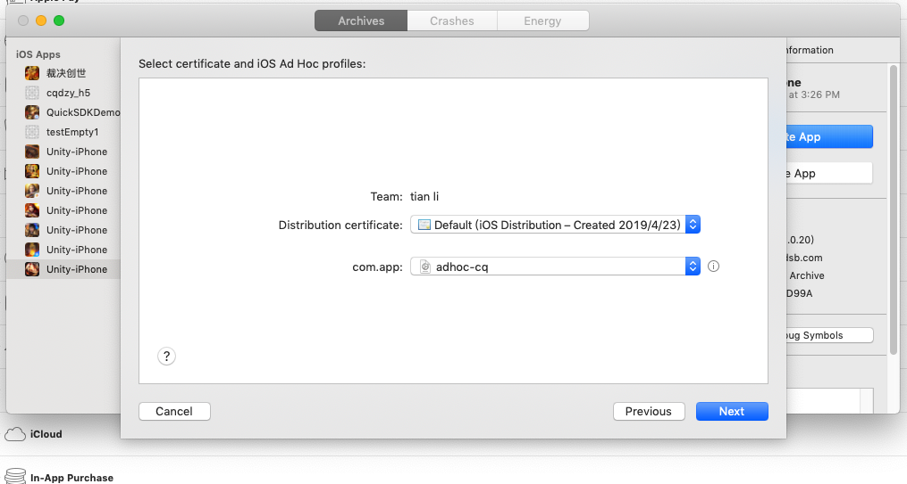

（2）检查ipa包是否正常，确认无误后交付给渠道方。

# 五 常见错误

出现其他错误及时补充。

### 5.1未引入库引发的错误

5.1.1 Undefined symbol：_OBJC_ClASS_ __$_SKMutablePayment/SKProductsRequest/SKPaymentQueue


解决办法：缺少StoreKit.framework（内购需要），添加至项目即可。