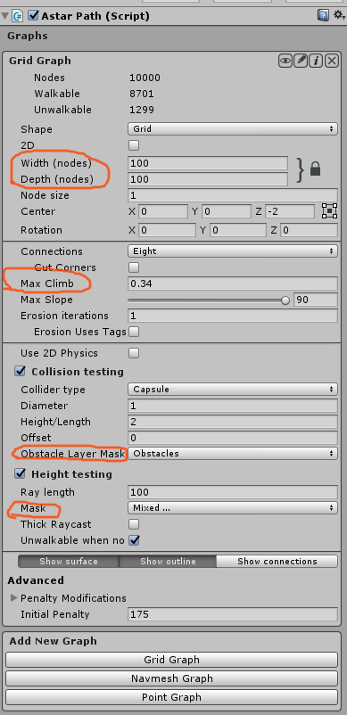

本文为AStarPathfinding插件的进阶内容，如果需要简单的使用寻路功能可以看上和中。

AI漫游以及扩展系统暂时没有做介绍，感兴趣的可以去官网看。

<!-- more -->

本篇为AStarPathfinding寻路系统的上部分，主要介绍插件的组件以及工作原理，和一个简单的Demo。

# 前言

除阅读热身章节外，需要了解寻路的基础知识才能阅读以下内容：

1. 游戏寻路基本原理
2. [寻路常用的几种图介绍](http://dongbeigtl.top/2019/01/02/寻路常用的图/)
3. [Unity的寻路系统](http://dongbeigtl.top/2018/12/27/导航网格等寻路工作原理/)

如果只是想了解该插件的基础功能，可以直接跳至热身章节阅读。

以下的讲解内容，一部分是翻译自文档，翻译的部分会给出原文参考。英语好的同学可以直接看官方文档，文档包括寻路常用的几种图的介绍和优劣对比，以及一套寻路系统的工作原理是怎样的，写的非常详细，[官网地址](https://www.arongranberg.com/astar/docs/beginner.html)

此外官方还有一个入门的[视频](https://youtu.be/5QT5Czfe0YE)，需要梯子看。

# 介绍

APathfinding是比较主流的Unity寻路插件，分付费（100刀）和免费版。支持五种图：Grid Graph，Navmesh Graph，Point Graph，Recast Graph（付费），Layered Grid Graph（付费）。同时支持自动生成Navmesh（付费），自带RVO避障系统（付费）。目前Unity寻路插件用的比较多的就是该插件，功能齐全，可调节估价公式等等等，总之是一款非常强大的插件。

# 准备，简单的Demo

下面的Demo是一个简单的寻路，将准备好的插件包导入新建项目中然后完成下面的操作：

**（1）**准备工作：场景中添加Plane（一块地板），障碍物。为Plane添加一个Layer（我的命名是Ground）。添加几个障碍物，为所有的障碍物添加Layer（Obs），注意障碍物要添加Box Collider组件*。新建一个空物体，并为空物体添加**Astar Path**组件。添加一个游戏人物命名为hero，一个球体命名为target用于表示hero要去的目标。场景内现在应该有：地板，障碍物，游戏人物，以及target，挂载了Astar Path的空物体。

**（2）**生成导航网格**：**准备完成后，在Astar Path中添加**Grid Graph**，并设置网格图的长宽以足够覆盖整个Plane。将Collison Testing中的**Obstacle Layer** Mask设置为障碍物所在的图层（Obs）。将**Height Tesing**中的Mask设置为Plane所在的图层（Ground）。


设置完成后点击Scan，效果如图：

[](http://img.dongbeigtl.top/A文章需要的截图/Unity插件：AStarPathfinding寻路系统/Image 0011545907201.png)

(3)让hero可以寻路：添加Seeker，Character Controler组件。新建一个名为MineAstarAI的脚本，并填入以下代码：

```
using Pathfinding;

public void Start () {
// Get the seeker component attached to this GameObject
var seeker = GetComponent<Seeker>();

// Start a new path request from the current position to a position 10 units forward.
// When the path has been calculated, it will be returned to the function OnPathComplete unless it was canceled by another path request
seeker.StartPath (transform.position, transform.position+transform.forward*10, OnPathComplete);

// Note that the path is NOT calculated at this stage
// It has just been queued for calculation
}

public void OnPathComplete (Path p) {
// We got our path back
if (p.error) {
// Nooo, a valid path couldn't be found
} else {
// Yay, now we can get a Vector3 representation of the path
// from p.vectorPath
}
}
```

 

然后在Target Position拖入Target。

[](http://img.dongbeigtl.top/A文章需要的截图/Unity插件：AStarPathfinding寻路系统/Image 0011545908704.png)

（4）运行，Scene窗口会显示寻路的路径：
[](http://img.dongbeigtl.top/A文章需要的截图/Unity插件：AStarPathfinding寻路系统/Image 0011545908795.png)

若没显示路径（绿线），检查seeker脚本中的Draw Gizmos选项是否勾选。

------

# 组件介绍

**概览**

主要组件有这几种，它们负责运作整套寻路系统。

1. **Astarpath.cs**：插件的核心脚本，是寻路系统的核心，所有对寻路的调整都要修改该组件才能完成。
2. **Seeker.cs：**：负责寻路调用，但不是必须。
3. **AIPath，RichAI，AILerp**：AI移动脚本，可以用这三个完成寻路移动或自己写一个。
4. **修饰脚本 SimpleSmoothModifier等等**：对已生成的路径进行修饰，平滑，简化路径。

## 1.Astarpath组件

Astarpath组件添加在object上以后会显示如下面板：


组件面板

**Scan 按钮**用于扫描更新图，在游戏启动时完成（除非缓存启动**，更多关于另一部分的启动**），并且一些图在有改动时会自动执行扫描，不会导致任何延迟。

> The Scan button is for updating the graphs, this is also done on startup (unless the startup is cached, more about that in another part) and some graphs will do it automatically when changing the graph settings and the scanning won't cause any lag.

比较重要的是Graphs，Settings。About是官网导航，版本检查问题反馈等等，就不做介绍了，重点介绍一下**Graphs**和Settings，Save和Optimization。

### Settings面板


| 属性                            | 功能                                                         |
| ------------------------------- | ------------------------------------------------------------ |
| Thread Count[1]                 | 寻路使用的线程数，None表示协程运行，Automatic自动根据配置调整线程。此功能为付费功能（WebGL 上无法使用此功能） |
| Max Nearest Node Distance       | 可搜索的临近点最大距离，如果请求不可到达点的路径，则会返回该点在该值范围内的最近节点。 |
| Heuristic[2]                    | 使用哪种估价公式                                             |
| Heuristic Scale[3]              | 启发式规模                                                   |
| Advanced                        |                                                              |
| Heuristic Optimization[4]       | 启发式优化（不知道怎么用）                                   |
| Batch Graph Updates[5]          | 批处理更新图                                                 |
| Prioritize Graphs[5]            | 图的优先级                                                   |
| Full Get Nearest Node Search[6] | 对所有图执行完整GetNearest搜索                               |
| Scan on Awake                   | 在执行Awake时生成图                                          |
| Path Logging                    | Log产生的消息数量（None/Normal/Heavy/InGame（和Heavy一样多，但在游戏中使用UI输出log）/OnlyErrors） |
| Graph Coloring                  | 根据不同的属性对图进行可视化（G/H/F/Penalty/Areas）          |
| Show Search Tree                | 如果勾选将会将节点的父节点可视化。（此功能目前还不完整）     |
| Show Unwalkable Nodes           | 显示不可走的节点                                             |
| Smooth Transitions[7]           | 在打开和关闭时动画下拉菜单                                   |

[1]Thread Count：推荐使用Automatic，因为不同用户间配置的不同，会导致性能的浪费或导致游戏无法以正常帧数运行。Automatic会检查当前机器的配置来确定线程数，稳定运行。另外需要的注意，如果场景中只有一个（或很少）需要寻路的角色（代理），应该只使用一个线程。因为多线程计算路径适用于计算不同路径以提升吞吐量，**但是多线程并不会使单个路径的计算速度变快。**

[2]不同的估价公式：

[](http://img.dongbeigtl.top/A文章需要的截图/Unity插件：AStarPathfinding寻路系统/Image 0011546845961.png)

估价公式的作用请看寻路原理文档以及网上查阅资料。

[3]Heuristic Scale：如果使用小于1的值，则寻路处理时会搜索更多节点（更慢）。 如果使用0，则路径查找算法将简化为dijkstra算法。 相当于将Heuristic选项设置为None。 如果使用大于1的值，则路径查找通常会更快，但因为搜索了更少的节点，所以路径可能不再是最佳路径（即最短路径）。

[4]Heuristic Optimization：

[5]Batch Graph Updates：图形更新将批处理并执行较少（由graphUpdateBatchingInterval指定更新）。

[6]Prioritize Graphs：图表将根据他们在检查员中的顺序进行优先排序。 将选择具有比优先级图限制更近的节点的第一个图，而不是搜索所有图。

[7]Smooth Transitions：

### SaveAndLoad面板

[](http://img.dongbeigtl.top/A文章需要的截图/Unity插件：AStarPathfinding寻路系统/Image 0011545903520.png)

此面板用于读取和保存图的信息。通过读取缓存数据避免在游戏中进行大量的图生成计算。

### Optimization面板

[](http://img.dongbeigtl.top/A文章需要的截图/Unity插件：AStarPathfinding寻路系统/Image 0011545903671.png)

禁用或使用面板中的某些功能来提升性能。

------

## 2.图

点击Graphs后会提示选择其中一种图来进行下一步的操作，这里拿Grid来做讲解，这几种图是干吗的在前言的文章有介绍。


组件面板


点击i按钮进行编辑

下面是这五种图的属性介绍。

[su_accordion][su_spoiler title="Grid和Layered Grid Graph" open="no" style="default" icon="plus" anchor="" class=""]

Grid和Layered Grid差别不大，合在一起说

Layered Grid是插件的付费功能，和Grid图的区别是它支持重叠区域的网格图。它在某些方面有点受限，它只支持4个邻居而不是8，并且比网格图使用更多的内存。但是当你需要一个重叠区域的网格图时它很有用。

 

| 属性                           | 功能                   |
| ------------------------------ | ---------------------- |
| Shape[1]                       | 生成图的形状           |
| 2D                             | 勾选后将适用于2D       |
| Width                          | 调整生成的图宽度       |
| Depth                          | 调整生成的图长度       |
| Node size                      | 节点大小               |
| Center                         | 确定中心点             |
| Rotation                       | 图的角度               |
| ------------------------------ |                        |
| Connections                    | 存储的邻接点数量4/8    |
| Cut Corners[2]                 | 是否剪切边角           |
| Max Climb                      | 最大攀爬高度           |
| Max Slope                      | 最大攀爬角度           |
| Erosion iterations[3]          | 侵蚀范围               |
| ------------------------------ |                        |
| Use 2D physics                 | 使用2D物理系统检测碰撞 |
| Colloder type                  | 碰撞体类型             |
| Dimaeter                       |                        |
| Height/Length                  |                        |
| Offset                         |                        |
| Obstacle Layer Mask            | 障碍物所在图层         |
| ------------------------------ |                        |
| Ray length[4]                  | 检测射线高度           |
| Mask                           | 地板所在图层           |
| Thick Raycast[5]               |                        |
| Advanced                       |                        |
| Unwalkable when no ground      |                        |
| Use Jump point Search[6]       | 使用跳跃点搜索         |

**[1]Shape:**Grid Graph有很多种，如网格图等等

**[2]Cut Corners:**

[](http://img.dongbeigtl.top/A文章需要的截图/Unity插件：AStarPathfinding寻路系统/cutCorners.png)

**[3]Erosion iterations：**

通过调整Erosion iterations实现侵蚀的效果，根据值的不同侵蚀的程度也不同：

[](http://img.dongbeigtl.top/A文章需要的截图/Unity插件：AStarPathfinding寻路系统/erosion.png)

分别为值是0，1，2时的效果

过多的侵蚀迭代次数会降低运行时（Graph UpdateObject）中的图形更新速度。

**[4]Ray length：**

**[5]Thick Raycast：**

**[6]Use Jump point Search：**

[/su_spoiler] [/su_accordion]

[su_accordion][su_spoiler title="Navmesh Graph" open="no" style="default" icon="plus" anchor="" class=""]

[](http://img.dongbeigtl.top/A文章需要的截图/Unity插件：AStarPathfinding寻路系统/Image 0011545905039.png)

| 属性                                | 功能                             |
| ----------------------------------- | -------------------------------- |
| Source Mesh                         | 生成的navmesh资源                |
| Offset                              | 偏移量                           |
| Rotation                            | 旋转角度                         |
| Scale                               | 缩放                             |
| Nearest Node queries in XZ space[1] | 仅在XZ空间中执行最近的节点搜索。 |
| Recalulate Normals[2]               | 确定如何计算法线                 |
| Initial Penalty[3]                  | 节点默认代价                     |

**[1]Nearest Node queries in XZ space**

**[2]Recalulate Normals**

**[3]Initial Penalty**

[/su_spoiler] [/su_accordion]

[su_accordion][su_spoiler title="Point Graph" open="no" style="default" icon="plus" anchor="" class=""]

[](http://img.dongbeigtl.top/A文章需要的截图/Unity插件：AStarPathfinding寻路系统/Image 0011545905044.png)

| 属性                         | 功能                       |
| ---------------------------- | -------------------------- |
| Root                         | 指定的根节点               |
| Recursive                    | 是否遍历根节点下的全部节点 |
| Tag                          | 指定路点的Tag              |
| Max Distance                 | 两路点最大距离，0无限大    |
| Max Distance()[1]            | 两路点最大距离，分轴计算   |
| Raycast                      | 使用raycast来检查连接      |
| Use 2D Physics               | 使用2D物理系统             |
| Thick Raycast                |                            |
| Mask                         | 用于射线检测的图层         |
| Optimize For Sparse Graph[2] | 优化稀疏图                 |
| Initial Penty                | 默认惩罚值                 |

[1]Max Distance()：与Max Distance不同，该属性可以分不同的方向来控制最大距离。

[2]Optimize For Sparse Graph：

[/su_spoiler] [/su_accordion]

[su_accordion][su_spoiler title="Recast Graph" open="no" style="default" icon="plus" anchor="" class=""]

[](http://img.dongbeigtl.top/A文章需要的截图/Unity插件：AStarPathfinding寻路系统/Image 0011545905050.png)

| 属性                      | 功能             |
| ------------------------- | ---------------- |
| Cell Size                 | 多边形大小       |
| Use Tiles                 | 是否使用Tiles    |
| Tile Size                 | Tile大小         |
| Min Region Size           | 最小区域大小     |
| Walkable Height           | 可行走高度       |
| Walkable Climb            | 可攀爬高度       |
| Character Radius          | 角色半径         |
| Max Slope                 | 最大攀爬角度     |
| Max Border Edge Lenght[1] | 最大细分边缘长度 |
| Max Edge Error            |                  |
| Rasterize Terrain         |                  |
| Rasteruze Tress           |                  |
| Collider Deta             |                  |
| Terrain Sample            |                  |
| Rasterize meshes          |                  |
| Rasterize Collider        |                  |
| Center                    | 中心点位置       |
| Size                      | 尺寸大小         |
| Rotation                  | 角度             |
| LayerMask                 |                  |
| TagMask                   |                  |
| Relevant Graph s          |                  |
| Nearest node              |                  |
| Initial Penalty           |                  |

[/su_spoiler] [/su_accordion]

------

## 3.Seeker组件

Seeker附加在请求寻路的GameObject上，通过调用Seeker.StartPath（）来请求寻路。同时Seeker还可以使用Modifiers组件使路径变得更加圆滑**，**简单。（需要注意的是Seeker会自动调用Modifiers）

使用方法：

```
public void Start () {
// Get a reference to the Seeker component we added earlier
Seeker seeker = GetComponent<Seeker>();

// Start to calculate a new path to the targetPosition object, return the result to the OnPathComplete method.
// Path requests are asynchronous, so when the OnPathComplete method is called depends on how long it
// takes to calculate the path. Usually it is called the next frame.
seeker.StartPath(transform.position, targetPosition.position, OnPathComplete);
}

public void OnPathComplete (Path p) {
Debug.Log("Yay, we got a path back. Did it have an error? " + p.error);
}
```

可以不填写回调参数：

```
// Set the path callback, this should be done once
seeker.pathCallback += OnPathComplete;

// Now we can skip the callback function parameter
seeker.StartPath (transform.position, transform.position+transform.forward*10);
```

注意第三个参数是委托，记得销毁时候：

```
public void OnDisable () {
seeker.pathCallback -= OnPathComplete;
}
```

Seeker组件旨在处理游戏中单个角色的寻路请求。所以，它一次只处理一个路径请求，如果正在计算路径时再次调用StartPath，它会记录一条日志，指出先前的路径计算已中止。

**注意Seeker一次只能进行一次寻路调用，如果在前一个路径完成之前请求新路径，则前一个路径请求将被取消。**并且StartPath调用之后**并不**会立即计算路径。StartPath调用仅目标点放入队列中。这样做是因为当许多单位同时请求计算路径时，可以在几帧上展开寻路计算以避免FPS下降。如果已启用多线程，还可以在其他线程计算路径。如果需要立即计算路径。可以使用Pathfinding.Path.BlockUntilCalculated方法。

原文：

> A common mistake is to assume that the path is already calculated right after the StartPath call. This is however incorrect. The StartPath call will only put the path in a queue. This is done because when many units are calculating their paths at the same time, it is desriable to spread out the path calculations over several frames to avoid FPS drops. We can also calculate the paths in other threads if [multithreading](https://www.arongranberg.com/astar/docs/astarpath.html#threadCount) has been enabled. There are of course cases where you need to calculate the path immediately. Then you can use the [Pathfinding.Path.BlockUntilCalculated](https://www.arongranberg.com/astar/docs/path.html#BlockUntilCalculated)method.

Seeker并不是必须要挂载的，但是用它寻路会更简单。

[](http://img.dongbeigtl.top/A文章需要的截图/Unity插件：AStarPathfinding寻路系统/Image 0011546850497.png)

| 属性                  | 功能                           |
| --------------------- | ------------------------------ |
| Draw Gizmos           | 显示寻路路线                   |
| Detailed Gizmos       | 显示被简化，平滑前的路径       |
| Start End Modifier[1] | 用于调整路径的起点和终点位置。 |
| Start Point Snapping  | 起点的位置                     |
| End Point Snapping    | 终点的位置                     |
| Add Points            | 添加                           |
| Traversable Graphs    |                                |

[1]Start End Modifier:

## 4.AIPath，RichAI，AILerp组件

插件提供了三个用于寻路移动脚本AIPath，RichAI，AILerp，这三个插件是可选的，可以不使用这些插件，用自己写的完成路径查找、移动功能。但这三个脚本功能齐全，拿来直接用也是没有问题的。要注意的是它们适用的场景各不相同，下面是官方的简介。

**AIPath：**

- 适用于所有图的全能移动脚本。
- 可以响应物理系统，并可以生成圆滑的路径。
- 支持本地躲避系统。
- 支持3D，2D。

**RichAI：**

- 专为navmesh / recast图设计，不适用于任何其他图类型。
- 在navmesh下寻路能力比AIPath好，**更好的处理路径，并且路径更加圆滑。**
- 更好的支持off-mesh，与AIPath相比。
- 支持本地躲避系统。
- 支持3D（XZ平面中的移动），但不支持2D。

注意**RichAi不支持大部分的modifiers，除** funnel modifier外。

> The RichAI script is specially written for movement on navmesh graphs. It enforces that the agent stays on the navmesh at all times. As opposed to other movement scripts in this project, it does not have support for path modifiers. This is because it does not follow a list of waypoints, instead it follows a list of nodes. This has the advantage that the character can be pushed around by some amount and it will still move correctly without a path recalculation.

（richiai不按照路点查询，在哪写了其他脚本按照路点查询） 这样的好处是什么关于RichAi的设置那段没看懂

**AILerp：**

- 线性插值的沿路径移动，不支持物理系统。
- 完全遵循路径，无任何偏差。
- 由于以上两点，AILerp完全不支持本地躲避系统。
- 到目前为止最快的移动脚本，因为移动本身更简单。如果在游戏中需要物理模拟，应当使用其他脚本。
- 支持3D，2D游戏中的移动。

[su_accordion][su_spoiler title="原文" open="no" style="default" icon="plus" anchor="" class=""]

> **AIPath**
>
> - Good all-around movement script which works on all graph types.
> - Follows paths smoothly and responds to physics.
> - Works well with local avoidance.
> - Supports movement in 3D games as well as 2D games.
>
> **RichAI**
>
> - Designed specifically for navmesh/recast graphs and does not work with any other graph types.
> - Better than the AIPath script at following paths on navmesh based graphs, it can handle getting pushed of its path better and usually follows the path more smoothly.
> - Has better support for off-mesh compared to AIPath.
> - Works well with local avoidance.
> - Supports movement in 3D games (movement in the XZ plane), but not 2D.
>
> **AILerp**
>
> - Uses linear interpolation to move along the path (which is why 'lerp', which stands for linear interpolation, is in the name), does not use physics in any way.
> - Follows the path exactly, without any deviations whatsoever.
> - Due to the above points it does not make sense to use it with local avoidance, and thus it does not support it.
> - By far the fastest of the movement scripts, because the movement in itself is much simpler, but keep in mind that if you need any kind of physical realism in the game, you should usually use one of the other movement scripts.
> - Supports movement in 3D games as well as 2D games.

[/su_spoiler] [/su_accordion]

总之，如果使用的是navmesh：使用RichAI脚本，否则使用AIPath或AILerp，具体取决于游戏所需的移动方式，具体在游戏中的表现看下面的演示章节。

脚本中会用到的一些属性：

- destination：需要移动到的目标点。
- reachedDestination：如果已到达目标的，则值为ture
- Velocity：代理的速度
- desiredVelocity：代理期望的移动速度*。

原文：

> - destination: Position in the world that this agent should move to.
> - reachedDestination: True if the ai has reached the #destination.
> - velocity: Actual velocity that the agent is moving with.
> - desiredVelocity: Velocity that this agent wants to move with.

 

## 5.Modifiers组件

Modifiers是一些小组件，如SimpleSmoothModifier，RaycastModifier，FunnelModifier，和Seeker挂在同一个GameObject上。在Seeker返回路径给调用者之前，对路径**自动（**需手动修改或调用**）**进行圆滑或简化处理。

例如，下图中，Raycast Modifier删除了路径中不必要的节点，使路径更短。SimpleSmoothModifier使路径更圆滑，看起来更自然。

下面是几种最常见的Modifier的比较：

[](http://img.dongbeigtl.top/A文章需要的截图/Unity插件：AStarPathfinding寻路系统/modifier_comparison_grid.png)

关于这些Modifier的具体功能，看下面章节。

需要注意，Modifiers通常不考虑世界几何图形或图形，因此小心使用太多平滑，可能会导致路径穿过不可行走的区域。圆滑路径一定要注意将参数调大，不然会卡死，如图：


**只有Seeker可以调用Modifieer吗**

------

# 使用

## 使用Modifiers组件

Modifiers组件一共有以下几种：

1. SimpleSmoothModifier
2. RaycastModifier
3. FunnelModifier
4. RadiusModifier
5. StartEndModifier
6. AlternativePath

重点介绍一下SimpleSmoothModifier，FunnelModifier，Raycast Modifier。

### SimpleSmoothModifier

SimpleSmooth的功能是平滑路径，可以通过细分路径并使定点靠近彼此来实现平滑（Simple模式），也可以使用贝塞尔曲线（Bezier 模式）来实现。下图是开启SimpleSmooth前后的对比。注意，因为在平滑时不考虑几何世界，所以**平滑路径会稍微削减拐点**。

> The simple smooth modifier is a modifier to smooth the path. It can do that either by just subdividing it and moving the vertices closer to each other or use splines, namely the Bezier curve.
> Below are two images showing a path with the smooth modifier turned off first and then on. Note that the smoothed path cuts the corners a bit, this can be a problem with the smooth modifier since it does not take world geometry into account when smoothing.

[](http://img.dongbeigtl.top/A文章需要的截图/Unity插件：AStarPathfinding寻路系统/smoothModifier_off.png)

[](http://img.dongbeigtl.top/A文章需要的截图/Unity插件：AStarPathfinding寻路系统/smoothModifier_on.png)

SimpleSmooth的类型有如下几种：

#### 1.SimpleSmooth

通过细分路径，使顶点互相靠近实现平滑。

[](http://img.dongbeigtl.top/A文章需要的截图/Unity插件：AStarPathfinding寻路系统/Image 0011545992300.png)

| Uniform Length     | 是否将所有线划分为相等长度的线段。 |
| ------------------ | ---------------------------------- |
| Max Segment Length | 分割线段最大长度                   |
| Iterations         | 平滑处理迭代次数                   |
| Strength           | 每次平滑处理的强度，0.5最佳        |

Uniform Length会将路径裁剪成每段相等线段，线段的最大长度取决于Max Segment Length，Max Segment Length越大路径越简单，同时也容易**穿过不可走区域。**我描述的可能不太清晰**，**看下面的例子或者自己尝试调节下参数很容易明白这两个属性的意义。

[](http://img.dongbeigtl.top/A文章需要的截图/Unity插件：AStarPathfinding寻路系统/Image 0011545993237.png)

未开启SimpleSmooth

[](http://img.dongbeigtl.top/A文章需要的截图/Unity插件：AStarPathfinding寻路系统/Image 0011545993249.png)

开启SimpleSmooth，但Uniform Length未开启。

[](http://img.dongbeigtl.top/A文章需要的截图/Unity插件：AStarPathfinding寻路系统/Image 0011545993261.png)

开启Uniform Length

[](http://img.dongbeigtl.top/A文章需要的截图/Unity插件：AStarPathfinding寻路系统/Image 0011545994656.png)

Max Segment Length = 20

[](http://img.dongbeigtl.top/A文章需要的截图/Unity插件：AStarPathfinding寻路系统/Image 0011545994680.png)

Max Segment Length = 100

#### 2.Bezier

通过贝塞尔曲线实现平滑，注意贝塞尔曲线处理过的路径总会通过所有的顶点（看下面的图就明白什么意思了），所以注意不要拐弯拐的太过。

[](http://img.dongbeigtl.top/A文章需要的截图/Unity插件：AStarPathfinding寻路系统/Image 0011545992326.png)

| Subdvisions           | 细分次数，设置为0时和未处理没什么区别 |
| --------------------- | ------------------------------------- |
| Bezier Tangent Length | 贝塞尔曲线“切线”的长度系数。          |

Bezier Tangent Length值要注意，如图：

[](http://img.dongbeigtl.top/A文章需要的截图/Unity插件：AStarPathfinding寻路系统/Image 0011545996463.png)

Bezier Tangent Length = 0

[](http://img.dongbeigtl.top/A文章需要的截图/Unity插件：AStarPathfinding寻路系统/Image 0011545996473.png)

Bezier Tangent Length = 0.5

[](http://img.dongbeigtl.top/A文章需要的截图/Unity插件：AStarPathfinding寻路系统/Image 0011545996558.png)

Bezier Tangent Length =3（挺好看的）

[](http://img.dongbeigtl.top/A文章需要的截图/Unity插件：AStarPathfinding寻路系统/Image 0011545996502.png)

Bezier Tangent Length =10，曲线的曲率已经大的看不到了。

关于贝塞尔曲线，自行查阅资料。

#### 3.OffSet

通过向外偏移路径，减少拐点角度来实现平滑，注意offset的值过大会非常乱。

[](http://img.dongbeigtl.top/A文章需要的截图/Unity插件：AStarPathfinding寻路系统/Image 0011545992330.png)

| Iterations | 平滑处理迭代次数 |
| ---------- | ---------------- |
| offset     | 偏移量           |

[](http://img.dongbeigtl.top/A文章需要的截图/Unity插件：AStarPathfinding寻路系统/Image 0011545999588.png)

offset = 2，可以看到该模式下致力于减少拐角处的角度实现平滑。

#### 4.Curved Non Uniform

这个没什么好说的，平滑处理时曲线曲率是不相等的。

[](http://img.dongbeigtl.top/A文章需要的截图/Unity插件：AStarPathfinding寻路系统/Image 0011545992334.png)

Factor：弧度系数

### FunnelModifier

FunnelModifier使用漏斗算法，快速准确的对路径进行简化。但在Grid的中优化的效果可能不尽人意，因为它只简化了路径队列中节点内的路径。在RaycastModifier中效果会好一些。

[](http://img.dongbeigtl.top/A文章需要的截图/Unity插件：AStarPathfinding寻路系统/Image 0011546001697.png)

Unwrap：开启后将在XY以及更复杂的空间支持简化路径。

[](http://img.dongbeigtl.top/A文章需要的截图/Unity插件：AStarPathfinding寻路系统/funnel_unwrap_illustration.png)

##### splitAtEveryPortal：每当通过一个节点就插入一个节点。

[](http://img.dongbeigtl.top/A文章需要的截图/Unity插件：AStarPathfinding寻路系统/funnel_split_at_every_portal.png)

[](http://img.dongbeigtl.top/A文章需要的截图/Unity插件：AStarPathfinding寻路系统/Image 0011550462938.png)

[](http://img.dongbeigtl.top/A文章需要的截图/Unity插件：AStarPathfinding寻路系统/Image 0011550462920.png)

Grid图中简化效果

[](http://img.dongbeigtl.top/A文章需要的截图/Unity插件：AStarPathfinding寻路系统/Image 0011550461435.png)

[](http://img.dongbeigtl.top/A文章需要的截图/Unity插件：AStarPathfinding寻路系统/Image 0011550461454.png)

NavMesh下简化效果

官方文档：https://www.arongranberg.com/astar/docs/funnelmodifier.html

### Raycast Modifier

Raycast Modifier将尝试使用光线检测（linecasting）从路径中删除尽可能多的节点。可以使用图的内置光线检测，也可以用Unity的Physics.Raycast完成光线检测。该组件主要应用于grid graphs 和 layered grid graphs。point graphs也可以使用Raycast Modifier，但point graphs并没有内置的光线检测系统，所以需要使用Unity的Physics.Raycast实现光线检测。

navmesh/recast图最好使用FunnelModifier。

在grid图中，Raycast Modifier和FunnelModifier可以同时使用。但混合使用可能不会简化出最优的路径，甚至可能带来不好的结果。当两者都被使用时，通常路径会紧密的贴在图的边界，而错失了简化路径的机会，并且混合使用时FunnelModifier会先运行简化路径，然后将简化结果传给Raycast Modifier进一步优化。

Raycast Modifier简化路径有几个级别，最高质量的计算速度明显慢于最低质量（大约十倍），下面是不同级别的区别：

1. Low：使用一次贪心算法
2. Medium：使用贪心算法迭代两次
3. High：使用动态规划迭代一次
4. Highest：使用动态规划迭代三次

[](http://img.dongbeigtl.top/A文章需要的截图/Unity插件：AStarPathfinding寻路系统/raycast_modifier_quality.gif)

 

## 手动编写寻路

虽然可以使用插件自带的组件来完成寻路移动，但是手写可以理解插件的工作原理。

上面的热身已经写过一个简单的寻路调用了，下面把它强化一下：**（备注没写）**

```
using UnityEngine;
// Note this line, if it is left out, the script won't know that the class 'Path' exists and it will throw compiler errors
// This line should always be present at the top of scripts which use pathfinding
using Pathfinding;

public class AstarAI : MonoBehaviour {
public Transform targetPosition;

private Seeker seeker;
private CharacterController controller;

public Path path;

public float speed = 2;

public float nextWaypointDistance = 3;

private int currentWaypoint = 0;

public bool reachedEndOfPath;

public void Start () {
seeker = GetComponent<Seeker>();
// If you are writing a 2D game you can remove this line
// and use the alternative way to move sugggested further below.
controller = GetComponent<CharacterController>();

// Start a new path to the targetPosition, call the the OnPathComplete function
// when the path has been calculated (which may take a few frames depending on the complexity)
seeker.StartPath(transform.position, targetPosition.position, OnPathComplete);
}

public void OnPathComplete (Path p) {
Debug.Log("A path was calculated. Did it fail with an error? " + p.error);

if (!p.error) {
path = p;
// Reset the waypoint counter so that we start to move towards the first point in the path
currentWaypoint = 0;
}
}

public void Update () {
if (path == null) {
// We have no path to follow yet, so don't do anything
return;
}

// Check in a loop if we are close enough to the current waypoint to switch to the next one.
// We do this in a loop because many waypoints might be close to each other and we may reach
// several of them in the same frame.
reachedEndOfPath = false;
// The distance to the next waypoint in the path
float distanceToWaypoint;
while (true) {
// If you want maximum performance you can check the squared distance instead to get rid of a
// square root calculation. But that is outside the scope of this tutorial.
distanceToWaypoint = Vector3.Distance(transform.position, path.vectorPath[currentWaypoint]);
if (distanceToWaypoint < nextWaypointDistance) {
// Check if there is another waypoint or if we have reached the end of the path
if (currentWaypoint + 1 < path.vectorPath.Count) {
currentWaypoint++;
} else {
// Set a status variable to indicate that the agent has reached the end of the path.
// You can use this to trigger some special code if your game requires that.
reachedEndOfPath = true;
break;
}
} else {
break;
}
}

// Slow down smoothly upon approaching the end of the path
// This value will smoothly go from 1 to 0 as the agent approaches the last waypoint in the path.
var speedFactor = reachedEndOfPath ? Mathf.Sqrt(distanceToWaypoint/nextWaypointDistance) : 1f;

// Direction to the next waypoint
// Normalize it so that it has a length of 1 world unit
Vector3 dir = (path.vectorPath[currentWaypoint] - transform.position).normalized;
// Multiply the direction by our desired speed to get a velocity
Vector3 velocity = dir * speed * speedFactor;

// Move the agent using the CharacterController component
// Note that SimpleMove takes a velocity in meters/second, so we should not multiply by Time.deltaTime
controller.SimpleMove(velocity);

// If you are writing a 2D game you may want to remove the CharacterController and instead use e.g transform.Translate
// transform.position += velocity * Time.deltaTime;
}
}
```

## 使用节点

### 查找靠近位置的节点

有时需要查找离目标点最近的点，使用方法：

```
// 找到距离GameObject最近的点
GraphNode node = AstarPath.active.GetNearest(transform.position).node;
if (node.Walkable) {
// 该点可走
}
```

或者只想获得离目标节点最近的可行走节点（Walkable），需要用到NNConstraint类，作为限定条件：

```
GraphNode node = AstarPath.active.GetNearest(transform.position, NNConstraint.Default).node;
```

NNConstraint是用于设置返回节点的条件的类，NNConstraint.Default是寻路的条件，也就是说该条件下计算出的节点都是Walkable。

如果想获得在更多限定条件下，距离目标节点最近的点。可以自行设置限定条件：

```
var constraint = NNConstraint.None;

// Constrain the search to walkable nodes only
constraint.constrainWalkability = true;
constraint.walkable = true;

// Constrain the search to only nodes with tag 3 or tag 5
// The 'tags' field is a bitmask
constraint.constrainTags = true;
constraint.tags = (1 << 3) | (1 << 5);

var info = AstarPath.active.GetNearest(transform.position, constraint);
var node = info.node;
var closestPoint = info.position;
```

需要注意的是，搜寻最近节点的距离受制与Max Nearest Node Distance属性（在A* Inspector -> Settings -> Max Nearest Node Distance可以设置）。也就是说如果最近的点距离目标节点的距离超过 Max Nearest Node Distance，GetNearest方法会返回Null值。

GetNearest方法返回了一个[NNInfo](https://arongranberg.com/astar/docs/nninfo.html)对象，[NNInfo](https://arongranberg.com/astar/docs/nninfo.html)中包括两个属性，一是[GraphNode](https://arongranberg.com/astar/docs/graphnode.html)类型的，距离最近的节点信息node。二是[Vector3](https://docs.unity3d.com/ScriptReference/Vector3.html)类型的，node的位置信息position。在Grid图中每个节点都被视为正方形，所以position就是正方形。在navmesh中，position就是最近的三角形的中心点（因为NavMesh的节点是每个三角形的中心点）。

所以同样的地图，Grid和NavMesh查找最近的点会有一些不同：

[](http://img.dongbeigtl.top/A文章需要的截图/Unity插件：AStarPathfinding寻路系统/Image 0011546422437.png)

在NavMesh中，红色方块是距离白色小球最近的位置。

[](http://img.dongbeigtl.top/A文章需要的截图/Unity插件：AStarPathfinding寻路系统/Image 0011546422596.png)

在Grid中，最近的节点位置就是最近的方块位置。

### 节点连接

```
GraphNode node = ...;
// Draw a line to all nodes that this node is connected to
node.GetConnections(otherNode => {
Debug.DrawLine((Vector3)node.position, (Vector3)otherNode.position);
});
```

**GraphNode node = ...;什么意思**

GetConnections需要一个委托，通过委托来取得与节点相连的点。

### 节点的属性

node.postion是int类型的，不能直接使用（一千倍），可以转换后使用：

```
GraphNode node = ...;
Vector3 v3position = (Vector3)node.position;
node.position = (Int3)v3position;
```

node还包含一些比较有用的信息，如tag，walkable。

```
bool walkable = node.Walkable;
uint tag = node.Tag;
uint penalty = node.Penalty;
```

获取一个节点所在表面的随机点：

Vector3 randomPoint = node.RandomPointOnSurface();（获取某位置的三角形）

### 可达性

通过Scene场景不同颜色的区域可以判断哪些区域是连通的，可以到达，如图：

[](http://img.dongbeigtl.top/A文章需要的截图/Unity插件：AStarPathfinding寻路系统/Image 0011546437009.png)

绿色和蓝色是两个区域且不连通

寻路系统通过计算图的连通分量来预先计算哪些节点可从哪些节点到达。不连通的两个区域（节点）会被标记为不同的颜色。每个节点的Area字段都设置为其连接组件的索引。如果2个节点具有相同的区域，则意味着它们之间存在有效路径。您也可以使用PathUtilities.IsPathPossible方法进行检查。计算这些区域或连接组件的过程被称为“洪水填充”。

通过代码判断两点之间的可达性：

```
var node1 = AstarPath.active.GetNearest(somePoint1);
var node2 = AstarPath.active.GetNearest(somePoint2);
if (PathUtilities.IsPathPossible(node1, node2)) {
// There is a valid path between the nodes
}
```

 

## 路径查找

前面以及介绍过了，Seeker并不是立即执行寻路计算的，若想立即计算，需要调用Pathfinding.Path.BlockUntilCalculated方法，代码如下：

```
// 立即计算路径   

Path p = seeker.StartPath (transform.position, transform.position + Vector3.forward * 10);
p.BlockUntilCalculated();
```

也可以使用协程等待路径计算：

```
IEnumerator Start () {
var path = seeker.StartPath (transform.position, transform.position+transform.forward*10, OnPathComplete);
// Wait... (may take some time depending on how complex the path is)
// The rest of the game will continue to run while waiting
yield return StartCoroutine (path.WaitForPath());
// The path is calculated now
}
```

也可以创建自己的路径对象，而不是使用seeker的方法，并能够在计算路径对象之前更改其设置。代码：

```
// Create a new path object, the last parameter is a callback function
// but it will be used internally by the seeker, so we will set it to null here
// Paths are created using the static Construct call because then it can use
// pooled paths instead of creating a new path object all the time
// which is a nice way to avoid frequent GC spikes.
var p = ABPath.Construct (transform.position, transform.position+transform.forward*10, null);

// By default, a search for the closest walkable nodes to the start and end nodes will be carried out
// but for example in a turn based game, you might not want it to search for the closest walkable node, but return an error if the target point
// was at an unwalkable node. Setting the NNConstraint to None will disable the nearest walkable node search
p.nnConstraint = NNConstraint.None;

// Start the path by sending it to the Seeker
seeker.StartPath (p, OnPathComplete);
```

### 多目标路径

 

### 直接使用AstarPath类

如果需要对路径进行更多控制，可以直接调用[AstarPath](https://www.arongranberg.com/astar/docs/astarpath.html)组件。[AstarPath](https://www.arongranberg.com/astar/docs/astarpath.html)组件的主要功能是[AstarPath.StartPath](https://www.arongranberg.com/astar/docs/astarpath.html#StartPath)。如果要同时计算大量路径。搜索者适用于一次只有一个活动路径的代理，如果您尝试同时请求多个路径，它将只计算最后一个路径并取消其余路径。

注：使用[AstarPath.StartPath](https://www.arongranberg.com/astar/docs/astarpath.html#StartPath)计算的路径不会进行后处理。但是，您可以在计算路径后使用附加到特定搜索器的修改器对其进行后处理，从而调用[Seeker.PostProcess](https://www.arongranberg.com/astar/docs/seeker.html#PostProcess)。

```
// There must be an AstarPath instance in the scene
if (AstarPath.active == null) return;

// We can calculate multiple paths asynchronously
for (int i = 0; i < 10; i++) {
// As there is not Seeker to keep track of the callbacks, we now need to specify the callback every time again
var p = ABPath.Construct(transform.position, transform.position+transform.forward*i*10, OnPathComplete);

// Start the path by calling the AstarPath component directly
// AstarPath.active is the active AstarPath instance in the scene
AstarPath.StartPath (p);
}
```

## NavMesh生成

生成NavMesh有两种方法，一是通过一些软件手动生成（[Blender](https://www.blender.org/) 等等），二是使用 Recast Graph自动生成（付费）。

手动生成就不做介绍了，可以看文档：https://arongranberg.com/astar/docs/createnavmesh.html

关于NavMesh的生成原理：

Recast Graph是付费版才有的图，功能强大，可以自动识别到地板以及障碍信息，使用Recast Graph生成Navmesh分为如下几步：

1.在Astar面板点击创建Recast Graph

2.点击Snap Bounds To Scene按钮

Snap Bounds To Scene会自动识别场景中的轮廓，如图：

[](http://img.dongbeigtl.top/A文章需要的截图/Unity插件：AStarPathfinding寻路系统/Image 0011546500422.png)

白色的边框就是被识别出的轮廓

3.调整参数

Recast Graph生成NavMesh时，面板上的Width和Depth是无法直接修改的。必须要通过控制Cell（每个体素的大小）的大小来调节Width和Depth。

[](http://img.dongbeigtl.top/A文章需要的截图/Unity插件：AStarPathfinding寻路系统/Image 0011546500981.png)

可以按图中设置为0.1

同时还有一个很关键的属性，**tiles。**recast graph使用tiles将图划分成一个个正方形区域。tile值的大小没有最佳，一般维持在 64至256。将Use tiles选项设置为Dont Use Tiles可以禁止使用tiles划分地图，但是Tiles有几个好处：

1. 可以并行扫描不同的图块，使扫描更快。
2. 可以实时更新recast graph中的各个tiles，比更新整个图更快。
3. navmesh切割以逐个图块为基础进行操作，并且更新图形的较小部分更快。
4. 可以分解非常大的多边形，从而降低寻路选择次优路径的风险（连接）。

原文：

1. It makes it possible to scan the different tiles in parallel which can make the scan a lot faster.
2. You can update individual tiles in a recast graph during runtime, which is faster than updating the whole graph.
3. navmesh cutting operates on a tile by tile basis and updating a smaller part of the graph is faster.
4. It breaks up very large polygons which reduces the risk of very suboptimal paths (more about this in Using navmeshes).

[](http://img.dongbeigtl.top/A文章需要的截图/Unity插件：AStarPathfinding寻路系统/Image 0011546501191.png)

不适用Tiles

[](http://img.dongbeigtl.top/A文章需要的截图/Unity插件：AStarPathfinding寻路系统/Image 0011546501197.png)

使用Tiles

4.将代理物体从NavMesh中分离：

[](http://img.dongbeigtl.top/A文章需要的截图/Unity插件：AStarPathfinding寻路系统/Image 0011546503590.png)

5.设置好参数后，点击扫描。注意点击Show Outline' 和 'Show Surface'选项以便观察生成的NavMesh。

**细节**

recast graph的分辨率（width/depth）会很明显的影响navmesh，如图：

[](http://img.dongbeigtl.top/A文章需要的截图/Unity插件：AStarPathfinding寻路系统/cell_size.gif)

[](http://img.dongbeigtl.top/A文章需要的截图/Unity插件：AStarPathfinding寻路系统/recast_resolution.png)

（有一个不可走的）

注意：（光栅化）分辨率对图的生成时间有很大影响，对运行时的性能没有直接影响（在游戏中完整更新一次图除外），但会微弱的影响性能，因为高分辨率意味着地图也会有更多的细节。

原文：

> Rasterization resolution has a great effect on the time it takes to generate a recast graph, but it has no direct impact on the runtime performance of it (except of course, full graph updates). Indirectly it can affect it slightly since a large resolution can add more detail to the graph.

一张很大的NavMesh扫描的时间会很长，可以使用缓存来节省性能，连接：。

 

------

# 工作原理