本文为AStarPathfinding插件的进阶内容，如果需要简单的使用寻路功能可以看上和中。

AI漫游以及扩展系统暂时没有做介绍，感兴趣的可以去官网看。

<!-- more -->

# Navmesh Cutting（付费功能）

[官方文档](https://arongranberg.com/astar/docs/navmeshcutting.html)

Navmesh Cutting用于动态添加一个物体时，移除（切割）Navmesh或Recast图中被障碍物阻挡的部分。Navmesh Cutting很适用于动态添加物体/障碍物的场景。（通常情况下Navmesh/Recast只允许更改现有的节点参数，不允许添加新内容或更改节点的位置）

官方文档不知道为什么没有写如何使用Navmesh Cutting是如何使用的，下面给出我使用此功能的流程：

1.首先新建一个具有Recast图并能正确使用的场景。

2.添加一个空物体，命名为Helper，为Helper添加Tile Handler Helper组件。

[](http://img.dongbeigtl.top/A文章需要的截图/Unity插件：AStarPathfinding寻路系统/Image 0011546871877.png)

（Tile Handler Helper组件干嘛用的）

3.添加一个障碍物，并为其添加NavMesh Cut组件，并按下图中所示调整参数：

[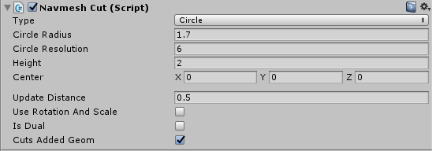](http://img.dongbeigtl.top/A文章需要的截图/Unity插件：AStarPathfinding上/Image 0011546871977.png)

4.运行游戏，拖动障碍物时NavMesh被遮挡的部分会不可用。

需要注意的是，切割的形状是XZ轴投影到Navmeshi平面的2D图形，不是3D，但2D图形通过拉伸也形成了高度，高度用于判断物体距离平面多高就需要切割的高度：

[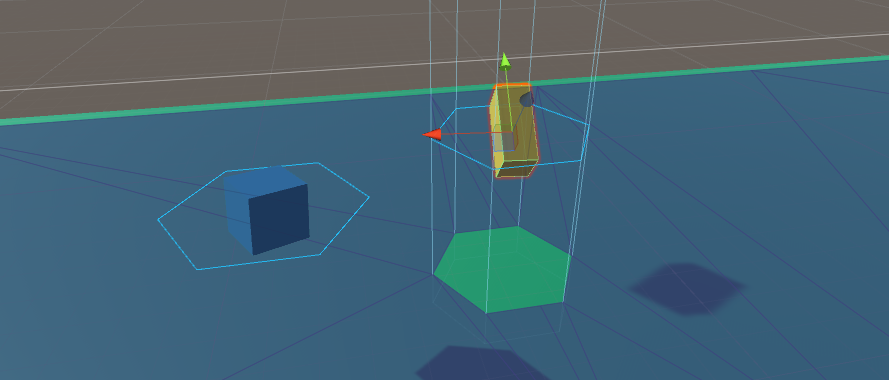](http://img.dongbeigtl.top/A文章需要的截图/Unity插件：AStarPathfinding上/Image 0011546931837.png)

所以只有物体在navmeshcut组件中设置的图形与NavMesh的接触部分才会被切割，包括高度和半径。

Is dual功能到底干嘛的

在3.x中，navmesh切割只能与重铸图一起使用，但在4.x中，它们可以与重铸和导航网图一起使用。

切割的形状可以自定义，自定义形状时有一些需要注意的细节，具体自行查看官方文档。

Navmesh Cutting会定期检查切割的应用，但也可以通过代码立即更新：

```
// Schedule pending updates to be done as soon as the pathfinding threads
// are done with what they are currently doing.
AstarPath.active.navmeshUpdates.ForceUpdate();
// Block until the updates have finished
AstarPath.active.FlushGraphUpdates();

也可以通过代码控制检查navmeshcut是否变化的时间:

// Check every frame (the default)
AstarPath.active.navmeshUpdates.updateInterval = 0;

// Check every 0.1 seconds
AstarPath.active.navmeshUpdates.updateInterval = 0.1f;

// Never check for changes
AstarPath.active.navmeshUpdates.updateInterval = -1;
// You will have to schedule updates manually using
AstarPath.active.navmeshUpdates.ForceUpdate();
```

（代码都不好使）

也可以通过Update Interval来更改。（这个值的更改位置不对 版本不同？？ ）

[](http://img.dongbeigtl.top/A文章需要的截图/Unity插件：AStarPathfinding寻路系统/Image 0011546945990.png)

[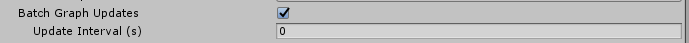](http://img.dongbeigtl.top/A文章需要的截图/Unity插件：AStarPathfinding上/Image 0011546943710.png)

因为navmesh切割可以很好地修改navmesh中的三角形，所以在更新图形时不可能保留标签和惩罚。对于在应用更新时保持完全相同的节点，将保留标签和惩罚。

如果您需要使用标记，唯一可靠的方法是保留它们是应用所有图形更新，每次完成导航网格剪切更新时都会设置它们。这当然相对较慢，但它至少会起作用。

# RVO（付费）

## 介绍

### 概览

到底躲的是谁  需不需要操作

AStarPathfinding使用了基于RVO的局部回避系统（Low level），RVO的性能良好，根据开发者的测试，i7处理器的电脑上可以以50-100FPS模拟五千个具有RVO系统的Agent。关于本章节，以及压力测试请看：<https://arongranberg.com/astar/documentation/4_1_16_7f164ebc/localavoidance.html>

RVO是路径规划中的Low level底层避障算法，用于躲避不可预估的障碍。具体看：

RVO基于采样检测和gradient descent算法来找到最佳躲避方案。它非常适合于移动的类人代理。但不太适合不能快速变换速度的物体。

RVO系统分为两个部分，一是完全独立不依赖Unity的核心代码，唯一使用到的Unity类是Math。核心代码控制着所有使用ROV的Agent。

> The RVO system is divided into two parts. First there is the core simulation code. It is completely independent of Unity specific objects such as GameObjects and MonoBehaviours. The only really Unity specific classes it uses are math classes which are easily interchangeable. This core handles all simulation of rvo (local avoidance) agents.

第二部分是Unity接口，大多数的类只是对应核心代码的包装类。例如RVOSimulator类只是Pathfinding.RVO.Simulator的包装类，为了更方便的集成使用，接口还包括一些帮助类。如会经常使用到的RVOController，似于Unity的Character Controller的类，支持Move等等功能，也可以更改如速度之类的属性。

> The second part is the Unity interface. Many of those classes are just wrappers for the corresponding core classes. The RVOSimulator class is for example just a wrapper class for the Pathfinding.RVO.Simulator class. The Unity interface also contains helper classes for much easier local avoidance integration. One of those is the RVOController which you will probably use quite a lot. It is written to be similar to the Unity Character Controller, supporting functions such as Move and has properties such as velocity which you can easily access.

Unity接口部分的所有脚本都假设场景中有且只有一个RVOSimulator，并会找到RVOSimulator获取核心代码部分。RVOSimulator可以被添加到任何游戏物体，通过一些简单的设置就可以正常工作。但注意，不要在场景内添加多个RVOSimulator，接口脚本通过FindObjectOfType 来找到RVOSimulator，FindObjectOfType无法精确控制将返回哪一个RVOSimulator。

> All of the scripts in the Unity interface part share common assumptions on how the scene should be set up: There should always be one (1) RVOSimulator in the scene, other scripts will look for it and get the core simulator instance it is a wrapper for. You can simply add it to any GameObject, edit the few settings if you want and it will work. You should never have more than one, all scripts which look for it use FindObjectOfType and there is no easy way to control exactly which of the multiple RVOSimulators it will return, so keep it to one for simplicity's sake.

### 集成

插件的AI脚本中，AIPath, RichAI支持RVOController，在挂载AIPath或RichAI脚本的物体上添加RVOController即可使用。（下面的Demo中不也是添加即可使用吗）

（3.x版本RVO在Rigidbody或CharacterController也被挂载的情况下不能很好地工作。因为RVO系统想要完全控制代理的移动。 在4.x中，可以将它与Rigidbody或CharacterController组件一起使用。需要注意的是，本地回避系统不使用碰撞系统，也不会试图避开碰撞体。）

AILerp脚本设计用于沿路径插入并完全跟随它，因此它没有意义偏离路径，因此它不支持本地回避。（AIlerp是怎么工作的）

### 物理系统

在拥挤情况下对Agent使用碰撞（或刚体）组件可能会使RVO的性能急剧下降，因为当拥挤时Agent可能会彼此重叠一部分。虽然Unity的物理系统会防止这种情况发生，但它并没有RVO系统做的好，还会产生错误的运动路线。

> Often you want to have colliders on your agents, maybe to be able to hit them with bullets or something. However if you just add colliders (plus a rigidbody) to your agents you may see that the local avoidance quality goes down drastically in crowded scenarios. This is because when it is very crowded agents may overlap a tiny bit, the physics system will prevent that, but it will not do it in as nice a way as the local avoidance system, and this may lead to worse movement.

如果Agent上有碰撞器，作者建议的解决办法是禁用代理之间的物理碰撞，将所有的代理放到一个单独的图层中，在Unity的物理系统设置中将该图层自身的碰撞关闭。

[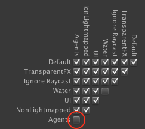](http://img.dongbeigtl.top/A文章需要的截图/Unity插件：AStarPathfinding下/disable_collisions.png)

### 保持代理在图中

在局部躲避时，在拥挤的情况下会出现Agent将另一个Agent推出图外的情况。

如果使用RichAI，则会自动处理被推出的情况。因为RichAI的移动需要它。如果使用AIPath，可以通过启用constrainInsideGraph来避免。

还有一种办法是使用RVONavmesh 组件，组件会将图的边界转化为障碍物添加进RVO系统。RVONavmesh计算成本偏高，尤其是在图较大或者运行时更新图的时候，但它允许RVO系统更好地预测障碍，而不是当撞到时才找到墙壁。

[](http://img.dongbeigtl.top/A文章需要的截图/Unity插件：AStarPathfinding寻路系统/Image 0011547030156.png)

如图所示，组件在图的边缘围一堵墙。但这样会增加一些性能开销（尤其是较大的图或者在运行期间更新图。）

使用方法：在场景中的任意物体添加RVONavmesh组件即可，可以通过RVOSimulator组件中的Draw Obstacles显示如图橙色的线。

### 障碍

将障碍添加至本地躲避系统后，代理将不会通过并且会使用本地躲避系统躲开障碍。

在Component-Pathfinding-Localavoidance中可以找到用于添加障碍物的组件，如图：

[](http://img.dongbeigtl.top/A文章需要的截图/Unity插件：AStarPathfinding寻路系统/Image 0011547032327.png)

也可以自己写碰撞器，看下章。

内置的碰撞体可以移动，并且可以适当的更新。但因为可以在周围移动并不代表移动的内置碰撞体可以将代理推开。事实上移动的内置碰撞体并不擅长这样。当碰撞体移动很慢时可以实现推开，但移动很快时会导致代理卡住。

内置的障碍物组件有一个属性很重要，Obstacle Mode，有两个值：Keep out会阻止代理进入障碍物，但如果处于某种原因留在了里面则会很容易出来。Keep in会将代理留在障碍物内部自由移动。

（需要一个例子 gif）

 

## 使用RVO组件

首先根据官方Demo做一个简单的练习：

1.创建一个新场景，添加一个平面尽量大一点。然后添加一个空物体命名为Simulator，并为其添加RVOSimulator组件。

2.添加一个新的圆柱体，并为其添加RVOController组件，将RVOController组件中的高度参数设置为圆柱体的高度，RVOController的作用和Character Controller差不多。

3.编写一个脚本，让圆柱体动起来：

```
using UnityEngine;
using System.Collections;
using Pathfinding.RVO;

public class SimpleRVOAI : MonoBehaviour {
RVOController controller;

// Use this for initialization
void Awake () {
controller = GetComponent<RVOController>();
}

// Update is called once per frame
public void Update () {
// Just some point far away
var targetPoint = transform.position + transform.forward * 100;

// Set the desired point to move towards using a desired speed of 10 and a max speed of 12
controller.SetTarget(targetPoint, 10, 12);

// Calculate how much to move during this frame
// This information is based on movement commands from earlier frames
// as local avoidance is calculated globally at regular intervals by the RVOSimulator component
var delta = controller.CalculateMovementDelta(transform.position, Time.deltaTime);
transform.position = transform.position + delta;
}
}
```

4.复制几个圆柱体并调整至相对，运行游戏可以看到圆柱体会尝试躲避其他圆柱体。

可以从代码看出来，**RVOController本身不处理移动**。因为一旦其他脚本也在控制移动，就会引起混乱。（在4.0之前RVOController是处理移动的）

RVOSimulator实际上是 [Pathfinding.RVO.Simulator](https://arongranberg.com/astar/documentation/4_1_16_7f164ebc/simulator.html)的包装类。

rvo面板介绍

## 添加RVO障碍

可以通过代码获取到RVOSimulator：

Pathfinding.RVO.Simulator sim = (FindObjectOfType(typeof(RVOSimulator)) as RVOSimulator).GetSimulator ();

通过以下代码可以添加一个障碍物到RVO系统

```
using UnityEngine;
using System.Collections;

public class SimpleRVOObstacle : MonoBehaviour {

void Start () {
//Get the simulator for this scene
Pathfinding.RVO.Simulator sim = (FindObjectOfType(typeof(RVOSimulator)) as RVOSimulator).GetSimulator ();

//Define the vertices of our obstacle
Vector3[] verts = new Vector3[] {new Vector3(1,0,-1), new Vector3(1,0,1), new Vector3 (-1,0,1), new Vector3 (-1,0,-1)};

//Add our obstacle to the simulation, we set the height to 2 units
sim.AddObstacle (verts, 2);
}
}
```

需要注意添加向量的方向不同会有不同的结果：

System.Array.Reverse (verts);

顺时针是keep in，逆时针使keep out。

也可以把一条线作为障碍物添加至系统：
sim.AddObstacle (firstPoint, secondPoint, height);

# Tag和GraphUpdateScene

GraphUpdateScene是一个功能很强的组件，可以划分自定义区域并更改惩罚值。

Tag是插件的新功能，可以控制每个代理的行走区域。例如场景中有闲逛的动物和人，那他们可以走的区域是不一样的（动物不会走入人住的房子），这时就需要使用Tag来实现。

**划分自定义代价值区域的使用方法：**

**1.**在场景中创建一个空物体命名为GUO（不是必须的），添加组件**Graph Update Scene。**

**2.**点击GUO，在场景中按住左Shift键，然后点击你想划分区域的地方，会出现一个点，再点击一下会将两个点连接起来。这样就可以创建出一块自定义的区域：

[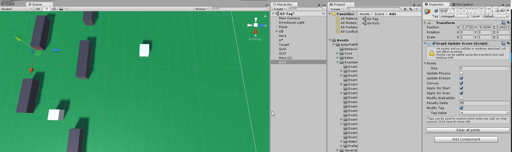](http://img.dongbeigtl.top/A文章需要的截图/Unity插件：AStarPathfinding下/Honeycam 2019-03-11 16-39-23.gif)

节点的位置信息可以在组件的Points属性里进行修改。

**3.**根据组件中的Penalty Delta来修改区域的代价值，不同的代价会让Agent在寻路时选择最优的路线，避开代价较大的区域。也可以设置为不可走区域。

[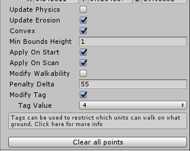](http://img.dongbeigtl.top/A文章需要的截图/Unity插件：AStarPathfinding下/Image 0011552293900.png)

**4.**如图所示，代理会尝试绕过代价高的区域

 

[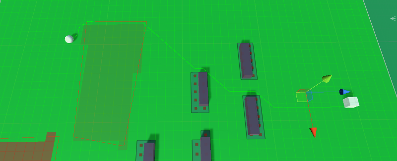](http://img.dongbeigtl.top/A文章需要的截图/Unity插件：AStarPathfinding下/Image 0011552295310.png)

**Tag的使用方法：**

Tag可以使两个Agent在同样的区域有不同的寻路结果.

0.新建一个场景，场景中像之前的流程一样，保持有地板，寻路目标，Agent，并可以正常寻路。

1.利用**Graph Update Scene**划分一片区域，并为区域添加一个Tag，命名为Grass（Tag的名称可以在A*组件的面板中修改。）

[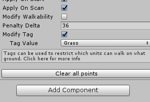](http://img.dongbeigtl.top/A文章需要的截图/Unity插件：AStarPathfinding下/Image 0011552296107.png)

2.添加两个agent，并附加Seeker脚本。修改Seeker的Tag属性，一个Agent将tag的Traversable取消勾选，另一个保持勾选。

[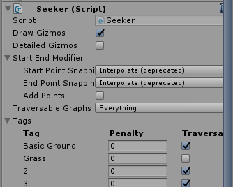](http://img.dongbeigtl.top/A文章需要的截图/Unity插件：AStarPathfinding下/Image 0011552547742.png)

3.运行游戏，两个Agent会规划出不同的路径。

[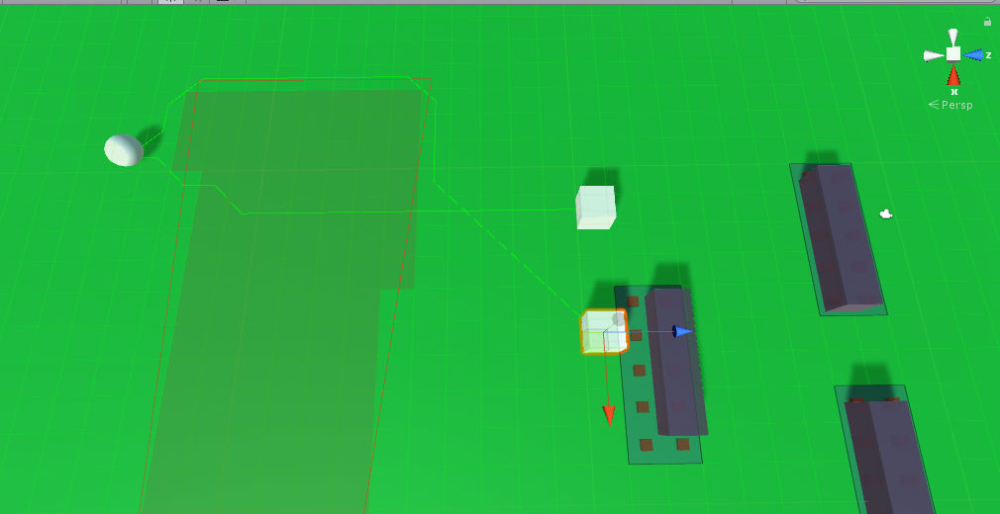](http://img.dongbeigtl.top/A文章需要的截图/Unity插件：AStarPathfinding下/Image 0011552548056.png)

也可以对每个Agent的每个Tag设置不同的惩罚值，可以实现开头说的场景。

------

NavMesh下有问题

公共惩罚值和个人惩罚值的计算关系

能做的：

自定义区域的惩罚值

自定义区域为不可走

讲某区域更改为a可走b不可走

将某区域更改为a的惩罚值高，b的低

GraphUpdateScene是什么

# 实时更新图

对于实时更新，不同场景有不同的需求，比如可能只更改了一部分，需要更新一部分地图。如果更改了整张地图则需要更新全部。还有可能需要加载/保存地图（具体介绍不在本章）等等。不同的需求需要不同的功能，下面的表列出了开发时会遇到的场景，以及对应的解决策略。

| 需求                                                         | 解决办法                                                     |
| ------------------------------------------------------------ | ------------------------------------------------------------ |
| 重新计算整张图                                               | 阅读重新计算整张图                                           |
| 精准的设置哪些节点可走，哪些不可以                           | 阅读直接使用图数据或应用于回合制游戏章节                     |
| 在某些物体移动或创建销毁时更新图                             | 阅读重计算部分图或[DynamicGridObstacle](https://arongranberg.com/astar/documentation/4_1_16_7f164ebc/dynamicgridobstacle.html)类或[Navmesh Cutting](https://arongranberg.com/astar/documentation/4_1_16_7f164ebc/navmeshcutting.html)章节 |
| 修改某单个节点的属性                                         | 阅读直接使用图数据或GraphUpdateScene                         |
| 动态加载或卸载地图                                           | 阅读保存和加载地图                                           |
| 创建一小块图在角色周围                                       | 阅读[ProceduralGridMover](https://arongranberg.com/astar/documentation/4_1_16_7f164ebc/proceduralgridmover.html)类 |
| 创建新节点并使用代码连接他们                                 | See [PointGraph.AddNode](https://arongranberg.com/astar/documentation/4_1_16_7f164ebc/pointgraph.html#AddNode) and [Writing Graph Generators](https://arongranberg.com/astar/documentation/4_1_16_7f164ebc/writinggraphgenerators.html) |
| 使图的一部分成本变高                                         | See [Recalculating parts of graphs](https://arongranberg.com/astar/documentation/4_1_16_7f164ebc/graphupdates.html#smaller-updates), [Using direct access to graph data](https://arongranberg.com/astar/documentation/4_1_16_7f164ebc/graphupdates.html#direct) and [GraphUpdateScene](https://arongranberg.com/astar/documentation/4_1_16_7f164ebc/graphupdatescene.html) |
| 阻止一些单位穿过某个节点，但是其他节点可以穿过               | See [Working with tags](https://arongranberg.com/astar/documentation/4_1_16_7f164ebc/tags.html), [Recalculating parts of graphs](https://arongranberg.com/astar/documentation/4_1_16_7f164ebc/graphupdates.html#smaller-updates), [GraphUpdateScene](https://arongranberg.com/astar/documentation/4_1_16_7f164ebc/graphupdatescene.html) and [Using direct access to graph data](https://arongranberg.com/astar/documentation/4_1_16_7f164ebc/graphupdates.html#direct) |
| 移动物体的寻路（如一艘船）                                   | See the example scene called 'Moving' (pro version only). This is not that well documented at the moment. |
| 添加一个障碍物，但首先确定障碍物没有困住或覆盖任何其他单位（TD游戏） | See [Check for blocking placements](https://arongranberg.com/astar/documentation/4_1_16_7f164ebc/graphupdates.html#blocking) |

## 需要更新的内容

当需要更新图时，通常会需要做两件事情中的一件。

你可能希望使用与最初生成图时相同的设置重新计算图形，但如果为了更新一部分区域而重新计算了整个图似乎很浪费（[AstarPath.Scan](https://arongranberg.com/astar/documentation/4_1_16_7f164ebc/astarpath.html#Scan)），比如，玩家可能只是TD游戏中放置了一座新塔。

或者只想要更改现有图的某些设置。例如，更改某些节点上的tag或代价。

可以对除了NavMesh之外的图重新计算一小部分，navmesh只有完全重新计算才有意义。使用脚本和GraphUpdateScene组件执行此操作，将名为“updatePhysics”的字段设置为true。

Grid 图会正常工作，只需指定边界，它就会为你完成所有操作。但是，考虑到侵蚀等问题，它可能会重新计算一个比指定边界略大的区域。

Recast  图只能全部重新计算。因此，使用较小的tile尺寸可以缩短重新计算的时间。但是如果太小，Recast图会退化为Grid图。如果使用多线程，则会将大部分重新计算放置到单独的线程中，以避免过多地影响FPS。

点图将重新计算通过边界的所有连接。但是，它不会寻找以GameObject形式新添加的新节点，为此你需要使用  [AstarPath.Scan](https://arongranberg.com/astar/documentation/4_1_16_7f164ebc/astarpath.html#Scan).

如想更改节点的属性，有一些东西可供你修改

你可以更改node的tag以实现不同单位行走不同区域，也可以修改节点的惩罚值

可以更改节点上的惩罚。这用于使某些节点比其他节点更难/更慢地遍历，以便代理在其他节点之前更喜欢某些路径。但是有一些限制。您不能指定负惩罚，因为使用的算法无法处理（如果可能，系统会慢得多）。然而，常见的技巧是设置非常大的初始惩罚（可以在图形设置中完成），然后从该高值减少惩罚。但请注意，由于必须搜索更多节点，因此这将使路径寻找更慢。所需的惩罚值非常高。没有真正的“惩罚单位”，但罚款1000大致相当于一个世界旅行单位。

> You can change the penalty on the nodes. This is used to make some nodes harder/slower to traverse compared the other nodes so that an agent will prefer some paths before others. There are some limitations though. You cannot specify negative penalties since the algorithms used cannot handle that (and if they could, the system would be a lot slower). However a common trick is to set a very large initial penalty (which can be done in the graph settings) and then decrease the penalty from that high value. Note however that this will make pathfinding slower overall since it has to search more nodes. The penalty values that are required are quite high. There is no real "penalty unit" however a penalty of 1000 corresponds roughly to one world unit of travel.

也可以直接修改节点的可步行性。 因此，您可以使某些边界内的所有节点都可以步行或全部无法行走。

有关如何使用GraphUpdateScene组件的信息。 查看该课程的文档。 GraphUpdateScene组件设置几乎将1到1映射到GraphUpdateObject，在使用脚本更新图形时使用GraphUpdateObject。 因此，即使您只是使用脚本，我也建议您阅读该页面。

------

## 重新计算整张图

```
// Recalculate all graphs
AstarPath.active.Scan();

// Recalculate only the first grid graph
var graphToScan = AstarPath.active.data.gridGraph;
AstarPath.active.Scan(graphToScan);

// Recalculate only the first and third graphs
var graphsToScan = new [] { AstarPath.active.data.graphs[0], AstarPath.active.data.graphs[2] };
AstarPath.active.Scan(graphsToScan);
```

协程加载 但不能保证良好的FPS，但至少可以显示加载屏幕

```
IEnumerator Start () {
foreach (Progress progress in AstarPath.active.ScanAsync()) {
Debug.Log("Scanning... " + progress.description + " - " + (progress.progress*100).ToString("0") + "%");
yield return null;
}
}
```

看一下这俩

[AstarPath.Scan](https://arongranberg.com/astar/documentation/4_1_16_7f164ebc/astarpath.html#Scan)

[AstarPath.ScanAsync](https://arongranberg.com/astar/documentation/4_1_16_7f164ebc/astarpath.html#ScanAsync)

## 重新计算部分图

可以使用GraphUpdateScene组件或使用脚本,调用AstarPath类中的方法完成部分图更新，脚本通过使用Bounds对象或Pathfinding.GraphUpdateObject（就是GraphUpdateScene组件，实际上是在后台就是这么运行的）。

> Smaller graph updates can either be done using the GraphUpdateScene component which can be edited in the Unity inspector or using scripting which is done by calling a method in the AstarPath class with either a Bounds object or a Pathfinding.GraphUpdateObject (which is what the GraphUpdateScene component actually does in the background).

```
Bounds bounds = GetComponent<Collider>().bounds;
AstarPath.active.UpdateGraphs(bounds);
// using Pathfinding; //At top of script

// As an example, use the bounding box from the attached collider
Bounds bounds = GetComponent<Collider>().bounds;
var guo = new GraphUpdateObject(bounds);

// Set some settings
guo.updatePhysics = true;
AstarPath.active.UpdateGraphs(guo);
```

然后，该方法将任务放入队列中，以便在下一个路径计算之前执行。它必须放在一个队列中，因为如果它直接执行会干扰寻路，特别是多线程开启的情况下，会导致无法直接看到图形的更新，所以它将始终在下一次寻路计算开始之前更新。

> The method will then put the task in a queue to be carried out before the next path calculation. It has to be put in a queue because if it carried out directly, it might interfere with pathfinding, especially if multithreading is on, and cause all kinds of errors. This means that you might not see an update of the graph directly, but it will always be updated before the next pathfinding calculation starts (almost always, see AstarPath.limitGraphUpdates ).

Recast图也可以使用[navmesh cutting](https://arongranberg.com/astar/documentation/4_1_16_7f164ebc/navmeshcutting.html)伪更新，[navmesh cutting](https://arongranberg.com/astar/documentation/4_1_16_7f164ebc/navmeshcutting.html)可以使障碍物在Navmesh中切出一个洞，但无法添加更多的Navmesh平面。See [Pathfinding.NavmeshCut](https://arongranberg.com/astar/documentation/4_1_16_7f164ebc/navmeshcut.html)，比重新计算整张图快的多，但是有更有限。

如果在Unity的Editor中编辑修改已知的图形，那么使用GraphUpdateScene组件是最方便简单的，使用组件你可以轻松更改特定区域的tag而无需任何代码。 但是，如果需要在游戏中动态执行，则使用代码更新图会更方便。 例如，在塔防游戏中新放置的建筑物的更新部分表操作。

## 使用脚本

需要创建GraphUpdateObject并设置所需的参数，然后调用AstarPath.UpdateGraphs方法，将更新任务添加至队列中。

```
// using Pathfinding; //At top of script

// As an example, use the bounding box from the attached collider
Bounds bounds = GetComponent<Collider>().bounds;
var guo = new GraphUpdateObject(bounds);

// Set some settings
guo.updatePhysics = true;
AstarPath.active.UpdateGraphs(guo);
```

bounds变量是UnityEngine.Bounds对象，它定义了一个轴对齐的框，用于更新图形，通常你会想围绕着新创建的对象更新图，通常情况下，更新部分图都是围绕新创建的对象的周围进行更新的，所以在示例中，Bounds取自新对象附加的collider

但是要确保该对象可以被图识别，对于Grid图应该确保对象的图层包含在碰撞检测图层（collision testing mask）或者高度检测图层（ height teting mask）中。

如果在使用网格图或者点图时，不需要重新计算所有节点的参数，可以将updatePhysics 设置为 false以避免不必要的计算

（我的理解是如果局部计算的话，需要将这个选项关闭以避免不必要的计算）

```
guo.updatePhysics = false;
```

For details about exactly what fields to set, take a look at the class documentation for the [GraphUpdateObject ](https://arongranberg.com/astar/documentation/4_1_16_7f164ebc/graphupdateobject.html).

### 直接使用图数据

有时可能需要直接对图数据进行操作。

[Accessing graph data](https://arongranberg.com/astar/documentation/4_1_16_7f164ebc/accessingdata.html) for information about how to access graph data.

[Node properties](https://arongranberg.com/astar/documentation/4_1_16_7f164ebc/usingnodes.html#node-properties) and [Pathfinding.GraphNode](https://arongranberg.com/astar/documentation/4_1_16_7f164ebc/graphnode.html) for information about what properties a node has.

下面是一个更改网格图中所有节点并使用perlin噪声来决定节点是否应该可以行走的示例：

```
AstarPath.active.AddWorkItem(new AstarWorkItem(ctx => {
var gg = AstarPath.active.data.gridGraph;
for (int z = 0; z < gg.depth; z++) {
for (int x = 0; x < gg.width; x++) {
var node = gg.GetNode(x, z);
// This example uses perlin noise to generate the map
node.Walkable = Mathf.PerlinNoise(x * 0.087f, z * 0.087f) > 0.4f;
}
}

// Recalculate all grid connections
// This is required because we have updated the walkability of some nodes
gg.GetNodes(node => gg.CalculateConnections((GridNodeBase)node));

// Update the 'area' information in the graph.
// This is required because we have updated the connectivity of the graph
ctx.QueueFloodFill();
}));
```

经过修改后的图：

[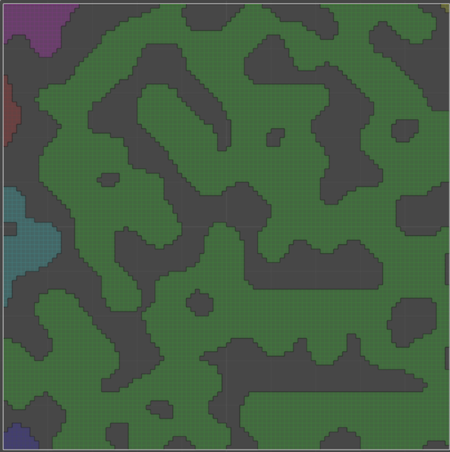](http://img.dongbeigtl.top/A文章需要的截图/Unity插件：AStarPathfinding下/Image 0011552639822.png)

只有在安全的情况下才能修改图表数据。路径查找可能随时在运行，因此必须先暂停路径寻找线程，然后更新数据。最简单的方法是使用[AstarPath.AddWorkItem](https://arongranberg.com/astar/documentation/4_1_16_7f164ebc/astarpath.html#AddWorkItem)：

```
AstarPath.active.AddWorkItem(() => {
// Safe to update graphs here
var node = AstarPath.active.GetNearest(transform.position).node;
node.position = (Int3)transform.position;
});
```

更改图数据后要及时更新图。如果更改了任何节点的Walkable或连接，则需要更新Area的信息，系统通过Area来确定哪些节点可以到达哪些其他节点，而这些节点又用于快速确定路径是否可行。

```
AstarPath.active.AddWorkItem(new AstarWorkItem(ctx => {
var node = AstarPath.active.GetNearest(transform.position).node;
node.Walkable = false;
ctx.QueueFloodFill();
}));
```

QueueFloodFill()是根据性能进行批处理的，因此在连续更新的多个图更新时不需要多次调用QueueFloodFill()。如果需要Area的信息是最新的，则应该调用[ctx.EnsureValidFloodFill](https://arongranberg.com/astar/documentation/4_1_16_7f164ebc/iworkitemcontext.html#EnsureValidFloodFill)方法。但是通常开发中不会用到。

> The flood fill calls are batched for performance so that multiple graph updates which are executed directly after each other do not have to run the flood fill more than once. If your work item requires that the area information is up to date you should call the ctx.EnsureValidFloodFill method first. Usually this is not something that work items require however.

如果修改了walkability，需要重新计算节点之间的链接。对于Grid图来说非常重要，可以使用[GridGraph.CalculateConnections](https://arongranberg.com/astar/documentation/4_1_16_7f164ebc/gridgraph.html#CalculateConnections5)方法。注意，这需要在你更改了walkability的节点以及与其相邻的节点上调用，因为他们可能必须更改其连接以添加或删除该节点作为连接。

AddWorkItem方法也可以以更高级的方式使用。例如，它允许您在必要时将计算分布在多个帧上：

```
AstarPath.active.AddWorkItem(new AstarWorkItem(
        () => {
    // Called once, right before the
    // first call to the method below
},
        force => {
    // Called every frame until complete.
    // Signal that the work item is
    // complete by returning true.
    // The "force" parameter will
    // be true if the work item is
    // required to complete immediately.
    // In that case this method should
    // block and return true when done.
    return true;
}
        ));
```

debug记得写一下

## 工作原理

当使用GraphUpdateObject进行实时更新时， 所有可以更新的内置的图都会循环调用自身的UpdateArea 方法。

图将每一个需要被更新或受影响的节点发送给[Pathfinding.GraphUpdateObject.Apply ](https://arongranberg.com/astar/documentation/4_1_16_7f164ebc/graphupdateobject.html#Apply)， Apply方法会更改惩罚值，walkablity或者其他指定的参数，图也可以使用特定的更新逻辑，如GridGraph(see [GridGraph specific details](https://arongranberg.com/astar/documentation/4_1_16_7f164ebc/graphupdates.html#gridgraphs))。你不需要明白这些更新方法的不同，这些方法的具体细节的了解适合想使用源码的人。

> When updating is carried out using a GraphUpdateObject, all graphs will be looped over and those which can be updated (all built in ones) will have their UpdateArea function called (i.e be updated).
> Each node is updated by the graphs calling [Pathfinding.GraphUpdateObject.Apply](https://arongranberg.com/astar/documentation/4_1_16_7f164ebc/graphupdateobject.html#Apply) sending each affected node to it, the Apply function will then change penalty, walkability or other parameters specified. Graphs can also use custom updating logic, such as the GridGraph (see [GridGraph specific details](https://arongranberg.com/astar/documentation/4_1_16_7f164ebc/graphupdates.html#gridgraphs)). You do not have to understand all different function calls to be able to use it, those are mostly for people who want to mess around with the source code.

### Gird图的特殊细节

[updatePhysics](https://arongranberg.com/astar/documentation/4_1_16_7f164ebc/graphupdateobject.html#updatePhysics)是更新Gird图时非常重要的属性，如果设置为true，所有被影响的节点都会重新计算他们的高度，然后检查自身是否可走。当更新Grid图时，最好保持为true。

当更新Grid图时，GraphUpdateObject的Apply方法会被更新范围内的所有节点调用，节点会检查[updatePhysics](https://arongranberg.com/astar/documentation/4_1_16_7f164ebc/graphupdateobject.html#updatePhysics)变量，如果[updatePhysics](https://arongranberg.com/astar/documentation/4_1_16_7f164ebc/graphupdateobject.html#updatePhysics)设置为true（默认值是true），则更新区域会根据Collision Testing设置的直径扩张，并且在其中的每个节点都会做碰撞检测，如果是false，则只有更新区域内的节点会调用Apply方法，并不会做其他事情。

> The updatePhysics variable matters a lot when updating grid graphs. If it is set to true, all nodes affected will have their height recalculated and then checked if they are still walkable. You usually want to leave this to true when updating a grid graph.
>
> When updating a GridGraph, the GraphUpdateObject's Apply function (which changed walkability, tags and penalties) will be called for each node inside the bounds, it will check the updatePhysics variable, if it is true (which is the default value), the area will be expanded by the diameter of the specified in the Collision Testing settings and every node inside the area will be checked for collisions. If it is false, however, only the Apply function will be called for the nodes inside the area (not expanded) and nothing else will be done.

### 基于Navmesh的图

基于navmesh的图（Navmesh和RecastGraph）只支持更新已存在的节点的惩罚，walkablity等以更新整个图，GraphUpdateObjects 不能添加新的节点（更新整个图除外），GraphUpdateObject 会更新所有交叉接触的节点/多边形，或者在GUO范围内的所有节点。对于recast也可以通过Nacmesh cut快速更新图。

> Navmesh based graphs (NavMeshGraph and RecastGraph) only have support for updating penalty, walkability and similar on already existing nodes or for recast graphs, to completely recalculate whole tiles. New nodes cannot be created using GraphUpdateObjects (unless recalculating whole tiles). The GraphUpdateObject will affect all nodes/triangles which intersect or are contained by the GUO's bounds.
> For recast graphs you can also use [navmesh cutting ](https://arongranberg.com/astar/documentation/4_1_16_7f164ebc/navmeshcut.html)to update the graph in a fast way.

### 点图（PointGraphs）

点图的更新会调用边界内的所有节点的Apply方法，GraphUpdateObject.updatePhysics如果设置为true，它还会重新计算经过更新区域的所有链接点。

## Graph Update Object

The GraphUpdateObject contains some basic variables on how to update each node. See documentation for the [Pathfinding.GraphUpdateObject](https://arongranberg.com/astar/documentation/4_1_16_7f164ebc/graphupdateobject.html) for more info.

#### 从GraphUpdateObject继承

GraphUpdateObject可以被继承，覆写某些方法。下面是一个例子，执行父类Apply方法的同时移动节点：

```
using UnityEngine;
using Pathfinding;

public class MyGUO : GraphUpdateObject {
public Vector3 offset = Vector3.up;
public override void Apply (GraphNode node) {
// Keep the base functionality
base.Apply(node);
// The position of a node is an Int3, so we need to cast the offset
node.position += (Int3)offset;
}
}
```

也可以这样：

```
public void Start () {
    MyGUO guo = new MyGUO();

    guo.offset = Vector3.up*2;
    guo.bounds = new Bounds(Vector3.zero, Vector3.one*10);
    AstarPath.active.UpdateGraphs(guo);
}
```

## 检查是否阻塞（塔防）

在塔防游戏中很重要的一点是，玩家放置的塔没有使出兵点和目标点直接堵塞，插件为此提供了对应的API。

[Pathfinding.GraphUpdateUtilities.UpdateGraphsNoBlock](https://arongranberg.com/astar/documentation/4_1_16_7f164ebc/graphupdateutilities.html#UpdateGraphsNoBlock)方法会检查给定的graph update object是否会引起两个或更多的点引起堵塞，然而该方法会比常规更新图速度要慢，所以你可能不会经常使用它。

举个例子，当玩家再塔防游戏中放置一个防御塔的时候，你可以初始化防御塔，然后调用UpdateGraphsNoBlock方法检查新添加的防御塔是否会阻挡路径，如果是则立即移除防御塔并提示玩家选择的位置不符合规则。你也可以传递节点列表给UpdateGraphsNoBlock方法，这样不仅可以确定初始点和目标点之间没有堵塞，并且在单位行走时可以放置防御塔的情况下，所有单位都能到达目标。

> The [Pathfinding.GraphUpdateUtilities.UpdateGraphsNoBlock](https://arongranberg.com/astar/documentation/4_1_16_7f164ebc/graphupdateutilities.html#UpdateGraphsNoBlock) method can be used to first check if a given graph update object will cause the path between two or more points to become blocked. This is however slower than a normal graph update so you probably don't want to use it too often.
>
> For example when a player in a tower defence game places a tower, you could instantiate it, then call the UpdateGraphsNoBlock method to check if the newly placed tower will block the path. If it did then remove the tower immediately and notify the player that the choosen position was not valid. You can pass a list of nodes to the UpdateGraphsNoBlock method so you could for example make sure that not only is the path from the start to the goal not blocked, but also that all units can still reach the goal (if it is possible to place towers when enemies are walking around).

```
var guo = new GraphUpdateObject(tower.GetComponent<Collider>().bounds);
var spawnPointNode = AstarPath.active.GetNearest(spawnPoint.position).node;
var goalNode = AstarPath.active.GetNearest(goalPoint.position).node;

if (GraphUpdateUtilities.UpdateGraphsNoBlock(guo, spawnPointNode, goalNode, false)) {
    // Valid tower position
    // Since the last parameter (which is called "alwaysRevert") in the method call was false
    // The graph is now updated and the game can just continue
} else {
    // Invalid tower position. It blocks the path between the spawn point and the goal
    // The effect on the graph has been reverted
    Destroy(tower);
}
```

# 保存和加载图表

 图的设置通过Unity的序列化来保存，但图没有通过序列化保存和加载，而是被保存至一个字节数组中，通过数组完成了保存和加载。

可以A* inspector面板中可以看到Save&Load选项。

[需要一张图片]

## 图的计算缓存

通常你希望游戏启动时重新计算图，但有的时候，尤其是使用RecastGraph或者在移动设备上开发，游戏开始时的延迟会非常烦。

打开Save&Load面板，点击Generate Cache来创建缓存。它将会询问你是否保存之前重新扫描图。现在游戏启动时会加载缓存读取图的节点信息和其他参数，不需要另外的计算时间。

[需要一张图片]

## 将图保存至文件并读取

您可能还希望将图表保存到稍后可以加载的文件中。您甚至可以在运行时从服务器加载它。

如果想保存你的图，点击Save to file 按钮，你可以只保存配置参数或者保存配置参数和节点数据。如果只保存设置配置参数，则在图被加载后，你需要重新计算他在任何角色使用图进行导航之前。你可以使用以下代码重新计算所有的图：

```
AstarPath.active.Scan();
```

如果要再次加载图形，只需按“从文件加载”按钮并找到该文件。请注意，这将替换您当前的图表。

问题：只保存设置，还如何加载图形？？保存的设置是什么？？？

## 使用代码进行保存和加载

如果需要实时加载或保存图，则需要在代码里进行操作。

`SerializeGraphs()`方法会将图的参数序列化为数组，默认情况下包含节点信息（假设序列化之前保存过图形）。

```csharp
byte[] bytes = AstarPath.active.data.SerializeGraphs();
```

可以近一步配置

```csharp
var settings = new Pathfinding.Serialization.SerializeSettings();

// Only save settings
settings.nodes = false;
byte[] bytes = AstarPath.active.data.SerializeGraphs(settings);
```

加载保存的数据：

```c++
AstarPath.active.data.DeserializeGraphs(bytes);
```

如果只加载了设置，你可能需要调用Scan方法在加载设置后：

```csharp
AstarPath.active.data.DeserializeGraphs(bytes);
AstarPath.active.Scan();
```

如果不是替换当前图，可以使用附加的方式加载图：

> Instead of replacing the currently loaded graphs, you can additively load graphs using

```
AstarPath.active.data.DeserializeGraphsAdditive(bytes);
```

使用以下方法卸载图：

```
var data = AstarPath.active.data;
var myGraph = data.gridGraph;
data.RemoveGraph(myGraph);
```

### Including Data in a TextAsset

图表数据可以被包含在TextAsset中，当你将数据保存为文件，把文件重命名为入“myGraph.bytes”，然后将它放入你的Unity工程中，这样会告诉Unity将文件视作二进制文件。如果使用.txt的后缀会使出现问题，因为Unity会尝试用text读取文件。一些操作系统会隐藏扩展名，所以如果Unity无法识别.bytes请检查文件后缀是否真的是bytes。zip（或者其他）后缀名可能会被隐藏。**然后，您可以通过在变量访问.bytes字段来加载text asse的图形，访问.bytes文件。**

```
Graph data can be included in textassets for easier inclusion in the build. When you have saved the data to a file, rename that file to something like "myGraph.bytes" and place it in your Unity Project. This will tell Unity to handle it as binary information. With an extension like .txt the data would get corrupted because Unity would try to read it as text. Some operating systems like to hide the extension, so if Unity doesn't seem to recognize the file with the .bytes extension make sure it really has a .bytes extension, the .zip (or other) extension might just be hidden. Then you can load the graph from a text asset by referencing it in a variable, and accessing the .bytes field.
```

### 数据类型

所有的参数设置都会被序列化为JSON，可以很好的保持向前或向后兼容。下面提到的所有文件都会被压缩进单独的zip文件，缩小尺寸，使数据更容易处理。这也意味着你可以打开zip文件进行手动处理。

【需要一章图片】

**meta**

meta.json文件会在所有的序列化中出现，A meta.json file is present in all serializations. This file contains information which is not connected to a specific graph, or is needed to load the other graphs.

- Version number for the system
- Number of graphs which are saved
- GUID values for each graph, to identify them
- Type of each graph

例如：

```
{
    "version": "3.0.9.5",
    
    "graphs": 1,
    
    "guids": 
        [
            "0d83c93fc4928934-8362a8662ec4fb9d"
        ],
    
    "typeNames": 
        [
            "Pathfinding.GridGraph"
        ]
}
```

### Graph Settings

每个图的配置参数会被保存为"graph#.json"，#代表图的编号。下面是一个grid图的参数序列化的例子（删除了一些参数以保持代码不会很长）：

```
{
   "aspectRatio":1,
   "rotation":{
      "x":0,
      "y":0,
      "z":0
   },
   "center":{
      "x":0,
      "y":-0.1,
      "z":0
   },
   "unclampedSize":{
      "x":100,
      "y":100
   },
   "nodeSize":1,
   "maxClimb":0.4,
   "maxClimbAxis":1,
   "maxSlope":90,
   "erodeIterations":0,
   "autoLinkGrids":false,
   "autoLinkDistLimit":10,
   "neighbours":"Eight",
   "cutCorners":true,
   "penaltyPositionOffset":0,
   "penaltyPosition":false,
   "penaltyPositionFactor":1,
   "penaltyAngle":false,
   "penaltyAngleFactor":100,
   "open":true,
   "infoScreenOpen":false
   ...
}
```

节点信息使用json来保存会占用很多空间，所以被替代为使用二进制文件写入。每个图类型都有自己的序列化保存节点代码。这由每个图上的SerializeExtraInfo和DeserializeExtraInfo方法处理。

# 多种Agent类型

 不同尺寸的Agent通常有不同的寻路结果，最简单的方法是创建多个图，每一个图对应一种Agent。如果拥有很多代理，您可能希望将它们分组为具有大量图形将增加内存使用量并且扫描将花费更长时间。


# 编辑器寻路

 

# GraphUpdateScene 组件

# Accessing graph data

# 应用于回合制游戏

 

# 优化

 
