本为为AStarPathfinding寻路系统介绍中篇，主要讲解演示。

<!-- more -->

# 基础寻路网格生成

## 1.1 Grid Graph

**（1）**准备工作：场景中添加Plane，障碍物。为Plane添加一个Layer（我的命名是Ground）。为所有的障碍物添加一个Layer（Obs），注意障碍物要添加Box Collider组件。新建一个空物体，并添加**Astar Path**组件。

**（2）**准备完成后，在Astar Path中添加**Grid Graph**，并设置网格图的长宽以足够覆盖整个Plane。根据障碍物的可攀爬高度设置**Max Cilb**。将Collison Testing中的**Obstacle Layer** Mask设置为障碍物所在的图层（Obs）。将**Height Tesing**中的Mask设置为Plane所在的图层（Ground）。


设置完成后点击Scan，效果如图：

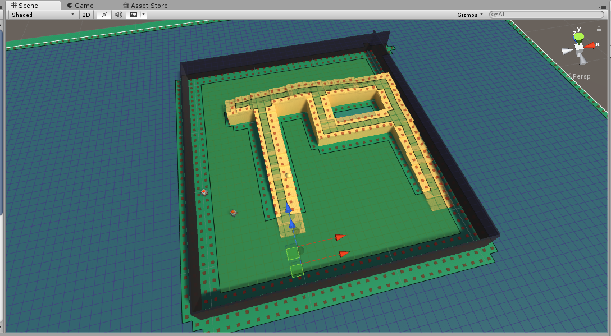

**（3）** 为人物添加寻路功能：首先添加**Seeker**组件，然后添加AIPah（或者RichAI，适用于NavMesh）最后添加让物体执行寻路的代码：

```
c#
using UnityEngine;
using System.Collections;
using Pathfinding;
public class AstarAI : MonoBehaviour
{
public Transform target;
public void Start()
{
//Get a reference to the Seeker component we added earlier
Seeker seeker = GetComponent<Seeker>();
//Start a new path to the targetPosition, return the result to the OnPathComplete function
seeker.StartPath(transform.position, target.position, OnPathComplete);
}
public void OnPathComplete(Path p)
{
Debug.Log("Yay, we got a path back. Did it have an error? " + p.error);
}
}
```

运行后，会显示如图的绿色寻路路径，如果未显示，检查seeker脚本中的Draw Gizmos选项是否勾选。
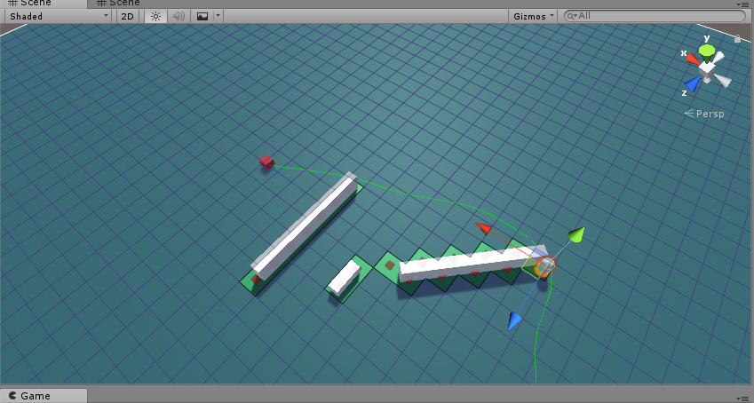

将Shape属性改为Hexagonal可以将网格更改为六边形：

[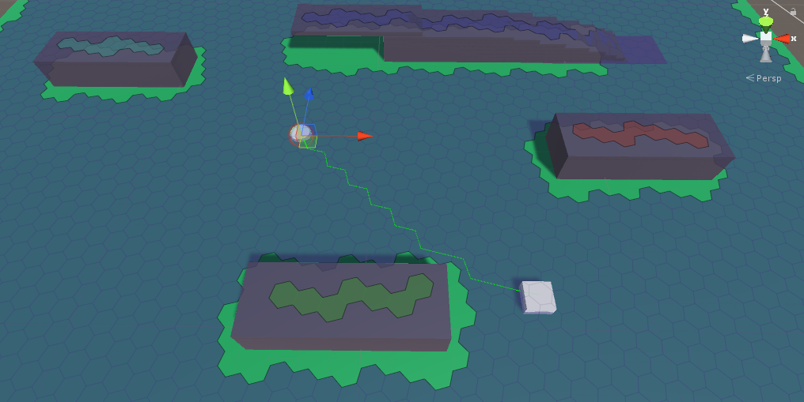](http://img.dongbeigtl.top/A文章需要的截图/Unity插件：AStarPathfinding中/Image 0011551784583.png)

也可以修改为适用于ISO的寻路网格：

[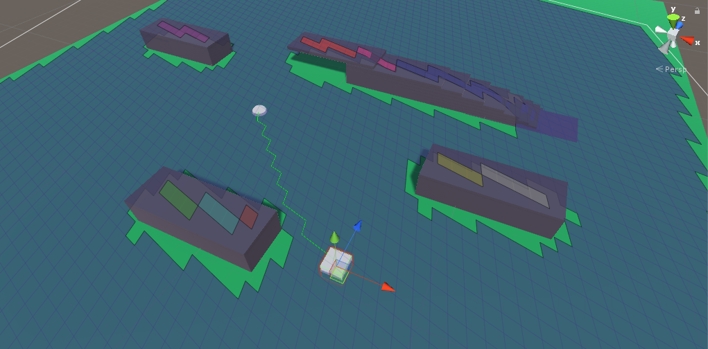](http://img.dongbeigtl.top/A文章需要的截图/Unity插件：AStarPathfinding中/Image 0011551784750.png)

## 1.2 NavMesh Graph

 

## 1.3 Point Graph

（1）场景内添加添加物体和上面的图也一样，不过过多了一个如图的**Way**节点，用于当作路点使用。在Way中添加一些Cube充当路点。

[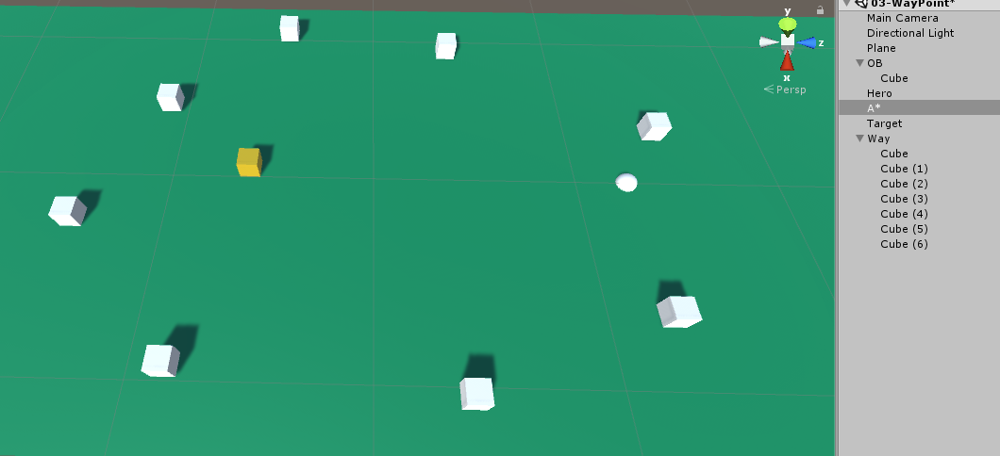](http://img.dongbeigtl.top/A文章需要的截图/Unity插件：AStarPathfinding中/Image 0011551672728.png)

（2）在A*组件中添加Point Graph。并将**Root属性**设置为Way。

[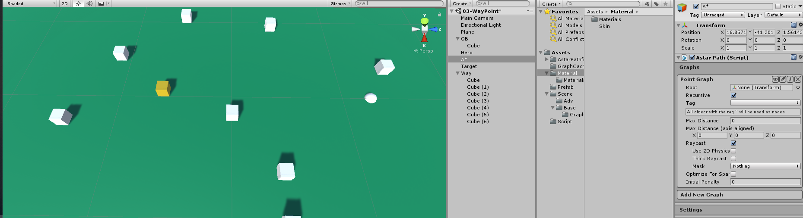](http://img.dongbeigtl.top/A文章需要的截图/Unity插件：AStarPathfinding中/Image 0011551672544.png)

（3）点击Scan即可。

[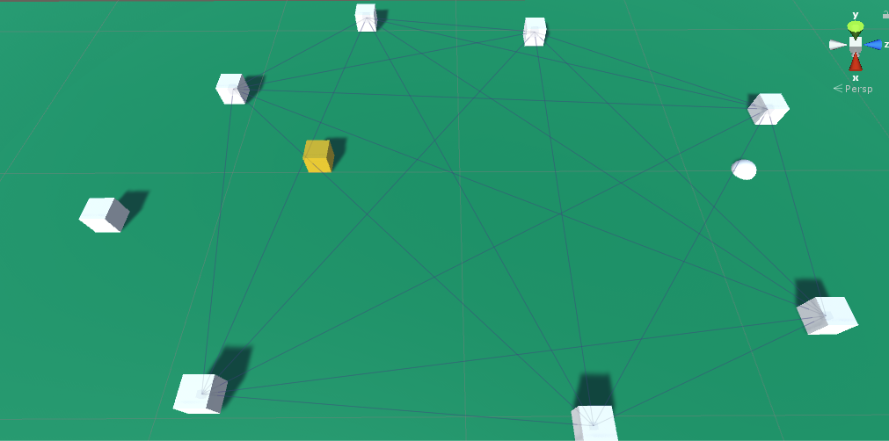](http://img.dongbeigtl.top/A文章需要的截图/Unity插件：AStarPathfinding中/Image 0011551672681.png)

## 1.4 Recast Graph

**（1）**和1.1的Grid做一样的准备工作

**（2）**在AstarPath组件中添加RecastGraph。

[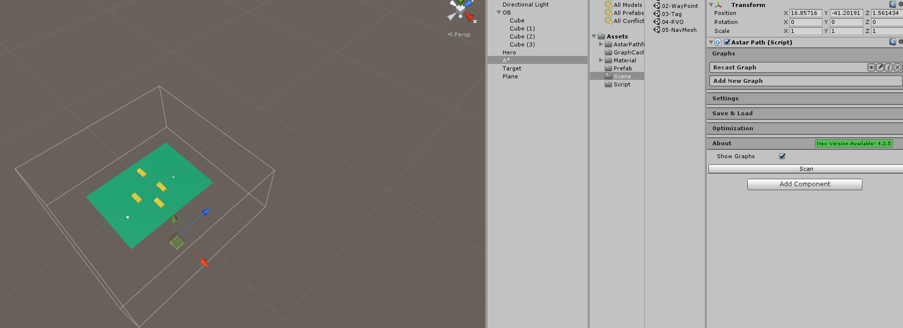](http://img.dongbeigtl.top/A文章需要的截图/Unity插件：AStarPathfinding中/Image 0011551669627.png)

**（3）**点击Snap Bounds按钮，组件会自动适配场景中的地形。[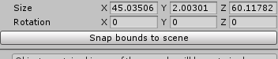](http://img.dongbeigtl.top/A文章需要的截图/Unity插件：AStarPathfinding中/Image 0011551671673.png)

**（4）**点击Scan 生成NavMesh

[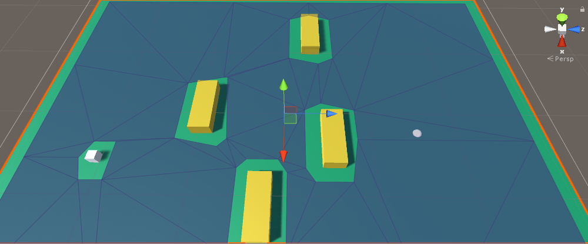](http://img.dongbeigtl.top/A文章需要的截图/Unity插件：AStarPathfinding中/Image 0011551671933.png)

**（5）**寻路脚本的添加和1.1一样，不再介绍。

## 1.5 Layered Grid Graph

Layered 图和Grid图的生成方式一样，但Layered图可以分辨出台阶和地面，如图：

[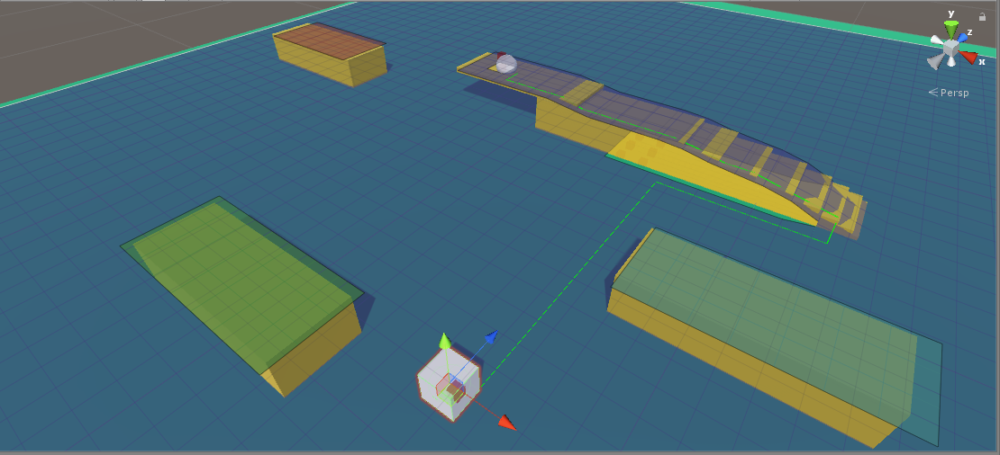](http://img.dongbeigtl.top/A文章需要的截图/Unity插件：AStarPathfinding中/Image 0011551684240.png)

[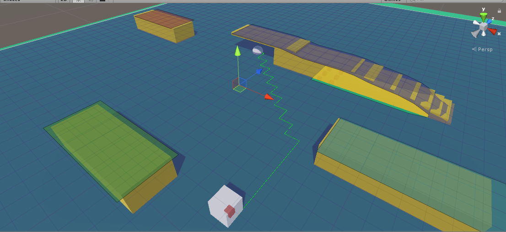](http://img.dongbeigtl.top/A文章需要的截图/Unity插件：AStarPathfinding中/Image 0011551684260.png)

Layered图中可以明确的分出台阶和地面

[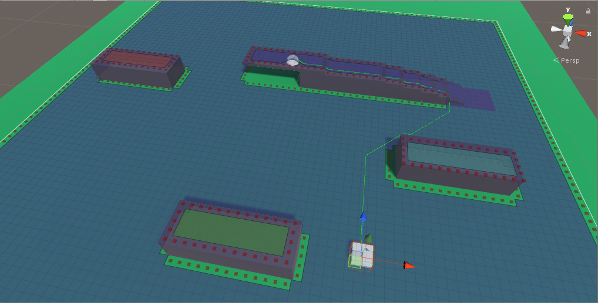](http://img.dongbeigtl.top/A文章需要的截图/Unity插件：AStarPathfinding中/Image 0011551775319.png)[](http://img.dongbeigtl.top/A文章需要的截图/Unity插件：AStarPathfinding中/Image 0011551775716.png)

Grid会将台阶下面的区域设定为不可走

# 一些常用场景

## 1.1 RVO

 

 

## 1.7 问题

1.Grid和Lay图的图层问题

 

 

 

 

 

 

 

 

 

 

 

 

 

 

 

 

 

 

 

 

 

 

 

 

 

 

 

 

 

 

 

 

 

 

 

 

 

 

 

 

 

 

 

 

 

 

 

 

 

 

 

 

 

 

 

 

 

 

 

 

 

 

 

 

 

 

 

 

 

 